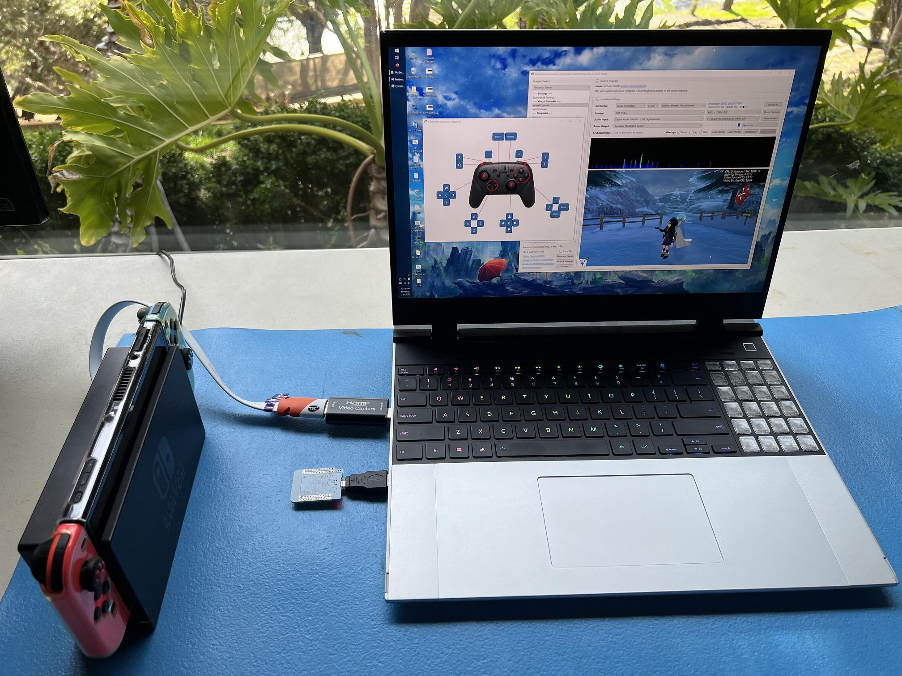
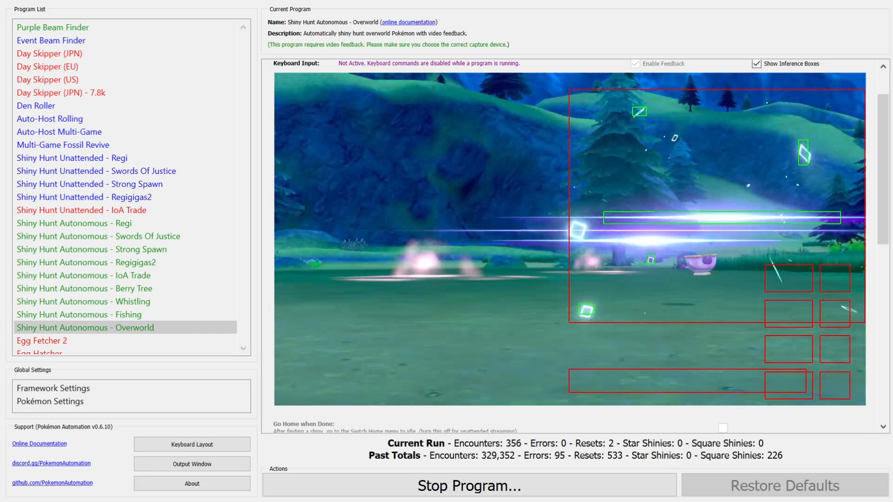

# Pokémon Automation - Computer-Control Programs

This repo contains the computer-control programs (formerly known as "serial programs") for Pokémon Automation.

[More information about this project.](https://github.com/PokemonAutomation/About/blob/master/README.md)

If you are new, you should start with our [Computer Control Setup Gude](Wiki/SetupGuide/README.md).

If you came here intending to run [AutoMaxLair](https://github.com/PokemonAutomation/AutoMaxLair), there is a newer version of it that's built-into the Computer-Control programs now. But if you want to play with the original Python one anyway, the hardware setup is the same as the wired configuration for the Computer-Control programs.

**Latest Downloads:**
- [See Releases](https://github.com/PokemonAutomation/ComputerControl/releases)

**Contents:**
- [Setup Gude](Wiki/SetupGuide/README.md)
- [Program List](Wiki/Programs/README.md)
  - [Nintendo Switch](Wiki/Programs/README.md#nintendo-switch)
  - [Pokémon Sword/Shield](Wiki/Programs/README.md#pokémon-swordshield)
  - [Pokémon Brilliant Diamond/Shining Pearl](Wiki/Programs/README.md#pokémon-brilliant-diamondshining-pearl)
  - [Pokémon Legends Arceus](Wiki/Programs/README.md#pokémon-legends-arceus)
  - [Pokémon Scarlet/Violet](Wiki/Programs/README.md#pokémon-scarlet-and-violet)
  - [Zelda: Tears of the Kingdom](Wiki/Programs/README.md#zelda-tears-of-the-kingdom)
- [Developer Guide](Wiki/Developer/README.md)
- [Version History](Wiki/VersionHistory.md)

## Computer-Control Automation

The next level game console automation using computer control, machine learning, and artificial intelligence.

