# Controller List

This is a full list of devices and controllers that we currently support.

**Terminology:**
- **Device** - A microcontroller such as an ESP32, Arduino, Teensy, etc...
- **Controller** - A game controller such as the Nintendo Pro Controller or Joycon.
- **Setup** or **Controller Setup** - A setup where a "device" is emulating a "controller" for automation.

## Controller Setups

This table lists all the device and controller combinations that we support in this project.

| | **Device Type** | **Supported Controllers** | **Guides** |
| --- | --- | --- | --- |
| **Recommended Setups:** | | | |
| 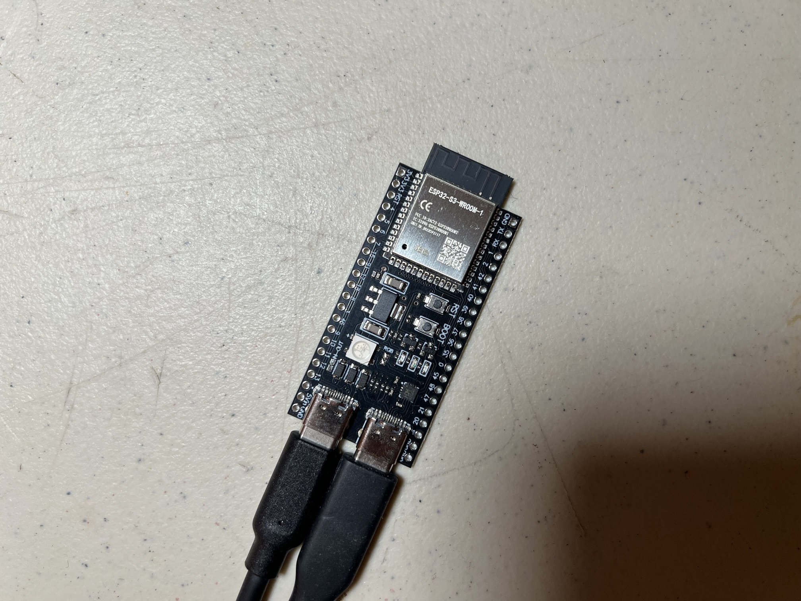 | ESP32-S3 | HID: Keyboard Switch 1: Wired Controller Switch 2: Wired Controller | [Windows](SetupGuide/Controllers/Controller-ESP32-S3.md) |
|  | ESP32-WROOM | Switch 1: Wireless Pro Controller Switch 1: Left Joycon Switch 1: Right Joycon | [Windows](SetupGuide/Controllers/Controller-ESP32-WROOM.md) [Mac](SetupGuide/Controllers/Controller-ESP32-WROOM-MacOS.md) |
| 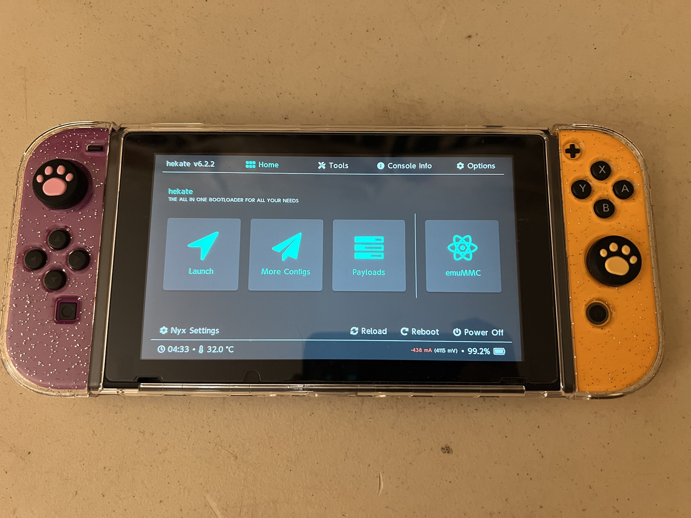 | CFW: sys-botbase 2 CFW: sys-botbase 3 | Switch 1: Wired Pro Controller | [Guide](SetupGuide/Controllers/Controller-sys-botbase.md) |
| **Beta Testing:** | | | |
|  | Raspberry Pi Pico W Raspberry Pi Pico 2 W (USB Mode) | Switch 1: Wireless Pro Controller Switch 1: Left Joycon Switch 1: Right Joycon | [Guide](SetupGuide/Controllers/Controller-PicoW-USB.md) |
|  | Raspberry Pi Pico W Raspberry Pi Pico 2 W (UART Mode) | HID: Keyboard Switch 1: Wired Controller Switch 2: Wired Controller Switch 1: Wireless Pro Controller Switch 1: Left Joycon Switch 1: Right Joycon | [Guide](SetupGuide/Controllers/Controller-PicoW-UART.md) |
| **Deprecated Setups:** Still supported. Not recommended for new users. | | | |
|  | Arduino Uno R3 | Switch 2: Wired Controller (compatible with Switch 1) | [Guide](SetupGuide/Controllers/Controller-ArduinoUnoR3.md) |
|  | Arduino Leonardo | Switch 2: Wired Controller (compatible with Switch 1) | [Guide](SetupGuide/Controllers/Controller-ArduinoLeonardo.md) |
|  | Pro Micro | Switch 2: Wired Controller (compatible with Switch 1) | [Mini-Grabbers](SetupGuide/Controllers/Controller-ProMicro-MiniGrabbers.md) [Hammer Headers](SetupGuide/Controllers/Controller-ProMicro-HammerHeaders.md) |
|  | Teensy 2.0 Teensy++ 2.0 | Switch 2: Wired Controller (compatible with Switch 1) | [Mini-Grabbers](SetupGuide/Controllers/Controller-Teensy2-MiniGrabbers.md) [Hammer Headers](SetupGuide/Controllers/Controller-Teensy2-HammerHeaders.md) |

### Setup Comparison Table:

| Setup | **Supported Controllers** | **Price (per Unit)** | **Setup Difficulty (Scale 1-10)** | **Notes:** |
| --- | --- | --- | --- | --- |
| Raspberry Pi Pico W (USB Mode) | NS1: Wireless Pro Controller NS1: Left Joycon NS1: Right Joycon | Single: $14 Volume: $7 | 1 | Upgradable to UART mode. |
| ESP32 | NS1: Wireless Pro Controller NS1: Left Joycon NS1: Right Joycon | Single: $10 Volume: $4 | 3 | Buggier than the Pico W. |
| ESP32-S3 | HID: Keyboard NS1: Wired Controller NS2: Wired Controller | Single: $15 Volume: $8 | 3 | Best wired setup by far. Workhorse for most seasoned users. |
| Raspberry Pi Pico W (UART Mode) | HID: Keyboard NS1: Wired Controller NS2: Wired Controller NS1: Wireless Pro Controller NS1: Left Joycon NS1: Right Joycon | Single: $24 Volume: $10 | 5 | Exposed pins can be annoying. |
| Arduino Uno R3 | NS2: Wired Controller | Single: $20 | 7 |  |
| Arduino Leonardo | NS2: Wired Controller | Single: $25 | 7 |  |
| Teensy 2/Teensy++ 2 (Mini Grabbers) | NS2: Wired Controller | (discontinued) | 8 | Final product is bulky and fragile. |
| Teensy 2/Teensy++ 2 (Hammer Headers) | NS2: Wired Controller | (discontinued) | 10 |  |
| Pro Micro (Mini Grabbers) | NS2: Wired Controller | Single: $25 Volume: $10 | 8 | Final product is bulky and fragile. |
| Pro Micro (Hammer Headers) | NS2: Wired Controller | Single: $25 Volume: $8 | 10 |  |

## Device Types

A "device" is a microcontroller or development board that we will use to implement a game controller.

| Image | Description |
| :---: | --- |
| 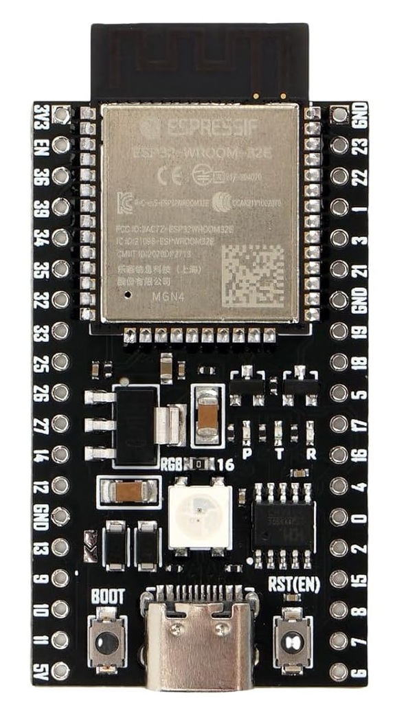 | **ESP32-WROOM**  Supported Controllers: - Switch 1: Wireless Pro Controller - Switch 1: Left Joycon - Switch 1: Right Joycon  The ESP32 is a microcontroller that supports Bluetooth. It is one of the few microcontrollers that supports Bluetooth Classic (BTC) since the world has moved onto Bluetooth LE (BLE). Thus it is (almost) uniquely suited to implement the Switch 1 wireless controllers which are also BTC.  The USB port on it is a built-in UART intended for debugging, but we hijack it as the main line of communication with CC to eliminate the need for an external UART. This makes it super convenient since a simgle USB adapter turns it into fully wireless dongle that allows your computer full control of your Switch without the hassle of any cables at all.  The ESP32 also supports BLE which is what the Switch 2 wireless controllers use. So it has the potential to implement the Switch 2 wireless controllers in the future. |
|  | **ESP32-S3**  Supported Controllers: - HID: Keyboard - Switch 1: Wired controller - Switch 2: Wired controller  The ESP32-S3 is the by far the best wired controller setup. It has both USB OTG and USB UART as separate ports. The USB OTG can be programmed as a game controller while the USB UART elminates the need for the external UART that was needed by the AVR8 setups (Arduino/Teensy). Thus ESP32-S3 is the perfect replacement for those older setups. Ease of setup is very important as it lowers the technical bar of entry for new users.  The ESP32-S3 also supports Bluetooth, but only Bluetooth LE (BLE). So while it cannot implement the Switch 1 wireless controllers, it does give us future ambitions of supporting the Switch 2 wireless controllers. |
| **Pico W** 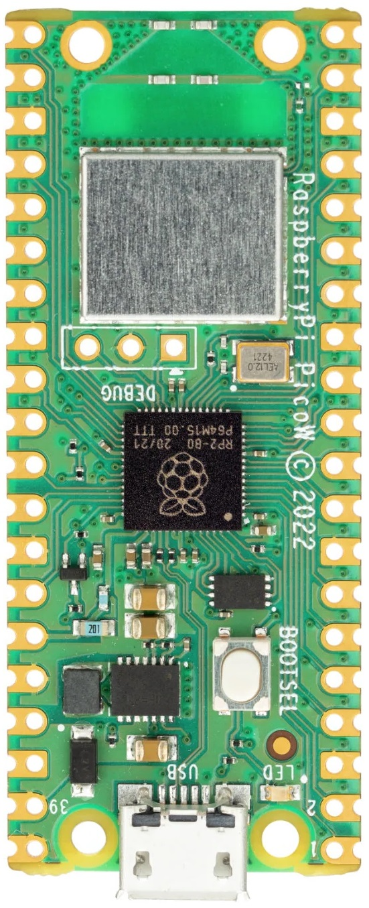   **Pico 2 W** 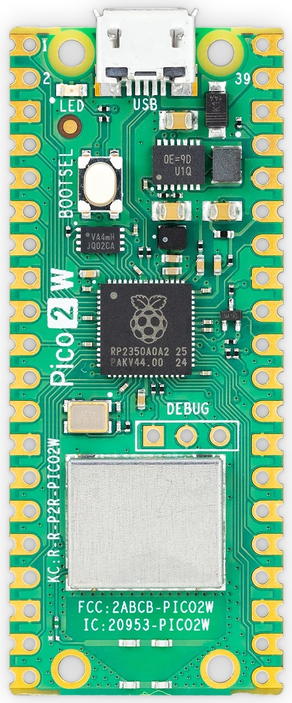 | **Raspberry Pi: Pico W and Pico 2 W**  Supported Controllers: - HID: Keyboard - Switch 1: Wired Controller - Switch 2: Wired Controller - Switch 1: Wireless Pro Controller - Switch 1: Left Joycon - Switch 1: Right Joycon  The Raspberry Pi Pico W is unique in that it can support every single controller. However, accessing the wired controllers is more difficult as it requires more setup.  The large (silver) chip is a Bluetooth module that supports both BTC and BLE. This allows it to implement wireless controllers. Meanwhile, the USB port on it is USB OTG which allows it to implement the wired controllers. But unlike the ESP32-S3, it does not have a 2nd USB port to use as a UART connection to the computer.   Therefore we have programmed two operating modes for the Pico W: - USB Mode - UART Mode  In USB mode, the USB port acts as a serial port that can be plugged directly into the computer. This makes it functionally the same as the ESP32 with only wireless controller support.  In UART mode, the USB port becomes a wired controller plugged into the console. This unlocks all the remaining (wired) controllers. However, you need to wire up an external UART to UART1 in order for it to communicate with the computer. Thus this setup is similar to that of the Teensy 2 and Pro Micro with the added bonus of the wireless controller support.  Both operating modes use the same firmware binary. On boot, it starts in USB mode. It will automatically switch to UART mode the moment it sees valid traffic on UART1. |
| 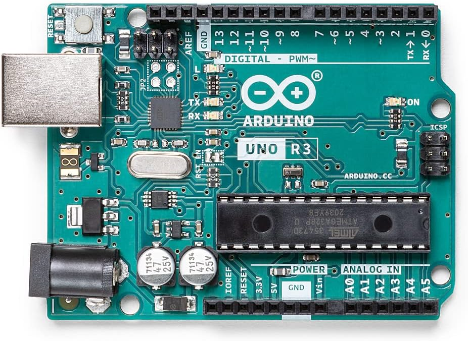 | **Arduino Uno R3**  Supported Controllers: - Switch 2: Wired controller  The Arduino Uno R3 is one of the original boards that spearheaded the Nintendo Switch automation community. However, it's ATmega16U2 AVR8 CPU is very weak with only 512 bytes of ram and 12KB of usable program memory.  This controller is only suitable for emulating the basic wired controllers. It doesn't even have enough memory to hold multiple controller implementations the way that some of the newer controllers can. |
| 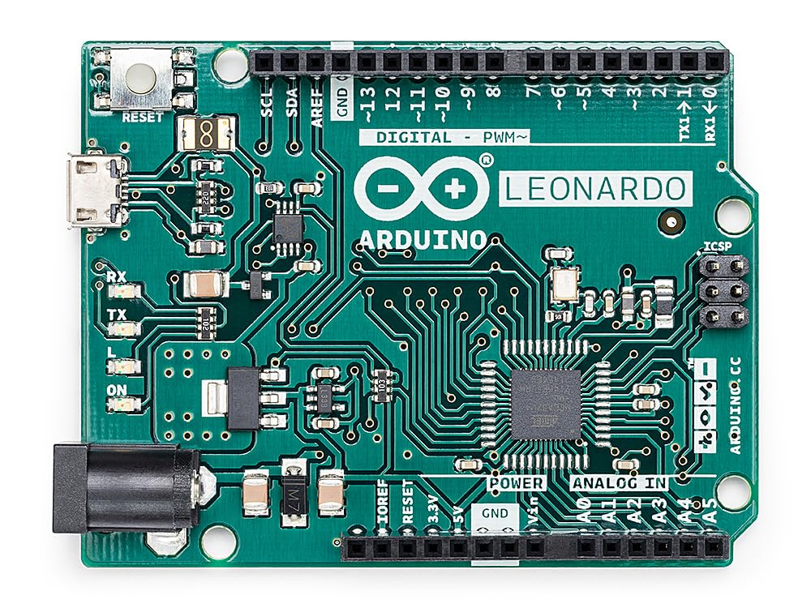 | **Arduino Leonardo**  Supported Controllers: - Switch 2: Wired controller  The Arduino Leonardo uses an ATmega32U4 AVR8 CPU. It has significantly more ram and program memory at 2.5KB and 32KB respectively. This was the last addition to the AVR8 microcontroller line up and was chosen because it was easier to setup a serial connection than the Teensy or Pro Micro boards.  Being an AVR8 processor, it shares codebase with the Arduino Uno R3 and thus we only support a single wired controller type on it. |
| 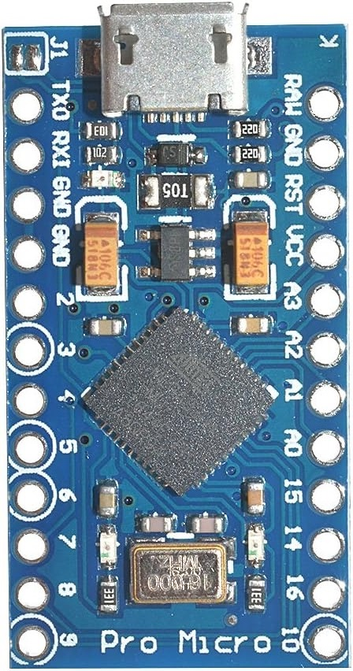 | **Pro Micro**  Supported Controllers: - Switch 2: Wired controller  The Pro Micro uses an ATmega32U4 AVR8 CPU and is functionally the same as the Arduino Leonardo and Teensy 2.0. This was added to our lineup because it was the cheapest microcontroller of this type in volume. Thus it became the work horse for many people with multiple Switches. |
| 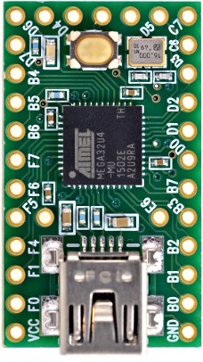 | **Teensy 2.0**  Supported Controllers: - Switch 2: Wired controller  The Arduino Uno R3 is one of the original boards that spearheaded the Nintendo Switch automation community.  The Teensy 2.0 uses an ATmega32U4 AVR8 CPU and is functionally the same as the Arduino Leonardo and Pro Micro. This (along with the Teensy++ 2.0) was by far the best board during the microcontroller-only automation era due to the easy-to-use button to put the board into flash mode. It began to fall out of use in the computer-control era due to the difficulty of setting up a serial connection on it. |
|  | **Teensy++ 2.0**  Supported Controllers: - Switch 2: Wired controller  The Teensy++ 2.0 is the same as the Teensy 2.0, but with an upgraded AT90USB1286 CPU which has much more ram and program memory.  This extra ram and program memory was never put to use in this project. So it is functionally the same as the Teensy 2.0 along with all its advantages and drawbacks. |

## Controller Types

A "controller" (not to be confused with the microcontrollers above) refers to a game controller that will be emulated for the purpose of controlling the game console.

| Image | Description |
| --- | --- |
| 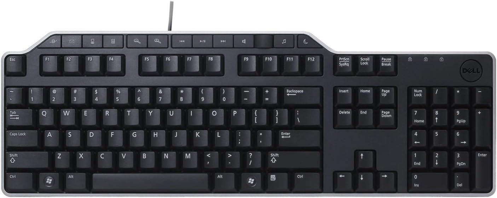 | **HID: Keyboard**  This is a standard HID keyboard over USB. While it can't be used to play a Nintendo Switch, it is useful for typing in text fields. Thus it provides the fastest method for Fast Code Entry.  This uses the standard 8-byte HID keyboard report that allows for up to 6 keys to be held at once. |
| 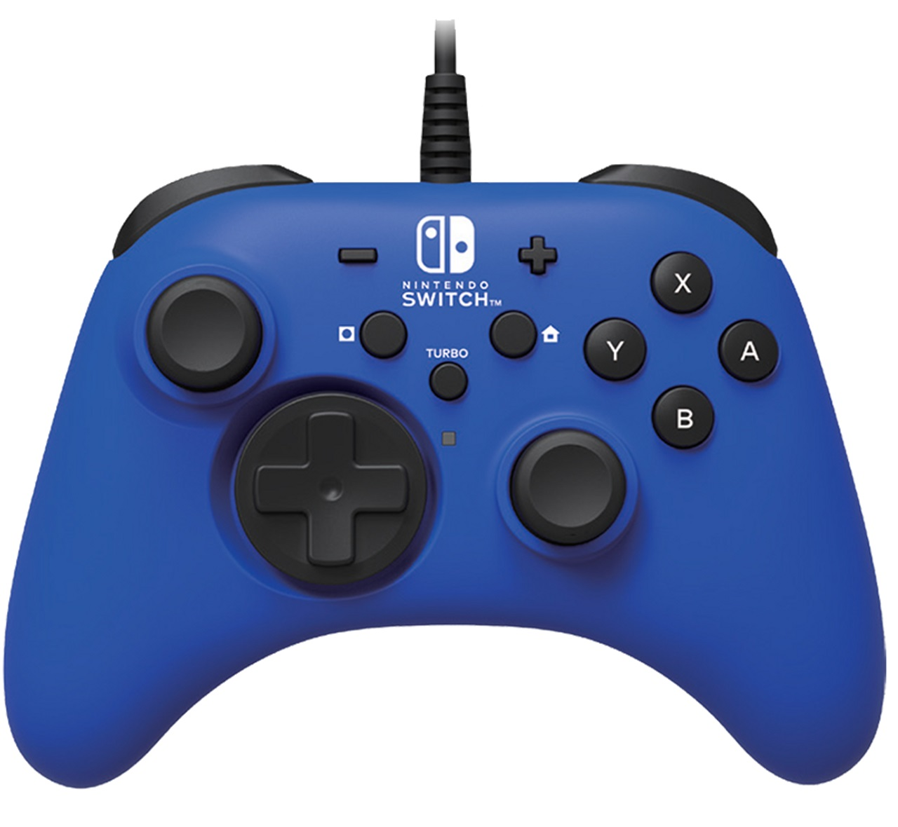 | **Switch 1: Wired Controller**  This is the standard 3rd party wired that most "officially licensed" controllers use. Most wired controllers from Horipad and PowerA fall into this category.  This controller type only supports the standard buttons/joystick and do not support rumble or gyro. It also does not support custom colors in its icon when connected to the Switch.  These use the standard 8-byte HID report type with 14 buttons, a dpad, and two joysticks with 8-bit precision. |
| 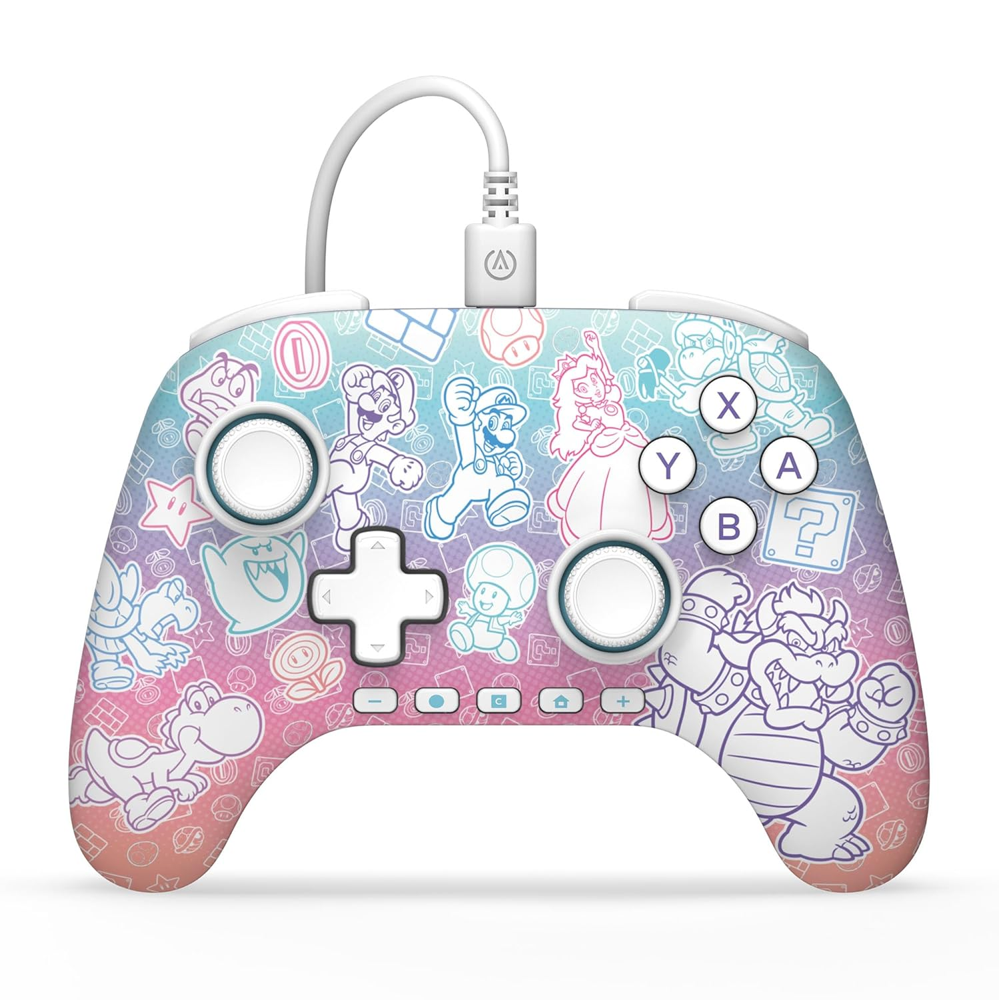 | **Switch 2: Wired Controller**  This is the same as the Switch 1 wired controller, except that they add the GL, GR, and C (gamechat) buttons for the Switch 2. This controller type is backwards compatible with the Switch 1 such that pressing the new buttons simply do nothing on the Switch 1.  These also use the standard 8-byte HID report type with 17 buttons, a dpad, and two joysticks with 8-bit precision. Due to the button field having only 16 bits, the 17'th button (the C button) instead uses an unused bit in the dpad byte. |
| 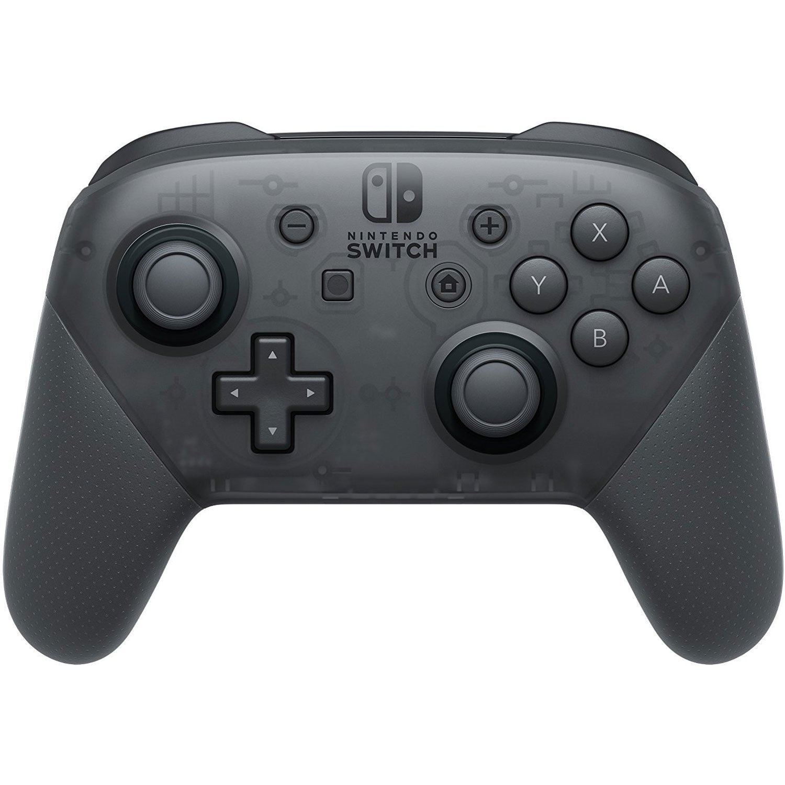 | **Switch 1: Wireless Pro Controller**  This is the official pro controller from Nintendo - connected wirelessly to the Switch.  At this time, this project does not support gyro, rumble, NFC, or console wake up. So in effect, it is functionally the same as the wired controller - though less stable due to wireless communication.  This uses Nintendo's proprietary 48-byte HID report 0x30.  **Switch 1: Wired Pro Controller**  This is the official pro controller connected to the Switch over USB.  Currently, the only implementation we have is sys-botbase. It does not use reports and instead, directly sets the controller state by writing to system memory. |
|  | **Switch 1: Left + Right Joycons**  These are the official joycons from Nintendo - connected wirelessly to the Switch.  At this time, this project does not support gyro, rumble, NFC, or console wake up.  This uses Nintendo's proprietary 48-byte HID report 0x30. |

## Controller Performance Classes

For the purposes of program compatibility, each setup/device + controller combination is placed into one of 3 performance categories:

- Wired
- Wireless
- sys-botbase 2

Programs that are speed-critical will have separate execution paths optimized for each performance category. (i.e. date spam, Fast Code Entry...)

### Wired:

Wired controllers are by far the most stable with a button timing accuracy of < 1ms (typically ~100us). It is not prone to random disconnects and can connect to the Switch from almost anywhere. This makes it the best suited for automation.

| **Device** | **Controller** |
| --- | --- |
| ESP32-S3 Pico 1/2 W (UART mode) | HID: Keyboard Switch 1: Wired Controller Switch 2: Wired Controller |
| Arduino Uno R3 Arduino Leonardo Pro Micro Teensy 2.0 Teensy++ 2.0 | Switch 2: Wired Controller |
| sys-botbase 3 (sbb3) | Switch 1: Wired Pro Controller |

### Wireless:

Wireless controllers are less stable and usually have timing variation on the order of 2-10ms. While they are clean and easy to setup with no additional cabling, wireless controllers are generally less reliable since they are prone to random disconnects and high latencies from wireless interference. Nintendo's complicated (and proprietary) wireless protocol means that 3rd party implementations (including this project) are typically less than perfect and prone to compatibility issues.

The main issue with wireless is that it can only reliably connect to the Switch inside the grip menu. So if you get disconnected outside of the grip menu and are unable to reconnect, you will need another controller or physical access to navigate back to the grip menu to re-pair the controller. For this reason, wireless controllers are less suited for remotely controlled automation.

| **Device** | **Controller** |
| --- | --- |
| ESP32 Pico 1/2 W (both modes) | Switch 1: Wireless Pro Controller Switch 1: Left Joycon Switch 1: Right Joycon |

### sys-botbase 2:

This category exists simply because sys-botbase 2 (sbb2) is extremely unstable with timing variations upwards of 150ms along with massive throughput issues due to backpressure. As a result, many programs written for the above wired and wireless controllers do not work on sbb2.

With the launch of sys-botbase 3 (sbb3), this setup has been deprecated.

| **Device** | **Controller** |
| --- | --- |
| sys-botbase 2 (sbb2) | Switch 1: Wired Pro Controller |

**Discord Server:** 

