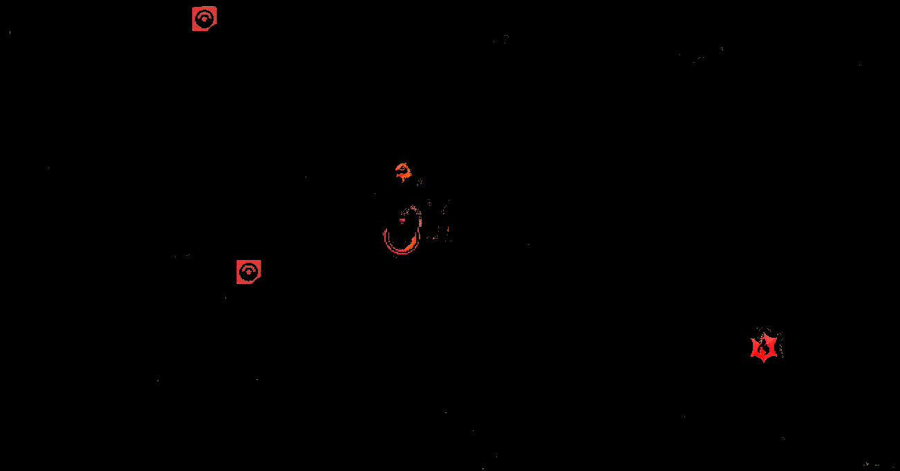

# Template Image Matching
[](https://discord.gg/cQ4gWxN)

Image matching is usually done with the Watcher classes, which is usually used by the `run_until` and `wait_until` functions. Run/wait_until takes a list of callbacks. These callbacks are usually Watcher classes. Every frame, the program runs the Watcher’s `process_frame` function. When the template image is detected, `process_frame` will return true, triggering the callback for run/wait_until. See [Parallel Routines](Parallel.md) for more details. 

The image matchers typically have a few classes that work together: the Watcher, the Detector, and the Matcher. 

- Watcher is a callback that can be used by `run_until` or `wait_until`. It includes the `process_frame` function, which runs on every video frame. It typically calls the Detector's `detect` function.
- Detector contains the `detect` function, which looks at the single still image from the video feed. It typically returns true if the image contains an object that matches the image template.
- Matcher includes the image template that we are searching for on the screen.

## Waterfill and template matching
The way that many detector/image matchers work is by using the Waterfill and template match method. 

Waterfill selects for objects on the screen that are a particular color. These Waterfilled objects are then compared with a template image. If the Waterfilled object is similar to the template image, the Detector returns true.

There are several detector/image matchers that you can look at for examples, such as `MapPokeCenterIconDetector` or `FastTravelDetector`. You can also use `GameName_ObjectNameDetector` as a template to build off of.

### Visualizing Waterfill

Suppose we have the following image and we want to detect the Pokecenter. 


Next, we use Waterfill to get the red portions of the image. The Waterfill algorithm first applies the red color filter, and you're left with something like the following binary image.



Waterfill then extracts all connected red portions (that are above a certain area threshold). Note that the red arc and dot inside the icon aren't connected to the rest of the icon, so these won't be a part of the Waterfill object.


These Waterfill objects are then compared with the waterfilled template. 


In particular, their area ratio and aspect ratio are compared with the template. Area ratio and aspect ratio are discussed later.

> Note: the binary image and waterfill images above are just for illustrative purposes. In reality, the binary image is actually a binary matrix. Similarly, Waterfill objects are not images, but are actually a class which contains the objects' coordinates on the image, its bounding box, and the number of bits in the object.

If the Waterfill object meets the area ratio and aspect ratio requirements, each Waterfill object will produce a cropped image, where the original image will be cropped according to the bounding box of the Waterfill object. 


Each cropped image will then be compared against the cropped template image.


In particular, RMSD will be computed for each cropped image. Any object that meets the RMSD threshold will be considered a match. 

Note that because we're no longer looking at the Waterfill object, but the cropped image, the red arc and dot inside the icon once again reappear. In other words, the red arc and dot aren't relevant for meeting the aspect ratio and area ratio requirements, but they are relevant for meeting the RMSD threshold.

### Waterfill

Waterfill is an algorithm that filters for all pixels that meet the given color filter(s). It then finds all the remaining pixel groups that are connected and are above a minimum area. Each of these connected pixel groups are considered Waterfill objects.

You can give the Waterfill operation multiple filters in an array. Waterfill will extract all objects that meet any of the filters. This can be helpful to deal with capture card variations; you can try multiple brightness shades of the object you're searching for. This can also be useful when the thing you're waterfilling for has poor contrast difference from the background, (for example, the flag pin in PLA against the icelands snow during midday).

One method to finding the correct color filters is to take a screenshot, crop to the object that you want to detect, then use the color picker in an image editor (e.g. MS Paint or Paint.net). Then find the range of RGB values for your object. Alternatively, you can use trial and error, while inspecting the dump folder to expand or narrow the filters as needed. The dump folder will be discussed further in a later section.

Note that the Waterfill matcher works best on images with solid colors. The Waterfill matcher cannot handle occlusion (i.e. other object covering/partially covering your desired object). For example, if the image you're trying to match is blue, but it's partially covered by something that is yellow, the Waterfill object will only include the blue portions, and not the portions covered by the yellow.

Also, note that if you know exactly where on the screen the desired object should be, you may not even need to use Waterfill, because you can just directly compare your image template with the object at that specific location. Waterfill is mainly useful when you don't know exactly where the desired object is, but it has a distinct and solid color that is different than its surroundings.

### Template matching

Each Waterfilled object is compared to the template image, where it must meet the requirements for aspect ratio, area ratio, and RMSD.

The aspect ratio is equal to width/height. The area ratio is equal to area/(width * height). Area is not the same as width*height. Area is the number of non-zero bits in the Waterfill object. Conceptually, if the Waterfill object were to be represented as an image, it would be the number of pixels in the object that meet the color filter.

The aspect ratio and area ratio of the Waterfill objects are compared with the template image. To be considered a match, the Waterfill object’s aspect ratio divided by the template image’s aspect ratio must be within the specified upper and lower bounds. Same for the area ratio.

Area ratio requirements are to help reduce false positives between solid vs hollow objects that may have the same outer shape.

RMSD (root mean square deviation) is a single number that summarizes how similar the given Waterfill object is, compared to the template image. The lower the RMSD, the more similar. A lower RMSD theshold means that we are more strict and that the Waterfill object must be more similar to the template.

Note, with area ratio and aspect ratio, each Waterfill object is compared with the Waterfilled template. i.e. Area ratio and aspect ratio values are based on the Waterfill objects. However, RMSD is done on cropped images. Each Waterfill object will produce a cropped image, where the original image will be cropped according to the bounding box of the Waterfill object. The Waterfilled template similarly produces a cropped template image. For each cropped image from the Waterfilll objects, RMSD will be computed in comparison to the cropped template image.

### Creating your own image templates

If you want to create a template image for a detector, I recommend ensuring screenshots are in 1080p (or 4K). One easy way to do this is to take screenshots from within the Computer Control program. Screenshots taken from the Switch are lower resolution (720p) and can cause issues with image matching. Then, use an image editor (like MS Paint or Paint.net) to crop down to the area of interest. Use the magic wand tool to remove most of the unwanted background. Then use the eraser tool to delete any remaining unwanted pixels.

### Why do we use Waterfill instead of object detection?

Waterfill is computationally cheap and works well with video games with lots of solid colors. General object detection will require machine learning, which is both much more computationally intensive and is currently out-of-scope for this project as we don't have the expertise for it yet.

## MapPokeCenterIconMatcher

In this section, we look at the code for MapPokeCenterIconDetector as an example: 

```
MapPokeCenterIconMatcher() : WaterfillTemplateMatcher(
    "PokemonSV/Map/PokeCenterIcon-Template.png", Color(150,0,0), Color(255, 100, 100), 50
){
    m_aspect_ratio_lower = 0.9;
    m_aspect_ratio_upper = 1.1;
    m_area_ratio_lower = 0.6;
    m_area_ratio_upper = 1.2;
}
```

PokeCenterIcon-Template.png is the template image. It’s located in the Resources folder. 


Still looking within the WaterfillTemplateMatcher constructor, the next two color parameters are for applying color filters for Waterfilling the template. In other words, the template is not being used as is, but rather is a Waterfill object. In this case, the color filter keeps all pixels with Red: 150-255, Green: 0-100, Blue: 0-100. i.e. the filter keeps all the red portions of the Pokecenter icon. The largest group of connected red pixels is the Waterfill object that is selected. This resulting Waterfill object is the template that we will use for comparing against objects on the screen. Note, another reminder that the red arc and dot inside the icon aren't connected to the rest of the icon, so these won't be a part of the Waterfill template object. In other words, the red arc and dot aren't relevant for meeting the aspect ratio and area ratio requirements. However, they are relevant for meeting the RMSD threshold, which doesn't use Waterfill objects, but rather cropped images.

The last parameter of the WaterfillTemplateMatcher constructor, 50, is the minimum area for the Waterfill template object.

Within the body of the Matcher constructor, are some of the matching requirements. Here, you specify the upper and lower bounds for aspect ratio and area ratio. To be considered a match, the Waterfill object’s aspect ratio divided by the template image’s aspect ratio must be within the specified upper and lower bounds. Same for the area ratio.

## MapPokeCenterIconDetector::detect_all

```
std::vector<ImageFloatBox> MapPokeCenterIconDetector::detect_all(const ImageViewRGB32& screen) const{

    const std::vector<std::pair<uint32_t, uint32_t>> filters = {
        {combine_rgb(150, 0, 0), combine_rgb(255, 120, 120)}
    };

    const double min_object_size = 350.0;
    const double rmsd_threshold = 100.0;

    const double screen_rel_size = (screen.height() / 1080.0);
    const size_t min_size = size_t(screen_rel_size * screen_rel_size * min_object_size);

    std::vector<ImageFloatBox> found_locations;

    ImagePixelBox pixel_search_area = floatbox_to_pixelbox(screen.width(), screen.height(), m_box);    

    match_template_by_waterfill(...)

    return found_locations;
}
```

This function tries to detect all PokeCenter icons.

`filters` specifies the color filters for Waterfill. In this case, Waterfill selects for pixels with Red: 150-255, Green: 0-120, Blue: 0-120, in order to find the Waterfill objects. In this case, Waterfill is looking for red images.

`min_object_size` specifies the minimum area for Waterfill objects. Any objects below the minimum size are ignored. `min_size` scales the minimum area as per the detected screen size.

`rmsd_threshold` is the RMSD threshold that each Waterfill object must meet, when compared to the template. 

### match_template_by_waterfill
```
match_template_by_waterfill(
    extract_box_reference(screen, m_box), 
    MapPokeCenterIconMatcher::instance(),
    filters,
    {min_size, SIZE_MAX},
    rmsd_threshold,
    [&](Kernels::Waterfill::WaterfillObject& object) -> bool {
        ImagePixelBox found_box(
            object.min_x + pixel_search_area.min_x, object.min_y + pixel_search_area.min_y,
            object.max_x + pixel_search_area.min_x, object.max_y + pixel_search_area.min_y);
        found_locations.emplace_back(pixelbox_to_floatbox(screen.width(), screen.height(), found_box));
        return false;
    }
);
```

`match_template_by_waterfill` is the function that does most of the work within the `detect_all` function. First, it finds objects on the current screen that match your color filters, using Waterfill operations. It then checks each Waterfill object to ensure it is within the upper and lower bounds for aspect ratio and area ratio (as defined in the Matcher class above), and that it is below the RMSD threshold. Any Waterfill object that meets these requirements is considered a match.

See the comments in the `WaterfillUtilities.h` header file for more details on how `match_template_by_waterfill` works.

- `extract_box_reference`: the portion of the screen that the detector is acting on, as per `m_box`. `m_box` is of the class `ImageFloatBox`, which specifies both the coordinates of the box on the screen, as well as its height and width.
- `MapPokeCenterIconMatcher`: the template image that the Waterfill objects are compared against. See the section above for more details on this.
- `filters`: the color filters for extracting the Waterfill objects.
- `{min_size, SIZE_MAX}`: the range of acceptable area values for the Waterfill objects.
- `rmsd_threshold`: the RMSD threshold that each Waterfill object must meet when compared to the template. A lower RMSD theshold means that we are more strict and that the Waterfill object must be more similar to the template.
- `[&](Kernels::Waterfill::WaterfillObject& object) -> bool {...}`: this is a lambda function that is run on every Waterfill object that successfully matches to the template (i.e. it meets the area ratio, aspect ratio, and RMSD thresholds). In this case, each successful Waterfill object's coordinates are saved as an `ImagePixelBox`, then converted to an `ImageFloatBox`, then saved to `found_locations`, which is a vector of `ImageFloatBox`. Returning false means that template matching operation continues looking for other matches.

# Debugging/testing

See [Command Line Tests](Tests.md) for more details on how to run the command line tests. 

In SerialProgram-Settings.json, you can also enable more print statements for debugging. Set `DEBUG.IMAGE_TEMPLATE_MATCHING` to true. If this is enabled, when the program runs, it will print out the area ratio, aspect ratio and RMSD for each Waterfill object. It will also dump image files into the folder `DebugDumps\CommonFramework\WaterfillTemplateMatcher`. If you’re building with Qt, it will be within the `build-SerialPrograms-Desktop_Qt_6_3_2_MSVC2019_64bit-Debug` folder (or something similar, depending on your Qt version). It dumps both the cropped template image as well as the cropped images from the Waterfill objects, so you can inspect them. It also dumps the binary image, which is the result of your color filters being applied to the area of interest on the screen; this can help you determine if your color filters are too broad or too narrow.

Some tips with inspecting the dump folder:
- If your desired Waterfill object isn’t within the debug dump at all, try expanding the color range for your Waterfill filters, or adding additional filters. Also, double check your `min_object_size` thresholds. 
- If your desired Waterfill object is there, but within a larger image/Waterfill object, try narrowing your color filters.
- If your desired Waterfill object is there, but only a portion of it is present, try expanding your filters. 
- If your desired Waterfill object is there, and perfect, then your Waterfill filters might be fine. Try inspecting your RMSD, area ratio, and aspect ratio thresholds and adjusting those. That being said, it's still possible that you have a problem with your area ratio. For example, the image in the dump folder could look perfect while your area ratio could be lower than expected, if Waterfill is primarily matching pixels along the borders/edge of the image, but not in the middle.


