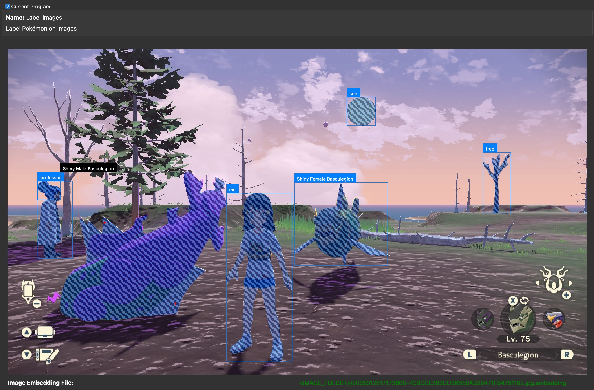

# Label Images (Dev-Mode Program)

## Program Description

Use this program to label images manually for training AI models. To train a model to detect shiny Pokémon and other in-game objects, we need to first create a dataset containing the correct labels of those objects.

On this program, you will draw bounding boxes around objects and assign labels to them.

The program has a useful feature: it runs an AI model [Segment Anything](https://github.com/facebookresearch/segment-anything) to help draw boxes. Once the user draws a box around an object, the Segment Anything model (SAM for short) will find pixels that belong to the object, refining the drawn box to be tighter around the object. This should remove the need for the user to draw pixel-accurate boxes around objects.

## Instructions

### Preparation

1. Build and run SerialPrograms under dev mode.
2. Make sure you have three files, `sam_cpu.onnx`, `sam_embedder_cpu.onnx` and `sam_embedder_cpu.onnx.data` under `Resources/ML/` folder. The first two files are already committed to the [Packages repo](https://github.com/PokemonAutomation/Packages). The third one can be downloaded at this [Discord link](https://discord.com/channels/695809740428673034/698357208185831564/1401731137335984380).
3. Collect images you want to annotate into a folder. You can create subfolders to organize the folder. Note all image files should have unique filenames for the program to tell them apart.

### Compute Image Embeddings

To run SAM, we first need to compute embedding data for each image. An embedding is a kind of intermediate data used in machine learning. Usually it works like this: one AI model converts raw data (e.g. images and texts) into embeddings, then another AI model loads embeddings and computes final results (detected objects or textual responses). In our case, we have a SAM Embedder (`sam_embedder_cpu.onnx` and its data) to convert images into image embeddings, then SAM (`sam_cpu.onnx`) to load image embeddings and compute pixel-masks using user drawn boxes. The steps are:

- Launch SerialPrograms.
- Choose program: ML -> Label Images.
- Click the button "Compute Image Embeddings (SLOW!)". It opens a file dialog. Pick the image folder you want to annotate.
- Wait for the SAM embedder model to finish. It will compute embeddings for all the images in that folder, including subfolders. Depending on how fast your CPU is, it can be as long as one minute per image. You can run it overnight if needed.

Note: the prorgram UI freezes when computing embeddings. You can track the progress of the computation on the terminal if you launch the program from there. In future when we have more time we can improve the UI to remove the freeze.

### Start Annotating

Once the image embeddings are computed, click the button "Open Image" to load and display an image. If the image embedding computation is successful, you will see a a line of text below the image: "Image Embedding File: \<IMAGE_FOLDER\>/....embedding".

#### Draw Boxes
Use left mouse button to drag a red bounding box around an object in the image. It will then show a blue per-pixel mask as the object detected by SAM. It will also show a black box as the tight box enclosing the masked pixels as the refined box. You can draw a second box around another object. The program displays all masks and refined boxes. To denote which object the user is currently annotating on, the current refined box is shown as black while the rest of the refined boxes are blue.

#### Add Labels to Boxes
Use the "Select Label: " UI to assign labels to the currently selected object (denoted by the black refined box). The UI includes a dropdown menu to choose three kinds of labels: Pokémon Forms, Custom Set and Manual Input.
- Pokémon Forms: it shows a second dropdown menu of an exhaustive list of Pokémon forms for the user to pick.
- Custom Set: it shows a second dropdown menu of a customizable list of names for the user to pick. By default, it consists of only one name, "mc" for "main character", but you can click the button "Load Custom Set" to load your own custom list from a JSON file. The format of the JSON file is just a list of strings.
- Manual Input: just type in whatever name you want to assign to the currently selected object.

#### Change Object Selection

To change which annotated object is currently selected, click it on the image. Whenever a click happens, the program will set the closest object as the currently selected object. Its refined box will be black while all the other refined boxes are blue.
You can also use the button "Prev Annotation" and "Next Annotation" to iterate on the annotated objects.

#### Delete Annotation

Click the button "Delete Selected Annotation" to delete the data associated with the currently selected object. You can also use shortcut key "backspace" or delete" to delete it.

#### Save Annotation

At any time, you can click the button "Save Annotation" to save your current work. The program also saves the work when it is closed or when it loads a new image.

#### Go to Next Image

Click the button "Next Image in Folder" to move to the next image in the same folder as the currently displayed image. The program automatically saves the annotation of the previous image.

#### When You Are Done

When you finish annotating every image, check the button "Open Saved Annotation Folder" to open the output folder, which has annotation files you created for each image you annotated. You can then upload the images and the annotation files to whoever can train the image detection model for you.

#### Advanced: Use Inclusion and Exclusion Points

If the mask generated by SAM is wrong, you can add inclusion and exclusion points to adjust the mask. Those points are additional guidence for SAM to improve the per-pixel mask. Control-click a point to tell the program the point should be part of the currently selected object. It will be shown as a red "+" marker. Shift-click a point to tell the program the point should not be part of the currently selected object. It will be shown as a blue "o" marker. The SAM model runs after every point change to improve the mask.

Those points are only shown for the currently selected object to avoid the user getting confused with other points from other objects. If you want to delete one of the points, press control-d to delete the point if it is an inclusion point, or press shift-d if it is an exclusion point. When control/shift d is pressed, the program will delete the inclusion/exclusion point that is the closest to the last user clicked location.

Note: SAM has its limits. It may fail to create the correct mask even after inclusion and exclusion points are added. And as more points are added, SAM may behave worse. This is fine. Try a few different shapes of boxes and different points and pick the best one among them. Don't spend too much time on one image.

## Credits

- **Author:** Gin

**Discord Server:** 

