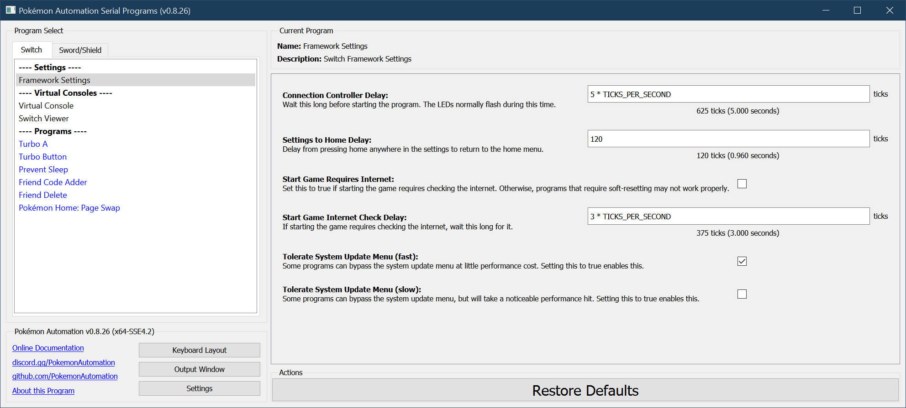

# Framework Settings

This is a list of global settings for the Nintendo Switch.

### Connection Controller Delay

After you plug in the controller, wait this long before starting the program. The LEDs will flash during this time.
The purpose of this is to indicate that the program is starting correctly.

***(The option is an artifact from the Microcontroller programs. It is currently not used in the Computer-Control programs.)***

### Settings to Home Delay

The delay from pressing home anywhere in the settings to return to the Switch home menu.

### Start Game Requires Internet

If a game is digital and not on the primary Switch, it need to check the internet to see if it's allowed to run.
Check this box if this is the case. Otherwise, programs that require soft-resetting may not work properly.

### Start Game Internet Check Delay

When the previous setting is enabled, wait this long for the internet check.

### Tolerate System Update Menu (fast)

When there is a system update available, it adds an extra prompt each time you start or re-enter a game. This prompt can break programs.

Some programs can bypass this update menu at little performance cost. Checking this box will enable this.

### Tolerate System Update Menu (slow)

When there is a system update available, it adds an extra prompt each time you start or re-enter a game. This prompt can break programs.

Some programs can bypass this update menu, but at little significant cost. Checking this box will enable this. This is disabled by default.

**Discord Server:** 

