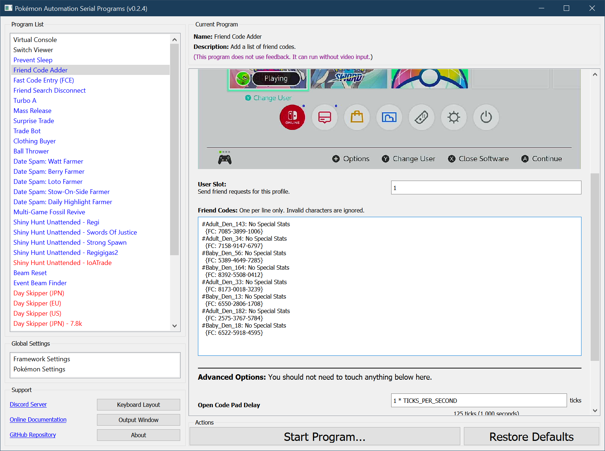
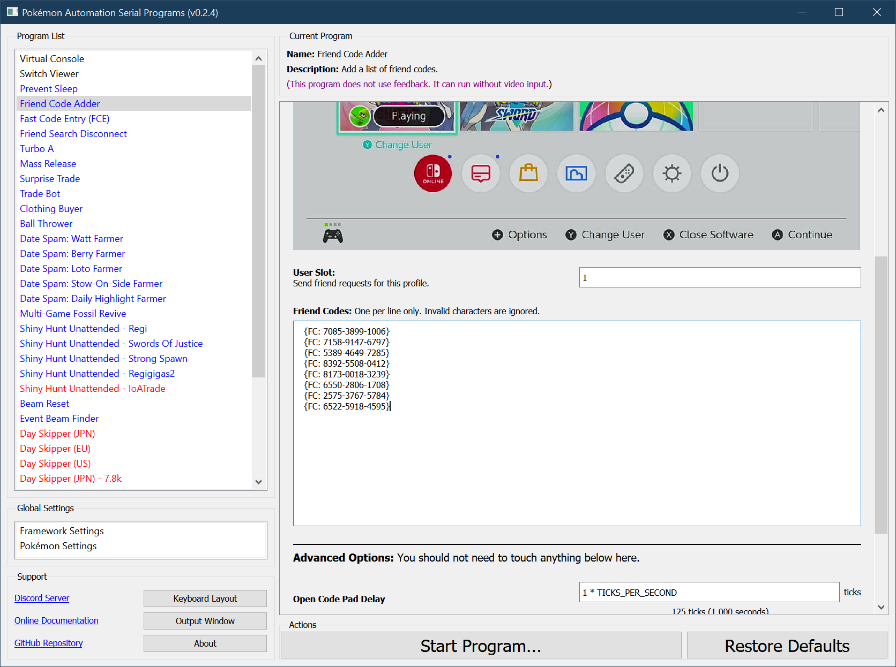

# Friend Code Adder

## Program Description

Quickly and easily add friend codes. Copy paste friend codes to the program and let it enter them for you.

[Demo Video.mov](https://cdn.discordapp.com/attachments/755635697737531544/810360426784227348/FriendCodeAdder.mov)

### Instructions

1. Copy-paste one or more friend codes into the text box. One per line only. The codes do not need to be formatted in a particular way. Any line with exactly 12 numbers will be considered a friend code. So you can realistically copy-paste entire Discord raid posts and the program will automatically pick out the friend code(s) for ultimate laziness.

2. Click away from the text box. The program will automatically remove all the invalid lines and leave behind only the ones that it thinks are friend codes. These friend codes are what the program will attempt to add when it you run it.

3. Select the [user slot](https://github.com/PokemonAutomation/Microcontroller/blob/master/Wiki/Programs/NintendoSwitch/UserSlotNumber.md) for the user you wish to add the friend codes to.
4. Start the program in game or the [Change Grip/Order Menu](https://github.com/PokemonAutomation/Microcontroller/blob/master/Wiki/Programs/NintendoSwitch/ChangeGripOrderMenu.md) depending on which option you choose.

> Note that this program will break if the Switch is in local connection when it enters the user profile. This will happen if the game is running and is in the overworld (where Y-COMM is accessible). If this is the case, you do actually need to start in the grip menu because that forces the Switch out of local connection mode. **Therefore, unlike the other serial programs, you cannot take the shortcut of starting this program in the Switch Home or inside a game.**

### Default Program Settings

After each friend code, the program will back out to the Switch Home before re-entering the profile for the next code. The purpose of this is to make the program tolerant to all of the following 3 scenarios.

- If the friend code has not been added, it will be requested. The program will then back out the Switch Home.
- If the friend code is already a friend, nothing bad will happen. The program will toggle the best friend status twice and then back out - thus leaving everything unchanged.
- If the friend code has already been requested but not accepted, nothing happens. The program will safely back out and move on to the next code.

This program runs slightly slower on the Arduino Uno R3. Due to the memory constraints of the Arduino, it uses a smaller (but slower) version of the fast code entry subroutine.

## Credits

- **Author:** Kuroneko/Mysticial

**Discord Server:** 

