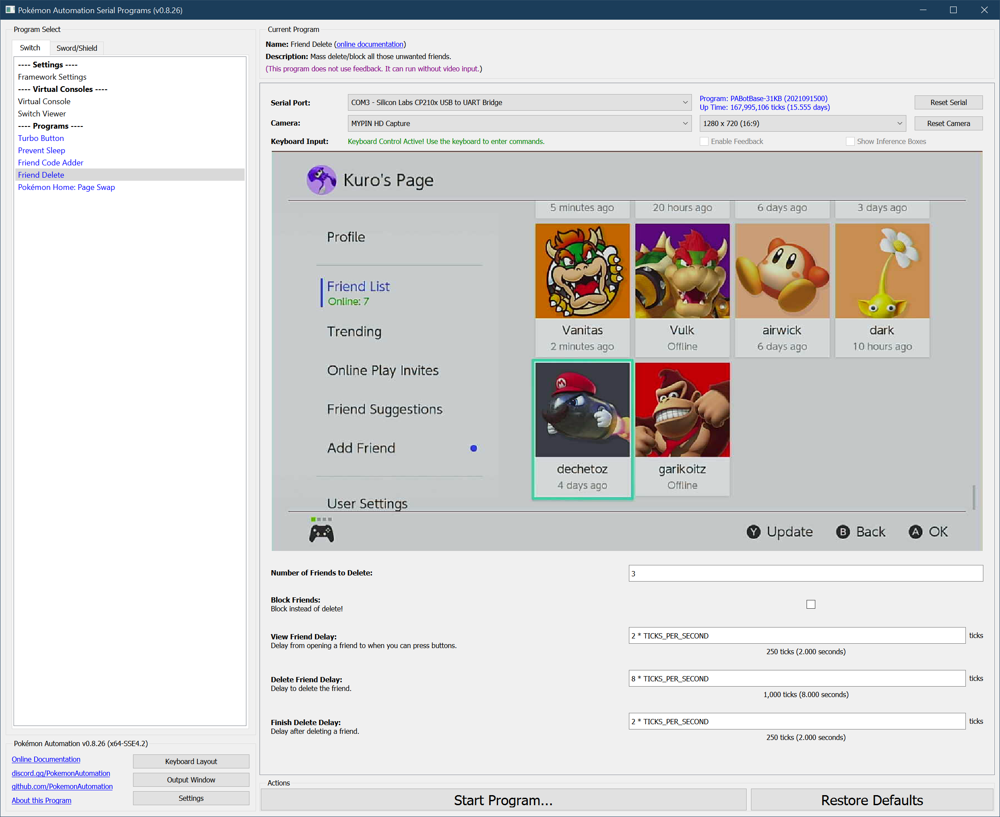

# Friend Delete

**Related Programs:**
- **Microcontroller:** [Friend Delete](https://github.com/PokemonAutomation/Microcontroller/blob/master/Wiki/Programs/NintendoSwitch/FriendDelete.md)
- **Computer Control:** [Friend Delete](https://github.com/PokemonAutomation/ComputerControl/blob/master/Wiki/Programs/NintendoSwitch/FriendDelete.md) (this program)

The microcontroller and computer-control versions of this program are functionally identical.

## Program Description

Delete or block from your friend list.

Once you’ve auto-hosted enough, your friend list is going to fill up. FriendDelete can clean it up.

### Instructions

> Please read these Implementation Notes carefully as you can easily delete friends you didn't intend to delete.

1. Mark all the friends you want to keep as "best" friend.
2. Go into a game that uses local connection such as Pokémon Sword/Shield. Make sure you're offline.
3. Return to your friends list. All your best friends will be sorted at the top regardless of who's online or not.
4. Scroll all the way to the bottom of your friends list.
5. With the cursor over the last person, start this program. The program will delete your friends one-by-one from the back of the list.
6. Once it has reached your "best" friends, stop the program.

### Implementation Notes:

Please note the following prior to use:
1. There is no way for the program to distinguish "best" friends from regular friends. Therefore you must either tell the program exactly how many to delete, or you must stop it manually.
2. There is also no way for the program to know when to stop aside from telling it exactly how many friends to delete. When you delete a friend, the cursor automatically moves to the next friend (or the previous if it was your last friend).

Therefore, the only way to feasibly auto-delete friends is to manipulate the sorting order of your friends to group all the ones you want to delete together. Then run the script on that group. Unfortunately, this requires the user to monitor the program while it's running since it's very easy to accidentally delete someone you didn't intend to.

The default sorting order of your friends list is:
1. Best friends who are online.
2. Normal friends who are online.
3. Best friends who are offline.
4. Normal friends who are offline.

However, you can trick it to sort all best friends first by enabling local communication (such as by going offline in Pokémon). This suppresses the online status of your friends when you first load it - thus forcing it to sort only by best friend status. As long as you don't press Y on your friends list or re-enter the friends list while online, it won't re-sort based on online status.

## Options

Most of the options here are self-explanatory. If your internet connection is slow, you can try adjusting the delays.

**Discord Server:** 

