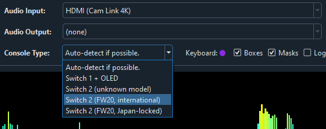
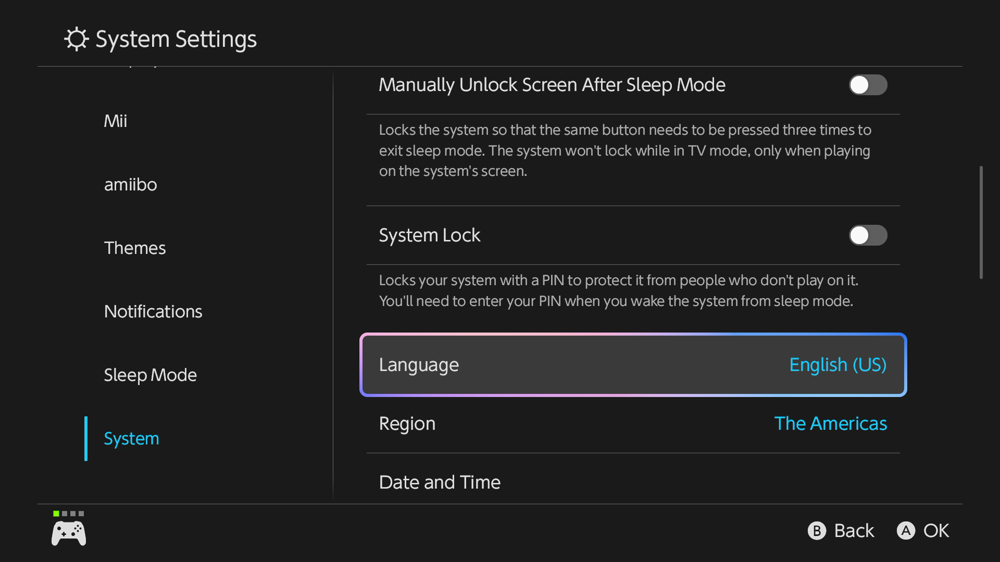
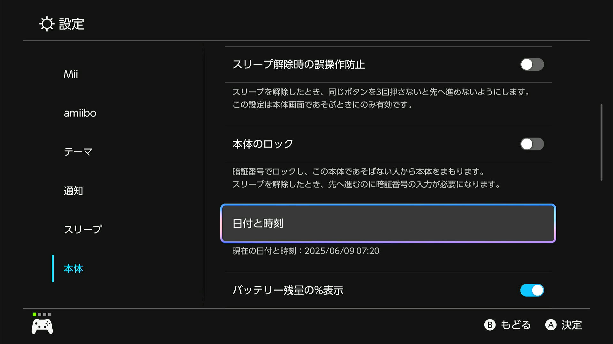
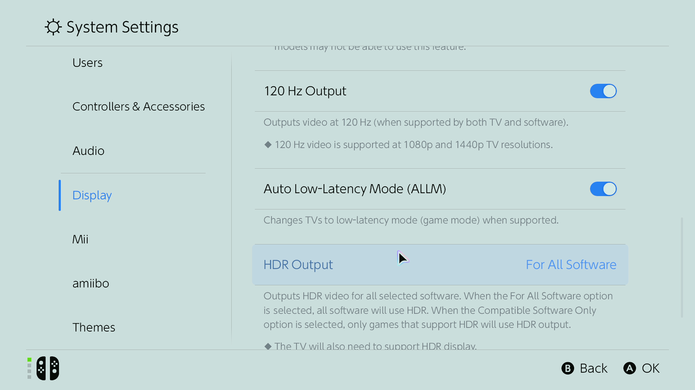

# Nintendo Switch 2 Support

Nintendo launched the Switch 2 in June 2025 and it completely turned this project upside down.
Nevertheless, we are in the process of fixing the project to work on Switch 2.

In the meantime, here are some notes regarding Switch 2 automation that will differ from Switch 1.

## General Setup Requirements

This is the tl;dr if you just want to know what settings to use for Switch 2.

**Common Settings:**
- Switch menu theme must be either light or dark theme.
- Colors should be normal, not greyscale or inverted.
- Text size should be normal. Not large.

**Other Settings:**
- For programs that reset the game, you must move the user profile to the 1st one (left-most slot).
- Some programs require specifying the Switch type. (Switch 1, Switch 2 international, Switch 2 Japan-locked)

## Switch 1 -> Switch 2 Differences

### Resetting a game moves the cursor to the 1st user profile.

This is perhaps the biggest (and most annoying) functional difference between Switch 1 and Switch 2.

- On the Switch 1, when you close and relaunch a game, the cursor stays on the same user profile that was previous playing.
- On the Switch 2, the cursor always moves to the 1st (left-most) user profile.

This breaks all programs that reset in-place unless the profile being used is already the 1st one.
Therefore, if you want to run a program that resets, you need to move the profile to the 1st one.

We are currently exploring ways to detect the running profile and automatically relaunch the same one.

### Japan region-locked Switches have different settings.

 

In the regular (international) Switch 2, there are options to set the Switch language and region.
However, these settings are missing in the Japan region-locked Switch 2s.

This affects programs that manipulate the date. Thus the program needs to know what Switch you have.

There are 3 different Switch setting layouts:
- Switch 1 (original and OLED have the same layouts)
- Switch 2: international
- Switch 2: Japan region-locked

Most programs can automatically detect which layout it is. But not always.
In cases where it fails, you will need to manually specify the Switch type in the dropdown.

Programs will stop and notify you in the following circumstances:
- You do not set the Switch type, the program needs to know and is unable to detect.
- You are not specific enough with the Switch type selection, the program needs to know and is unable to detect.
- Your selection conflicts with what the program has detected.

### Elgato capture cards do not play well with the Switch 2.

Numerous people have been reporting issues with Elgato capture cards. There is an entire reddit thread for this, the one that affects us the most is that colors can become extremely washed out. This causes problems for programs that do color-sensitive visual recognition.

Reddit Thread: https://www.reddit.com/r/elgato/comments/1l48p6g/megathread_switch_2_capture_or_streaming_issues/

In Elgato 4k Capture Utility settings:
- HDMI Color Range: Bypass
- Input EDID Mode: Display
- EDID (Internal): Default

Additionally, make sure to close the 4k Capture Utility before running programs.

### Switch 2 HDR may be problematic.

HDR has been known to cause some issues. But these are often in conjunction with Elgato cards. So more information is needed.

If using an HDR-capable card, we recommend turning it off in System Settings -> Display. Make sure to toggle the second HDR option (pictured below), as that controls the TV Output. (The first HDR option is for handheld mode.)
|HDR Off|HDR On|
|---|---|
|||

## For Developers

### System menus are generally slower.

On the Switch 1, it was possible to navigate all system menus at the rate of 24ms per action. This is no longer possible on Switch 2. While some menus retain their 24ms rate, others are much slower. In particular, numpad and keyboard scrolling now requires 48ms delay to be reliable - thus slowing down Fast Code Entry (FCE).

Some methods of simultaneous and overlapping button presses no longer work on the Switch 2 as it interprets them differently. Thus many optimizations that were developed for the Switch 1 no longer work on Switch 2. We have yet to figure out new methods specific to the Switch 2, though we are not confident they exist.

### The wired controller poll rate is no longer a constant 125 Hz.

For most of the history of this project (and many similar automation projects), we have used the AVR8 microcontrollers. The canonical method to issuing a fixed schedule of button presses with precise timings is to rely on the USB controller poll rate of 125 Hz or 8 milliseconds. Thus for every 125 times that the host (the Switch) requests a controller state, we know that exactly 1 second has elapsed. This 8 millisecond "tick" is precisely how the tick-based time unit evolved in both our MC and CC automation.

Both the Switch 1 as well as any computer will poll the controller at this steady 125 Hz. However, the Switch 2 has been observed to vary the poll rate between 125 Hz and 62.5 Hz. Needless to say, this broke our Arduino/Teensy controllers which we had to fix.

For developers, we now have 3 different controller setups with different minimum time units (tick size):
- Wired controller (Switch 1): 8ms
- Wired controller (Switch 2): 8ms or 16ms
- ESP32 Wireless (Switch 1 only): 15ms

The minimum time unit is the minimum amount of time between controller state changes. Meaning that if you press A, you cannot release it until at least 8ms later (for 8ms tick size). ESP32 increased it to 15ms. Now on Switch 2, it needs to be at least 16ms.

In the vast majority of cases, this does not matter since buttons need to be held down for at least ~40ms for the Switch to register it as a press. But for fast programs that use multiple buttons in parallel, you need to be careful that the implied state changes do not drop below 16ms in duration if you want it to be reliable across all systems.

**Discord Server:** 

