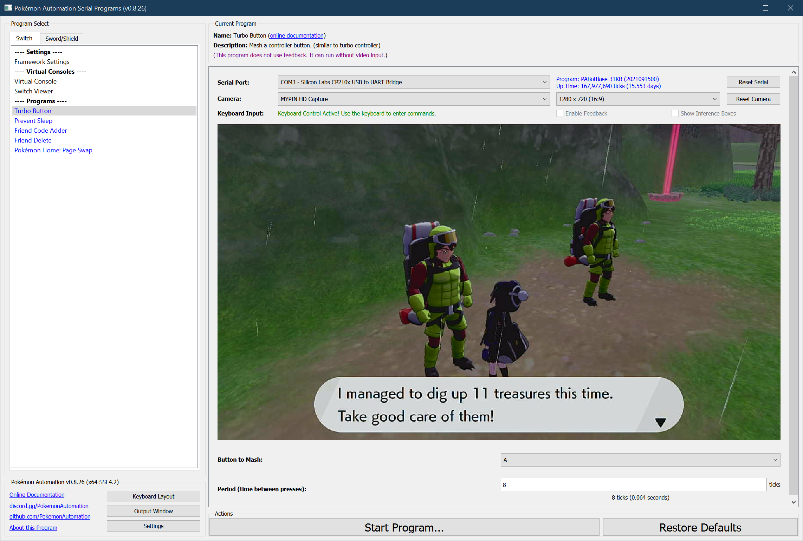

# Nintendo Switch: Turbo Button

## Program Description

TurboA does exactly what its name implies - it endlessly presses the button you've selected.

### Instructions

1. You are standing in front of what you want to mash the button.
2. Start the program in the game. Make sure the microcontroller is the primary controller.

## Options

Most of the options here are self-explanatory.

## Credits

- **Author:** Kuroneko/Mysticial

**Discord Server:** 

