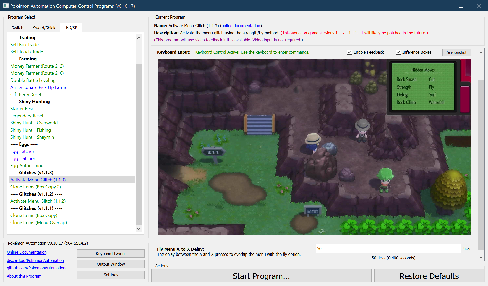

# Activate Menu Glitch (1.1.3)

***This glitch works on v1.1.1 - v1.1.3. It has been patched out in v1.2.0.***

See: [Version Preservation](VersionPreservation.md)

**Related Programs:**
- [Activate Menu Glitch (1.1.3)](ActivateMenuGlitch-113.md) (this program)
- [Activate Menu Glitch (1.1.2)](ActivateMenuGlitch-Poketch.md)
- [Clone Items (Box Copy Method 2)](CloneItemsBoxCopy2.md)

## Program Description

This program activates the menu glitch using the strength+fly method. It works on game version 1.1.3.

The method is described here: https://www.youtube.com/watch?v=bFKOP4hw3ls

This program can be used to setup the [item cloning program](CloneItemsBoxCopy2.md).

### Settings

**Game Settings:**
1. Text Speed: Fast

### Instructions

1. Your Pokémon is not following you.
2. You have the Strength HM.
3. Stand to the left side of the bolder on Route 211 as pictured above. (west of Celestic Town)
4. Face the bolder as pictured above.
5. Open the Pokétch and move the cursor over Fly.
6. Minimize the Pokétch, but keep it open (as in the picture above).
7. Start the program in the game.

The program will attempt to enable the menu glitch and fly to Celestic Town.

## Options

### Fly Menu A-to-X Delay

This is the delay from pressing A to open the fly dialog to pressing X to open the menu.

## Credits

- **Author:** Kuroneko/Mysticial

**Discord Server:** 

