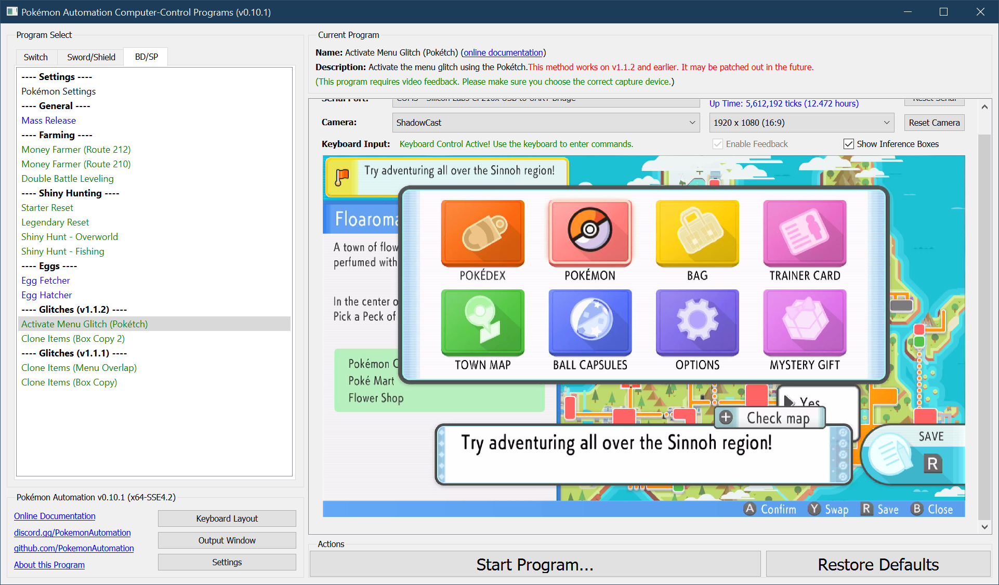
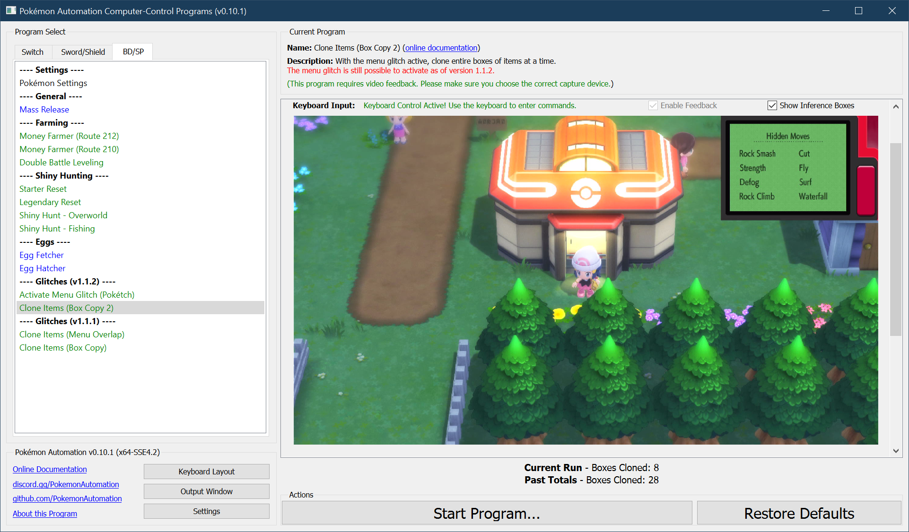
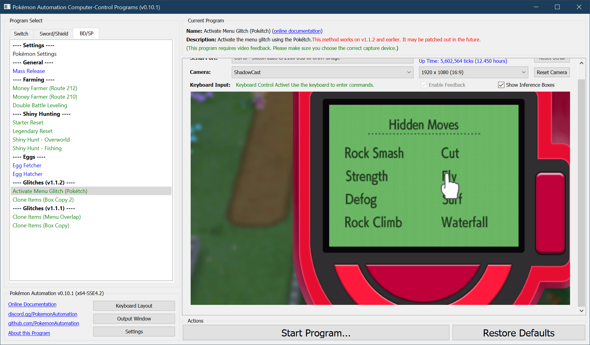

# Activate Menu Glitch (Pokétch)

***This glitch works as of version 1.1.2. But will likely be patched out in the near future.***

**Related Programs:**
- [Activate Menu Glitch (Pokétch)](ActivateMenuGlitch-Poketch.md) (this program)
- [Clone Items (Box Copy Method 2)](CloneItemsBoxCopy2.md)

## Program Description

This program activates the menu glitch using the Pokétch method. It works on game version 1.1.2.

The method is described here: https://www.youtube.com/watch?v=OGBPgeSsf-E

This program can be used to setup the [item cloning program](CloneItemsBoxCopy2.md).

### Settings

1. Text Speed: Fast

### Instructions

1. Stand in front of a Pokémon center.
2. The Pokémon center you choose cannot have any NPCs blocking the path to the escalator.
3. Your Pokémon is not following you.
4. Open the Pokétch and move the cursor over Fly.
5. Start the program in the game.

The program will attempt to enable the menu glitch. Then it will enter the Pokémon center and park in the ideal spot to run the cloning programs.

 

## Options

There are no options for this program.

**Discord Server:** 

