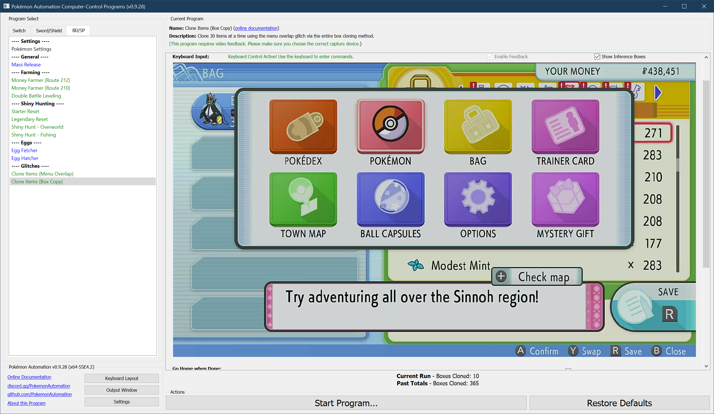
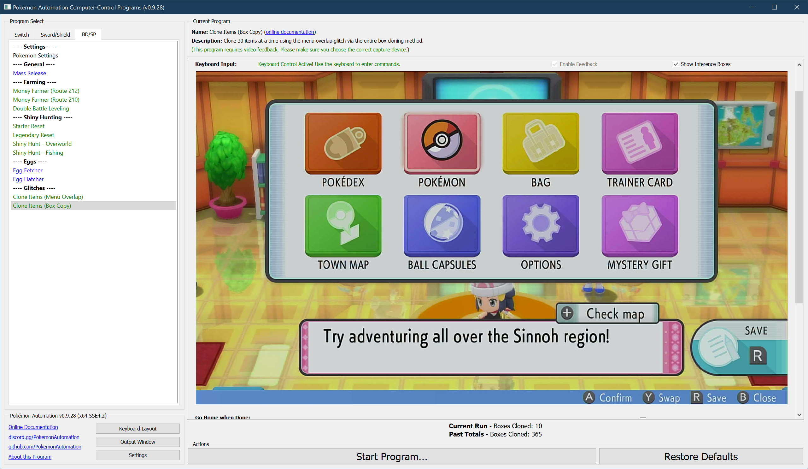

# Clone Items (Box Copy Method)

***This glitch only works on v1.1.1 and earlier. It has been patched out in v1.1.2.***

See: [Version Preservation](VersionPreservation.md)

**Related Programs:**
- [Clone Items (Box Copy Method 2)](CloneItemsBoxCopy2.md)
- [Clone Items (Box Copy Method)](CloneItemsBoxCopy.md) (this program)
- [Clone Items (Menu Overlap Method)](CloneItemsMenuOverlap.md)

## Program Description

Clone an entire box of items at a time using the method described here: https://www.youtube.com/watch?v=naHINKnWu7k

### Settings

1. Text Speed: Fast

### Box Setup

1. The current box is completely filled with 30 Pokémon.
2. All 30 Pokémon in the current box must be releasable.
3. The next box (to the right) is empty.

### Instructions

1. Setup your party and box like the above image:
2. You are indoors standing a place with no moving NPCs. (such as a Pokémon center)
3. Your cursor in the menu is over "Pokémon".
4. The menu is closed. (You're in the overworld with no menu open.)
5. Start the program in the game.

The program will trigger the overlap glitch, clone the current box, release the clones (which detaches items to your inventory), and repeat.

## Options

### Go Home when Done:

After the program finishes, go to the Switch Home to idle.

### Boxes to Clone:

Clone the box of items this many times.

**Discord Server:** 

