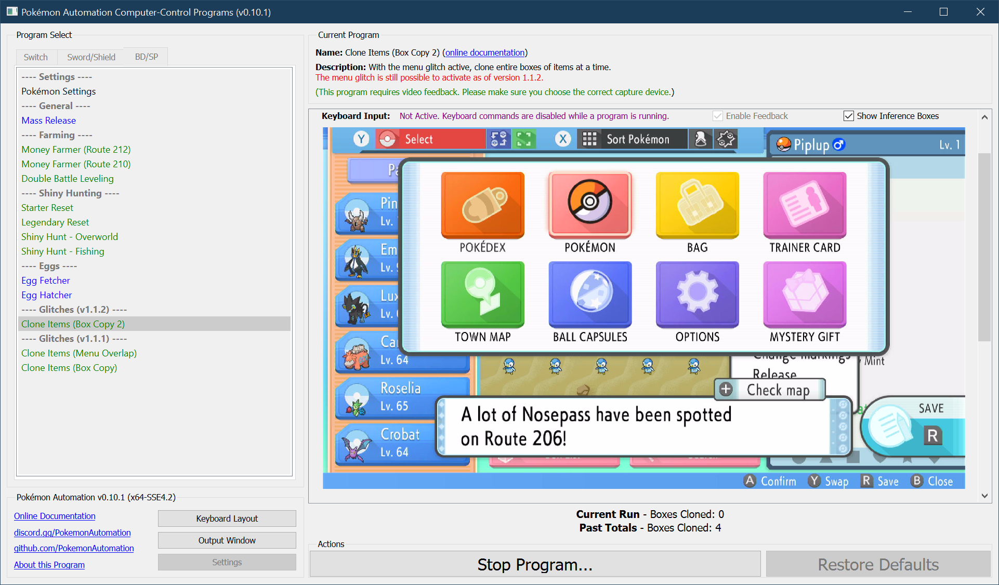
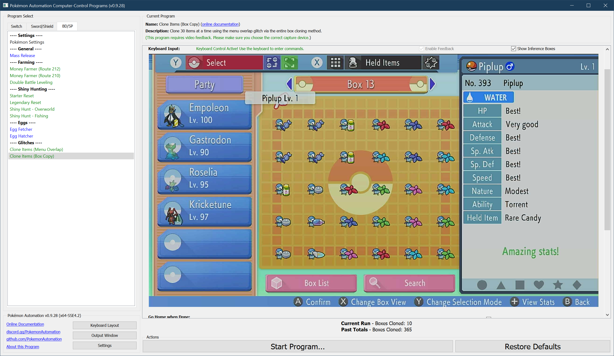
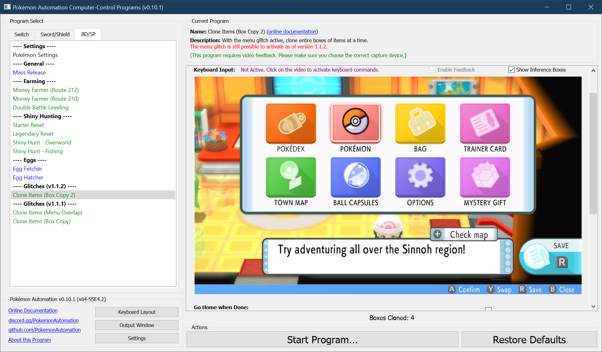

# Clone Items (Box Copy Method 2)

***This glitch worked as of version 1.1.2. It has been patched out in 1.1.3.***

See: [Version Preservation](VersionPreservation.md)

**Related Programs:**
- [Activate Menu Glitch (Pokétch)](ActivateMenuGlitch-Poketch.md)
- [Clone Items (Box Copy Method 2)](CloneItemsBoxCopy2.md) (this program)
- [Clone Items (Box Copy Method)](CloneItemsBoxCopy.md)
- [Clone Items (Menu Overlap Method)](CloneItemsMenuOverlap.md)

## Program Description

This an update version of the [cloning program](CloneItemsBoxCopy.md) that can be used on game version 1.1.2.

This program requires that the menu overlap glitch be already active. *How* you choose activate is the glitch is up to you (and dependent on the game version).

You can use [this program](ActivateMenuGlitch-Poketch.md) to help you activate the menu glitch on 1.1.2.

Relevant Videos:
- Original Box Clone Method: https://www.youtube.com/watch?v=naHINKnWu7k
- Version 1.1.2 Update: https://www.youtube.com/watch?v=OGBPgeSsf-E

(Note there is a slightly [faster method](https://www.youtube.com/watch?v=ZbNYA9PzCAw) to clone items.
However, this approach is harder to automate because the sequence breaks when your bag is full.)

### Settings

1. Text Speed: Fast

### Box Setup

1. The current box is completely filled with 30 Pokémon.
2. All 30 Pokémon in the current box must be releasable.
3. The next box (to the right) is empty.

### Instructions

1. Setup your party and box like the above image:
2. You are indoors and far away from anything that can be interacted with.
3. Your cursor in the menu is over "Pokémon".
4. The menu glitch is active with the menu open. (see below picture for the starting position)
5. Start the program in the game.

The program will enter the box system, clone the current box, release the clones (which detaches items to your inventory), and repeat.
Unlike the previous version of this program, it will not back out into the overworld and reactive the glitch.

## Options

### Go Home when Done:

After the program finishes, go to the Switch Home to idle.

### Boxes to Clone:

Clone the box of items this many times.

**Discord Server:** 

