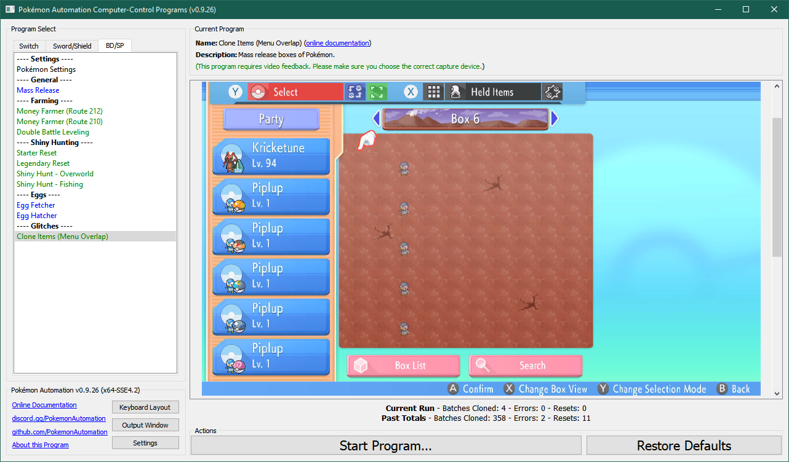
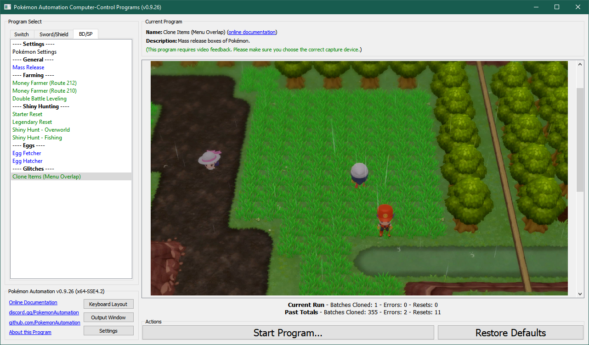

# Clone Items (Menu Overlap Method)

***This program is still in development and is not yet available.***

**Related Programs:**
- [Clone Items (Menu Overlap Method)](CloneItemsMenuOverlap.md) (this program)
- [Clone Items (Box Copy Method)](CloneItemsBoxCopy.md)

*The "Box Copy Method" is much faster and easier to setup. Thus there is little point in using this cloning program. The only reason this program exists is because it was made before the box copy method was discovered.*

## Program Description

Clone 5 items at a time using the menu overlap menu method described here: https://www.youtube.com/watch?v=IBDYRePk2qQ

### Settings

1. Text Speed: Fast

### Box and Party

1. Your lead Pokémon is always able to run away from encounters. (faster or holding Smoke Ball)
2. Your lead is either shiny, has high happiness, or has an activating ability.
   - This is needed to help delay the battle menu long enough for the program to swap the party.
3. The 5 other Pokémon in your party are all holding items which you wish to duplicate.
4. The first column in the current box is empty.
5. The second column in the current box is filled with throwaway Pokémon that will be destroyed/overwritten.

### Instructions

1. Setup your party and box like the above image:
2. You are standing in this specific grassy area in Route 212.
   - This location is always rainy and cloudy which helps the program identify the overworld.
   - The rain helps delay the battle menu long enough for the program to swap the party.
2. You are on foot. (not on your bike)
3. Your cursor in the menu is over "Pokémon".
4. Save the game.
5. Start the program in the overworld as pictured in the image.

The program will trigger the overlap glitch, then clone the 5 Pokémon in your party, detach their items, and continue.

## Options

### Go Home when Done:

After the program finishes, go to the Switch Home to idle.

### Batches to Clone:

Clone the items in your party this many times before stopping the program.

### Save Game Interval:

Save your game every this many batches. If zero, no saving is ever done.

This feature can be used to avoid losing progress when the program gets stuck on the black screen softlock.

**(This is a dangerous feature because saving the game while abusing a glitch can put your save file into a bad state. Do not use unless you have CFW backup to recover.)**

**Discord Server:** 

