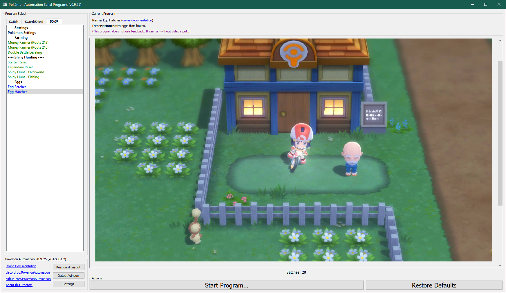

# Egg Autonomous

## Program Description

A fully autonomous bot that will fetch and hatch eggs and keep all the shinies that are hatched. It can also be configured to breed for IV spreads.

Unlike [Egg Fetcher](EggFetcher.md) and [Egg Hatcher](EggHatcher.md), this program can run completely unattended for many days without intervention.

**(insert image when available)**

### Setup of Settings

1. Text Speed: Fast
2. The "Send to Boxes" option must be set to "Automatic".
3. Nicknaming: Off
4. The menu cursor is over the Pokémon option.
5. The parents are already deposited at the daycare center.

**Strongly Recommended:**
- Masuda Method: The Pokémon in the daycare are of different languages.
- Have the Oval Charm.
- Have the Shiny Charm.
- Your lead Pokémon is a flame body (or similar) Pokémon.

### Party Setup

1. Your lead Pokémon is not an egg.
2. The rest of your party consists of 5 eggs.

**(insert image when available)**

### Pokémon Box Setup

1. Box 1 is full except for an empty 1st column.
2. The last box (bottom-right corner in the box view) has plenty of free spaces. This is where the kept babies will be deposited.
3. You are on Box 1.
4. The right panel is set to the IV Judge Panel. (you can also set it to the stats panel if you are not doing IV filtering)

**(insert image when available)**

### Required Parameters:

- The value of **Max Keepers** must be no greater than the number of free spaces in the last box. If the box fills up, the program will break!

### Run Instructions

1. You are on your bike and in high gear.
2. Stand in the following location.
3. Start the program.

**(update image when available)**

Once the program starts, it will immediately save the game (if [Error Recovery](#error-recovery) is enabled) and start spinning. It will periodically fetch eggs and hatch your entire party.

Once it has fetched 5 eggs and hatched all 5 eggs in your party, it will enter the box system and check each of the 5 babies in your party. Each baby is run through the [Actions Table](#actions-table). Depending on what conditions are matched, the baby will be either released, deposited into the last box, or the program will stop.

Once it has finished processing your party, it will withdraw the 5 eggs in the first column of Box 1 and continue.

## Options

### Go Home when Done:

After the program finishes, go to the Switch Home to idle.

### Game Language:

The language you are playing in. This is required only if you are doing IV filtering via the [Actions Table](#actions-table).

### Bike Shortcut:

This is the Dpad button that is used to quickly trigger the bike.

### Max Keepers:

Stop the program once it has kept this many babies. This value should be no greater than the number of free spaces in the last box.

### Travel Time per Fetch:

Spin on your bike for this long before attempting to fetch another egg.

### Error Recovery:

Pokémon BDSP is very prone to crashing.

When enabled, this option, will save the game at the start of the program and after baby that is kept.
That way if the game crashes or the program encounters some error, you won't lose too much progress.

### Actions Table:

This tables lets you specify the actions to perform on babies that meet a certain criteria.

By default, there is one action which is to keep all shinies. (deposit them into the last box)
But you can add more actions to keep babies of certain IV spreads. This is useful if you are still selectively breeding for perfect parents.

***If you are using any IV filters, the right panel in the box must be set to the IV Judge.***

**Discord Server:** 

