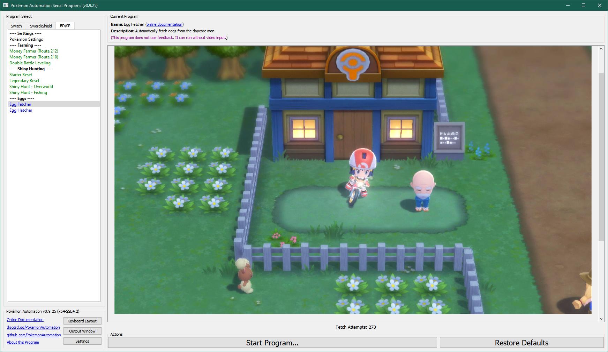

# Egg Fetcher

## Program Description

Fetch eggs into your boxes without hatching them.

This program is used with [EggHatcher](EggHatcher.md) to fetch and hatch eggs. Thus you first fetch a bunch of eggs with EggFetcher, then you hatch them with EggHatcher.

### Setup of Settings

1. Text Speed: Fast
2. The "Send to Boxes" option must be set to "Automatic".
3. The parents are already deposited at the daycare center.

**Strongly Recommended:**
- Masuda Method: The Pokémon in the daycare are of different languages.
- Have the Oval Charm.
- Have the Shiny Charm.

### Instructions

1. Your party is full and none are eggs.
2. You are on your bike and in high gear.
3. Stand in the following location.
4. Start the program.

## Options

### Go Home when Done:

After the program finishes, go to the Switch Home to idle.

### Fetch Attempts:

Make this many attempts to fetch an egg. The only reason to set this option is to avoid over-fetching of eggs and clogging up all your boxes.

### Travel Time per Fetch:

Spin on your bike for this long before attempting to fetch another egg.

**Discord Server:** 

