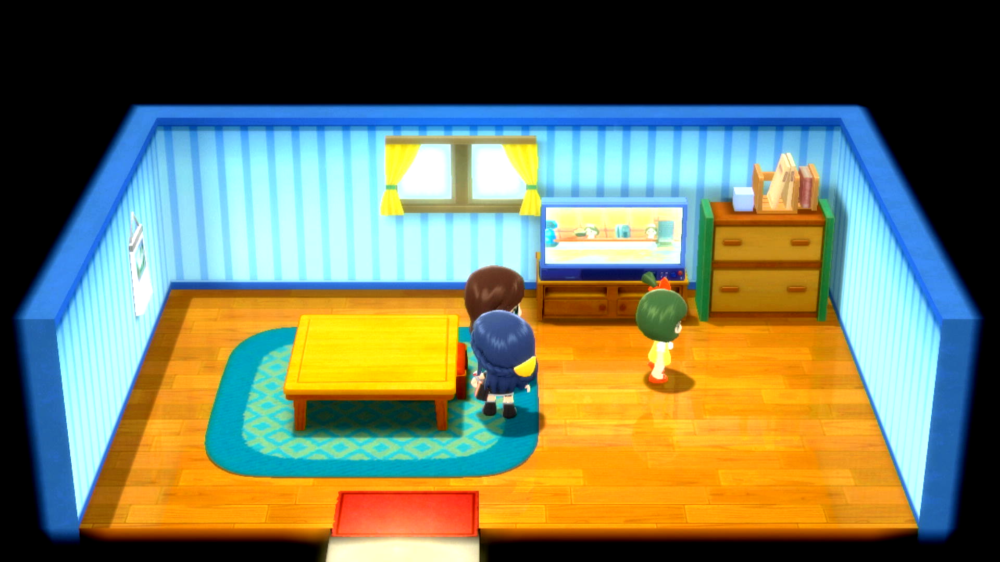

# Gift Berry Reset

## Program Description

Reset for a rare berry given by the berry NPC in Pastoria City.

### Setup of Settings

1. Screen size: Must be 100% within the Switch settings
2. Video Resolution: 1080p or higher in program settings
   > Text recognition is not reliable at low resolutions.
3. Text Speed: Fast

### Instructions

1. Stand facing the npc in her house.
3. Save the game.
4. Start the program in game. Make sure the device is the connected controller.

## Options

This program uses [**Tolerate System Update Menu (fast)**](/Wiki/Programs/NintendoSwitch/FrameworkSettings.md#tolerate-system-update-menu-fast) to bypass the system update window.

### Go Home when Done:

After finding a desired berry, go to the Switch Home to idle.

### Game Language:

The game language so that the program knows to do text recognition in which language.

If you are playing in an Asian language (Japanese, Korean, Chinese), set your video resolution to 1080p or higher. These languages are difficult to accurately read with text recognition at low resolutions.

### Berries:

The berries you would like to receive from the NPC. The program will stop if one of the selected berries is recognized. The following 20 berries are available from the NPC once a day. They include all 18 move-weaking berries and two retaliatory berries.

- Occa Berry
- Passho Berry
- Wacan Berry
- Rindo Berry
- Yache Berry
- Chople Berry
- Kebia Berry
- Shuca Berry
- Coba Berry
- Payapa Berry
- Tanga Berry
- Charti Berry
- Kasib Berry
- Haban Berry
- Colbur Berry
- Babiri Berry
- Chilan Berry
- Jaboca Berry
- Rowap Berry
- Roseli Berry

**Discord Server:** 

