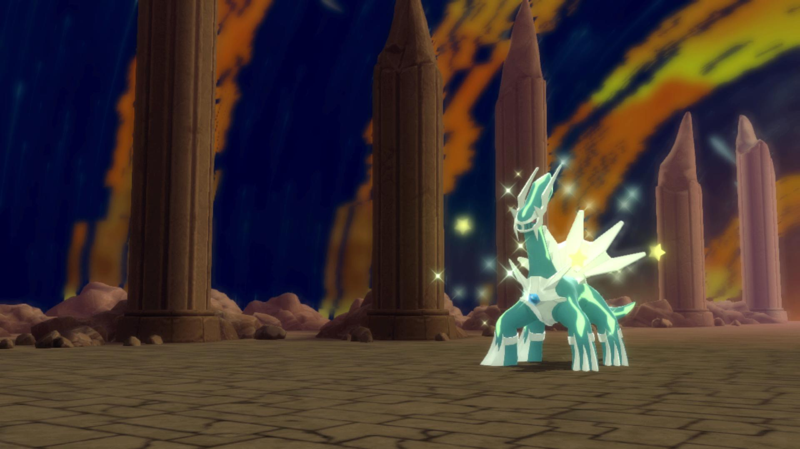

# Legendary Reset

## Program Description

Reset for a battleable shiny legendary.

This program works for:
- Dialga
- Palkia
- Uxie
- Azelf
- Heatran
- Regigigas
- Giratina
- Shaymin (use [the Shaymin Program](ShinyHunt-Shaymin.md) instead since it is faster)
- Arceus
- Darkrai
- All Ramanas Park Pokémon.

This program cannot be used to shiny hunt:
- Mesprit
- Cresselia

It is not known if this program works on:
- Drifloon
- Spiritomb
- Rotom

### Setup of Settings

1. Screen size: Must be 100% within the Switch settings
2. Video Resolution: 1080p or higher in program settings
   > Shiny detection and text recognition is not reliable at low resolutions.
3. Text Speed: Fast

### Setup of Party
1. Your lead Pokémon must not be shiny.
   > This may cause false positives if a capture card lags

### Instructions

1. Stand facing the legendary you will encounter.
2. If starting the encounter requires moving up, make sure the "Walk Up" option is enabled.
3. Save the game.
4. Start the program in game. Make sure the device is the connected controller.

## Options

This program uses [**Tolerate System Update Menu (fast)**](/Wiki/Programs/NintendoSwitch/FrameworkSettings.md#tolerate-system-update-menu-fast) to bypass the system update window.

### Go Home when Done:

After finding a shiny, go to the Switch Home to idle. Turn this off for unattended streaming so that your viewers can see the shiny.

### Game Language:

If set to a language, the program will attempt to read the name of each Pokémon you encounter and log it.

If you are playing in an Asian language (Japanese, Korean, Chinese), set your video resolution to 1080p or higher. These languages are difficult to accurately read with text recognition at low resolutions.

### Walk Up:

Walk up while mashing A to trigger the encounter.

### Use Sound Detection:

Whether to use sound detection to improve shiny detection robustness. Make sure you have proper audio input set.

## Credits

- **Author:** Kuroneko/Mysticial

**Discord Server:** 

