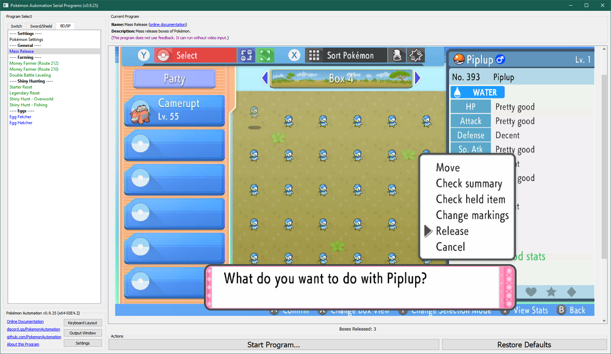

# Mass Release

**Related Programs:**
- **Microcontroller:** [Mass Release](https://github.com/PokemonAutomation/Microcontroller/blob/master/Wiki/Programs/PokemonBDSP/MassRelease.md)
- **Computer Control:** [Mass Release](https://github.com/PokemonAutomation/ComputerControl/blob/master/Wiki/Programs/PokemonBDSP/MassRelease.md) (this program)

The microcontroller and computer-control versions of this program are functionally identical.

## Program Description

MassRelease will release entire boxes of Pokémon. The main use case is getting rid of breedjects, non-shiny fossils, and other hunts.

### Setup of Settings

1. Text Speed: Fast
2. The "Send to Boxes" option must be set to "Automatic".

### Box Setup

1. Place entire boxes filled with Pokémon to be released consecutively.
2. All boxes marked for deletion must be full.
   1. This program does not tolerate partial boxes.

### Instructions

1. You must in the box system.
2. The cursor must be over the 1st Pokémon in the box. (top-left corner)
3. The cursor must be red. (not blue or green)
4. Start the program in game.

Once started, this program will release the specified number of boxes consecutively starting from the current box.

### Safety Recommendations:

See [Maximizing Switch Stability](https://github.com/PokemonAutomation/Microcontroller/blob/master/Wiki/Programs/NintendoSwitch/SwitchStability.md).

## Options

Most of the options here are self-explanatory.

## Credits

- **Author:** Kuroneko/Mysticial

**Discord Server:** 

