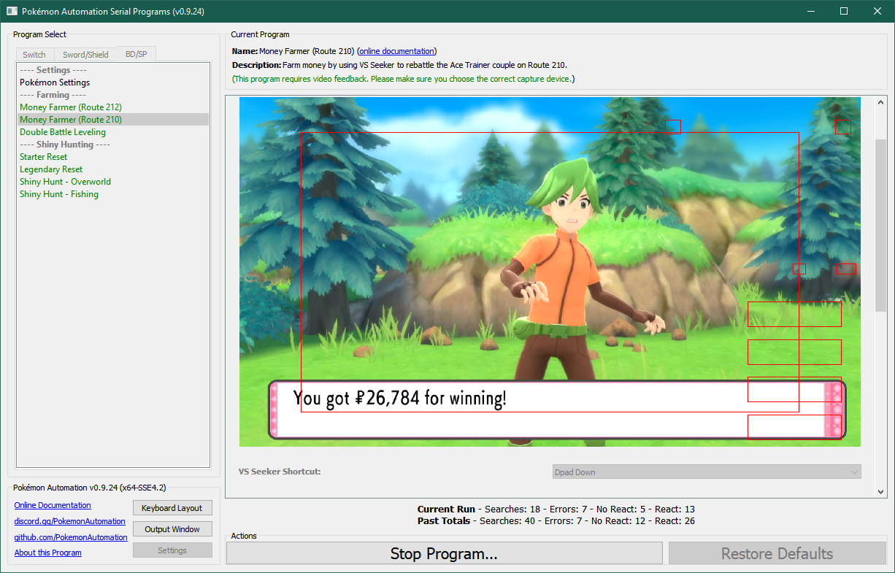
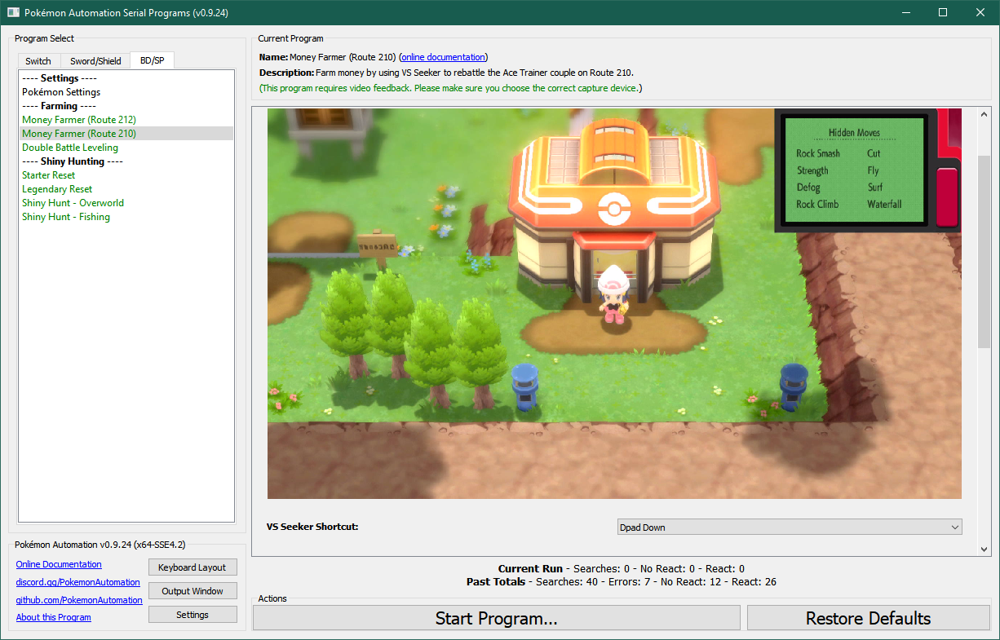
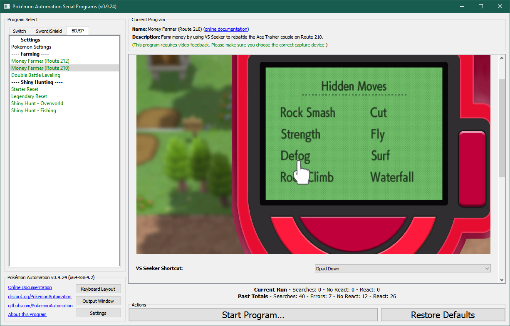

# Money Farmer (Route 210)

**Related Programs:**
- [Money Farmer (Route 212)](MoneyFarmerRoute212.md)
- [Money Farmer (Route 210)](MoneyFarmerRoute210.md) (this program)

## Program Description

Farm money by using the VS seeker to repeatedly battle trainer with high payout.

This version of the Money Farmer uses a higher paying trainer (double) battle on Route 210. But it is more complicated to set up.

### Setup of Settings

1. Screen size: Must be 100% within the Switch settings
2. Video Resolution: 1080p or higher in program settings
3. Text Speed: Fast

### Instructions

1. Beat all the trainers on Route 210 so they don't get in the way.
2. You have fly unlocked.
3. The HM Pokétch app is on and the cursor is over Defog.
3. You have the VS Seeker registered. (and the Dpad shortcut option correctly selected in the program)
4. Your two leading Pokémon are faster than both the opposing Pokémon.
5. Your two leading Pokémon must reliably win the battle in one turn by targetting the left* opponent. (consuming 1 PP each)
6. Every move that you intend to use must have the PP set properly in the program.
7. Make sure nobody in your party is at risk of leveling up and learning a move or evolving.
8. You are on foot. (not on your bike)
9. Your Pokémon is not following you.
10. Start the program in front of the Celestic Town Pokémon Center.

*This implies that your faster Pokémon must be able to OHKO the Gyarados and your slower one will OHKO the Raichu. (be aware of Raichu's Static ability)
Alternatively you can use a spread move that wipes out both as long as it doesn't hurt your other Pokémon.

Once started, the program will walk to the following locations on Route 210 and repeatedly battle the Ace Trainer pair.

 

## Options

### VS Seeker Shortcut:

This is the Dpad button that is used to quickly trigger the VS Seeker.

### Lead Pokémon Move 1/2/3/4 PP + 2nd Pokémon Move 1/2/3/4 PP

This the amount of PP for each of your Pokémon's moves.
If you don't wish to use a move, set the PP to zero. In all cases any 2 move combinations must be able to win the battle in one turn.

When the program runs out of PP for a move, it moves to the next move. When, either Pokémon runs out of PP, it flies back to Celestic Town to heal and return.

**Discord Server:** 

