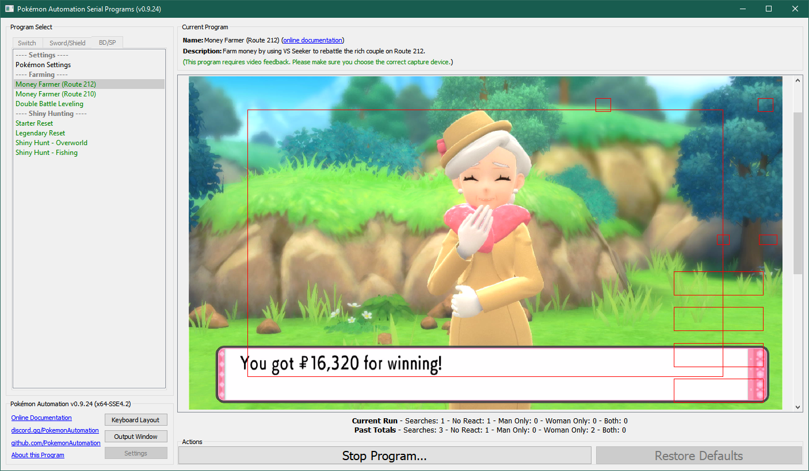
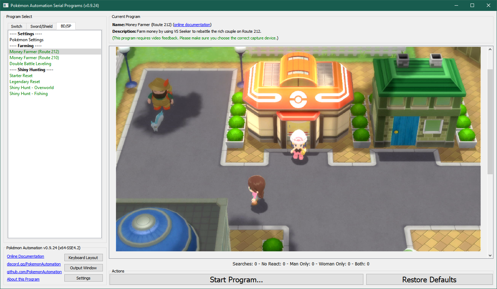
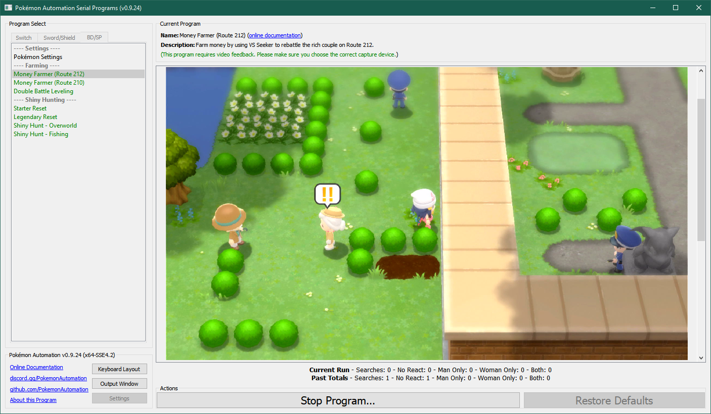

# Money Farmer (Route 212)

**Related Programs:**
- [Money Farmer (Route 212)](MoneyFarmerRoute212.md) (this program)
- [Money Farmer (Route 210)](MoneyFarmerRoute210.md)

## Program Description

Farm money by using the VS seeker to repeatedly battle a trainer with high payout.

This is essentially an automated version of: https://www.youtube.com/watch?v=9qN-fB6XX90

With the Amulet Coin, this program can max out your money at 999,999 in a couple hours.

### Setup of Settings

1. Screen size: Must be 100% within the Switch settings
2. Video Resolution: 1080p or higher in program settings
3. Text Speed: Fast

### Instructions

1. Beat all the trainers on Route 212 so they don't get in the way.
2. You have fly unlocked.
3. You have the VS Seeker registered. (and the Dpad shortcut option correctly selected in the program)
4. Your lead Pokémon is faster than the rich elderly couple's mons.
5. Every move that you intend to use must have the PP set properly in the program.
6. Every move that you intend to use must always OHKO the opponent mons.
7. Make sure nobody in your party is at risk of leveling up and learning a move or evolving.
8. You are on foot. (not on your bike)
9. Your Pokémon is not following you.
10. Start the program in front of the Hearthome City Pokémon Center.

**Recommended:** Have the Amulet Coin on your leading Pokémon for double the pay out.

Once started, the program will walk down to the following location in Route 212 and repeatedly battle the old woman.

## Options

### VS Seeker Shortcut:

This is the Dpad button that is used to quickly trigger the VS Seeker.

### Move 1/2/3/4 PP:

This the amount of PP for each of your lead Pokémon's moves.
If you don't wish to use a move, set the PP to zero. If you do wish to use a move, it must be able to OHKO the lady's Roselia.

When the program runs out of PP for a move, it moves to the next move. Once there is no PP left for all available moves, it flies back to Hearthome City to heal and return.

**Discord Server:** 

