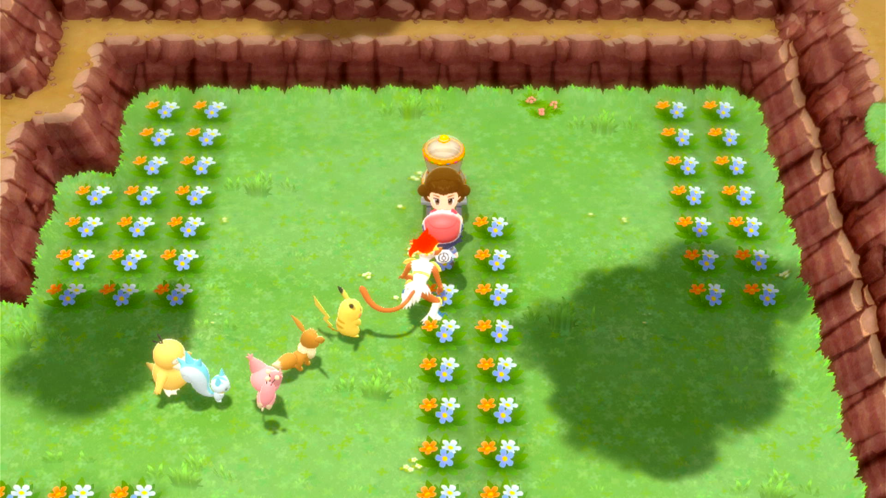

# Poffin Cooker

## Program Description

PoffinCooker is used to cook poffins with your Pokémon in Amity Square.

### Setup of Settings

1. Text Speed: Fast

### Instructions

1. Favorite the 4 berries you want to use for cooking. They have to be 4 distinct berries, otherwise the poffin will always be bad.
2. Enter the Amity Square with a party of 6 Pokémon that can go in the Amity Square. To get better poffins (lower sheen), it is **highly** recommended to have max friendship on all your party Pokémon.
3. Gather your 6 Pokémon and stand in the location shown below.
4. Start the program in game.

Once started, this program will repeatedly cook poffins with the first four berries of your inventory.

### Safety Recommendations:

See [Maximizing Switch Stability](https://github.com/PokemonAutomation/Microcontroller/blob/master/Wiki/Programs/NintendoSwitch/SwitchStability.md).

## Options

### Go Home when Done:

After finding a shiny, go to the Switch Home to idle. Turn this off for unattended streaming so that your viewers can see the shiny.

### Cook this many times:

This puts a limit on how many poffins you get. Since 4 berries are used each time, you get 4 identical poffins each time. Your poffin bag can only contain 100 poffins at a time, so you should never input more than 25 here.

## Credits

- **Author:** Baboul

**Discord Server:** 

