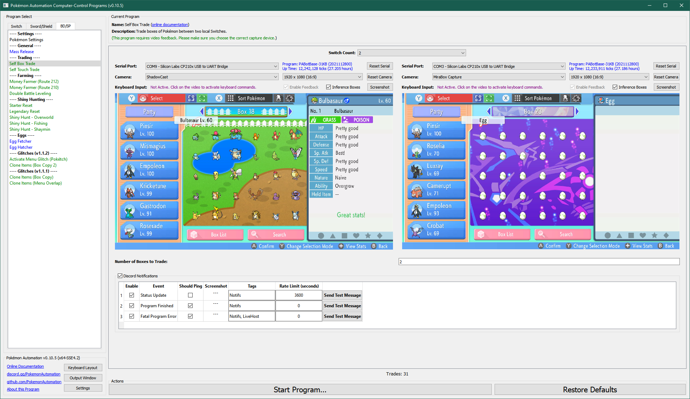

# Self Box Trade

**Related Programs:**
- [Self Box Trade](SelfBoxTrade.md) (this program)
- [Self Touch Trade](SelfTouchTrade.md)

## Program Description

Trade boxes of Pokémon between two Switches locally.

### Setup of Settings

**Switch Settings:**
1. Screen size: Must be 100% within the Switch settings

**Program Settings:**
1. Video Resolution: 1080p or higher

**Game Settings:**
1. Text Speed: Fast

### Box Setup

1. Both Switches have N boxes completely filled consecutively in the box system.
2. All Pokémon in these N boxes on both Switches must be tradable.
3. No Pokémon in these N boxes on both Switches will evolve on trade.

***Warning:** Kadabra will evolve into Alakazam even if it is holding an Everstone.*

### Instructions

1. The two Switches are in a trade together.
2. Both Switches are on the first (left-most) box of the N boxes that they will exchange.
3. The cursor on both Switches is on the top-left Pokémon in the box.
4. The cursor on both Switches is red. (not blue)
5. Start the program in the game.

Once started, the program will swap all the Pokémon in the N boxes on the two Switches.

## Options

### Number of Boxes to Trade:

Pretty self-explanatory.

## Credits

- **Author:** Kuroneko/Mysticial

**Discord Server:** 

