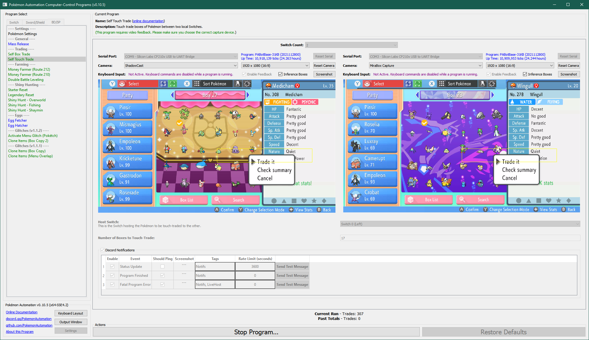

# Self Touch Trade

## Program Description

Touch trade boxes of Pokémon from a host Switch to a receiving Switch. The purpose is Pokédex filling without Pokémon Home connectivity.

### Setup of Settings

1. Screen size: Must be 100% within the Switch settings
2. Video Resolution: 1080p or higher in program settings
3. Text Speed: Fast

### Box Setup

**Hosting Switch:**

The hosting Switch is the Switch with all the Pokémon to be touch-traded.

1. The hosting Switch has N boxes completely filled consecutively in the box system.
2. All Pokémon in these N boxes on both Switches must be tradable.
3. No Pokémon in these N boxes on both Switches will evolve on trade.

***Warning:** Kadabra will evolve into Alakazam even if it is holding an Everstone.*

**Receiving Switch:**

1. The receiving Switch has one completely filled box.
2. All Pokémon in this box are tradable.
3. No Pokémon in these N boxes on both Switches will evolve on trade.

### Instructions

1. The two Switches are in a trade together.
2. The hosting Switch is on the first (left-most) box of the N boxes that they will exchange.
3. The receiving Switch is on the box that will be used to faciliate the touch trade.
4. The cursor on both Switches is on the top-left Pokémon in the box.
5. The cursor on both Switches is red. (not blue)
6. Start the program in the game.

Once started, the program will trade the first box to the receiving Switch, then trade the 2nd box on the host and receive the 1st box back and so on.
This will shift all the boxes on the host Switch to the left by one. Once all boxes have been touch traded to the receiving Switch, the host to rewind back to the first box and trade it back to the receiving Switch.

**Example:**

**Startind Position:**

Hosting Switch:
- Box A
- Box B
- Box C
- Box D

Receiving Switch:
- Box X

**After all boxes are touch traded:**

Hosting Switch:
- Box X
- Box A
- Box B
- Box C

Receiving Switch:
- Box D

**End of Program:**

Hosting Switch:
- Box D
- Box A
- Box B
- Box C

Receiving Switch:
- Box X

## Options

### Number of Boxes to Trade:

Pretty self-explanatory.

**Discord Server:** 

