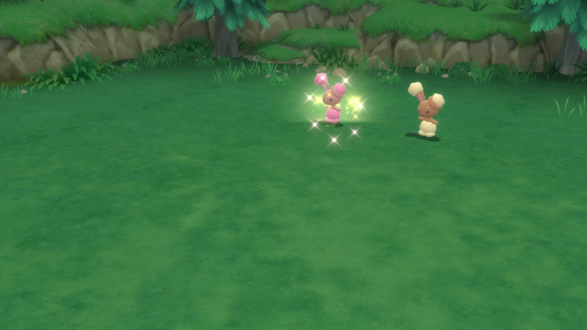

# Shiny Hunt - Overworld

## Program Description

This program will shiny hunt random encounters (grass, cave). It supports both single and double encounters.

This program does not work in the Grand Underground.

### Setup of Settings

1. Screen size: Must be 100% within the Switch settings
2. Video Resolution: 1080p or higher in program settings
   > Shiny detection and text recognition is not reliable at low resolutions.
3. Text Speed: Fast

### Setup of Party
1. Your lead Pokémon must be able to run away. (faster or holding Smoke Ball)

   > **Recommended for Performance**
   > - Your lead Pokémon is not shiny.
   > - Your lead Pokémon does not have high happiness.
   > - Your lead Pokémon does not have an ability that activates upon entry to battle.

### Instructions

1. Stand in a spot where you can move left/right or up/down forever and not wander off.
2. Make sure you are safe from getting attacked by trainers.
3. Start the program in game. Make sure the device is the connected controller.

## Options

### Go Home when Done:

After finding a shiny, go to the Switch Home to idle. Turn this off for unattended streaming so that your viewers can see the shiny.

### Game Language:

If set to a language, the program will attempt to read the name of each Pokémon you encounter and log it.

If you are playing in an Asian language (Japanese, Korean, Chinese), set your video resolution to 1080p or higher. These languages are difficult to accurately read with text recognition at low resolutions.

### Trigger Method:

Pick the one that's most appropriate for your location:

- Move left/right. (no bias)
- Move left/right. (bias left)
- Move left/right. (bias right)
- Move up/down. (no bias)
- Move up/down. (bias up)
- Move up/down. (bias down)

The "bias" will make it travel in that direction a little bit more. So if you're standing against a wall that's unbounded on the other wide, you'll want to bias in the direction of the wall to avoid drifting away from it.

### Move Direction:

Travel for this long before changing directions.

## Advanced Settings:
These are advanced settings. You shouldn't need to touch these unless something isn't working and you're trying to debug it yourself.

### Exit Battle Timeout:

After running, wait this long to return to the overworld. The program will resume before this time if it detects that that the battle has ended.

**Discord Server:** 

