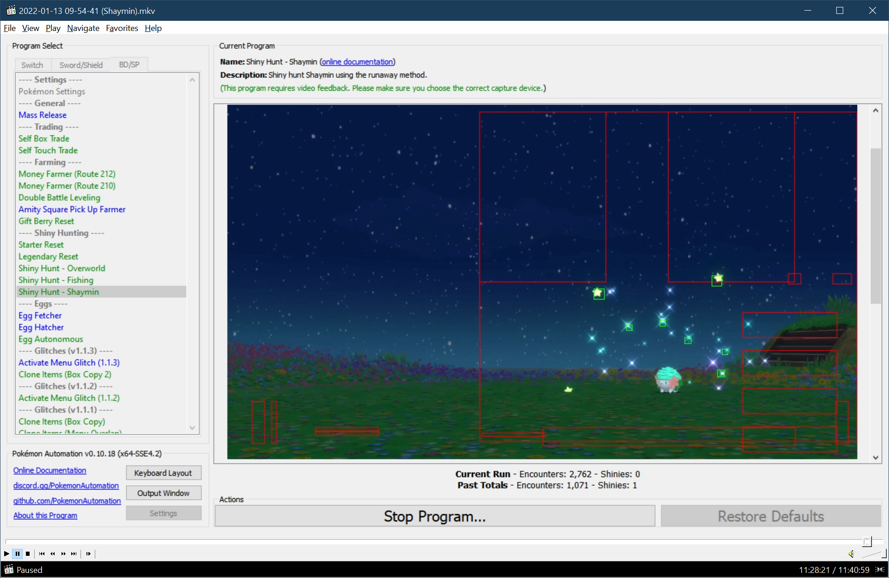

# Shiny Hunt - Shaymin

## Program Description

Shiny hunt Shaymin using the runaway method. This program is faster than [Legendary Reset](LegendaryReset.md).

### Setup of Settings

1. Screen size: Must be 100% within the Switch settings
2. Video Resolution: 1080p or higher in program settings
3. Text Speed: Fast

### Setup of Party
1. Your lead Pokémon must be able to run away. (faster or holding Smoke Ball)
2. Your lead Pokémon must not be shiny. (This may cause false positives if a capture card lags)
   > **Recommended for Performance**
   > - Your lead Pokémon does not have high happiness.
   > - Your lead Pokémon does not have an ability that activates upon entry to battle.

### Instructions

1. Stand in front of Shaymin on tile shown in example image below.
2. Start the program in game. Make sure the device is the connected controller.

## Options

### Go Home when Done:

After finding a shiny, go to the Switch Home to idle. Turn this off for unattended streaming so that your viewers can see the shiny.

### Use Sound Detection:

Whether to use sound detection to improve shiny detection robustness. Make sure you have proper audio input set.

### Stop On:

Choose when to stop the program. You can set Shiny, NonShiny, Anything or Nothing.

### Video Capture:

Whether to take a video of the encounter if it is a shiny.

## Advanced Settings:
These are advanced settings. You shouldn't need to touch these unless something isn't working and you're trying to debug it yourself.

### Exit Battle Timeout:

After running, wait this long to return to the overworld. The program will resume before this time if it detects that that the battle has ended.

## Credits

- **Author:** b0bness

**Discord Server:** 

