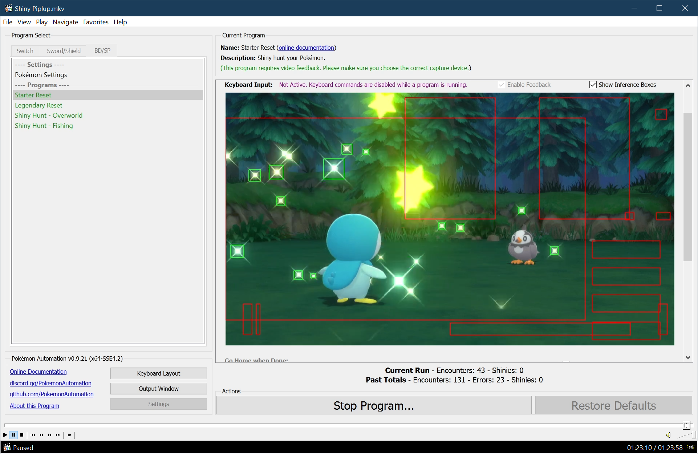

# Starter Reset

## Program Description

Reset for a shiny starter.

Demo Video: https://cdn.discordapp.com/attachments/755635697737531544/911525673414303744/2021-11-20_01-27-36.mp4

### Setup of Settings

1. Screen size: Must be 100% within the Switch settings
2. Video Resolution: 1080p or higher in program settings
3. Text Speed: Fast

### Instructions

1. Stand at the entrance of Lake Verity
2. Save the game.
3. Start the program in game. Make sure the device is the connected controller.

## Options

This program uses [**Tolerate System Update Menu (fast)**](/Wiki/Programs/NintendoSwitch/FrameworkSettings.md#tolerate-system-update-menu-fast) to bypass the system update window.

### Go Home when Done:

After finding a shiny, go to the Switch Home to idle. Turn this off for unattended streaming so that your viewers can see the shiny.

### Starter:

The starter you are picking.

**Discord Server:** 

