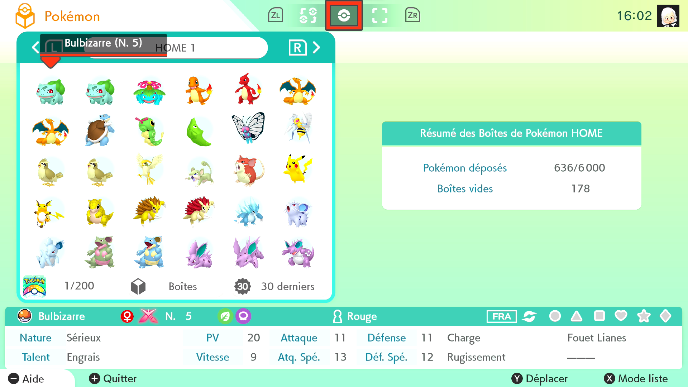

# Pokemon Home Box Sorter

## Program Description

Order boxes of Pokémon based on their national dex number.

This program will go through each pokemon summary page to check for their national dex number, it will avoid empty slots and go through empty boxes succesfuly if needed. Keep in mind that this program only rely on dex number recognition for now, if the program read the wrong number as it could happens sometimes, you will have to sort thoses remaining pokemons manually. The program will go through the number of boxes you have chosen by navigating to the right.

## Stats

This program is able to read one box in 20 seconds and able to sort one box in less than 1 minutes.

I successfuly sorted 18 boxes in 54 minutes with default settings.

## Preparation Instructions

1. Screen size: Must be 100% within the Switch settings
2. Video Resolution: 1280 x 720 or higher in program settings

## Instructions

1. Go to the first box you want to sort
2. Try the program with one box to figure out camera and game delay
3. Select the number of boxes you want to order

## Options

### Number of boxes to order:

This is the number of box the program will sort going to the right (the first box count in this number)

### Camera Delay:

This is the delay of your capture card, every capture card have some delay cheap ones tend to have more, you will have to run the program a bit to see what delay works best for you

### Game delay:

This is the pokemon home app delay, this delay need to be increased if you plan on doing a lot of boxes (10 is too low for more than 20), the more delay you put the slower the sort will be. 
Make sure to put some margin if you are not confident with the delay you have chosen

## Credits

- **Author:** Prismillon

**Discord Server:** 

