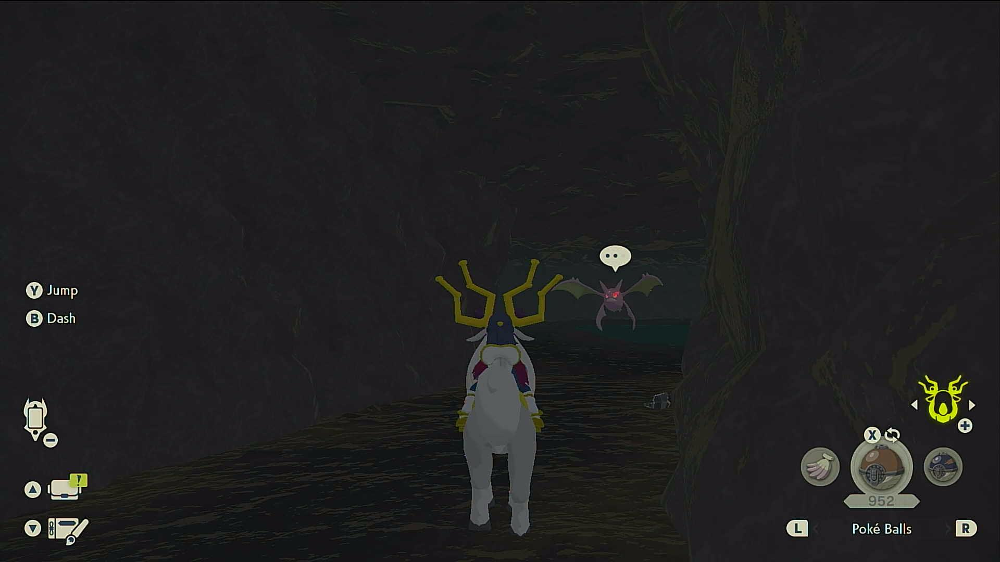
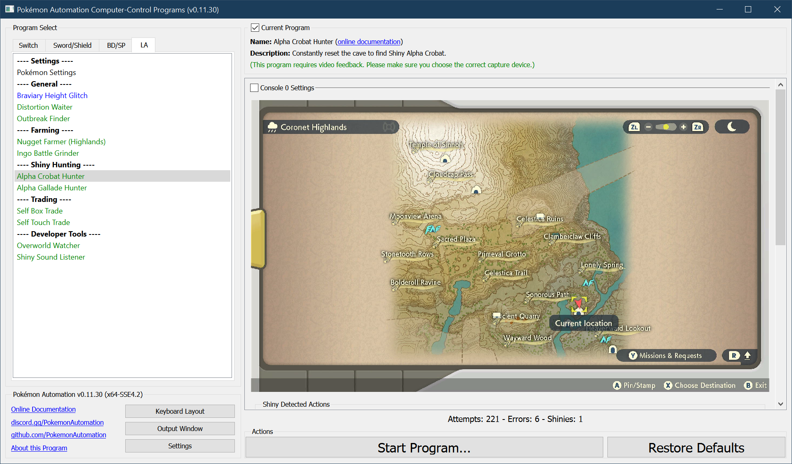
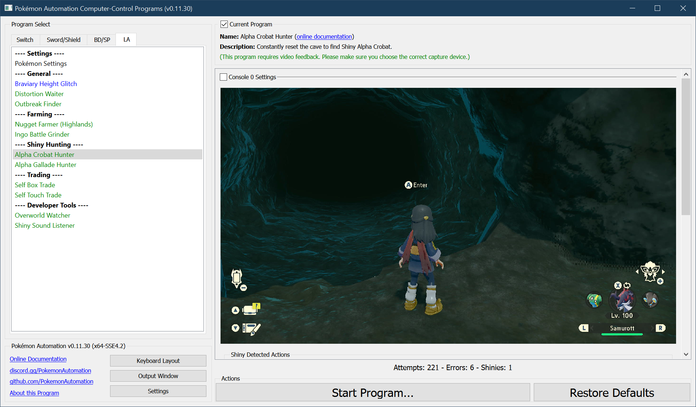

# Alpha Crobat Hunter

**Related Programs:**
- [Alpha Crobat Hunter](AlphaCrobatHunter.md) (this program)
- [Alpha Gallade Hunter](AlphaGalladeHunter.md)
- [Unown Hunter](UnownHunter.md) 
- [Froslass Hunter](AlphaFroslassHunter.md)
- [Tree Shiny Hunter](TreeShinyHunter.md)

## Program Description

Shiny hunt the alpha Crobat in the Snowpoint Temple using the method described here: https://www.youtube.com/watch?v=tz0b62pkKTk

This program uses audio recognition to detect shinies. And as such, it will also pick up shinies of anything on or near the path to the Crobat.
- Alpha Crobat
- Zubat
- Golbat
- Gible

It is not yet known if the path taken brings it close enough to Barboach or Whiscash.

Demo Video: https://cdn.discordapp.com/attachments/755635697737531544/949882362257375292/2022-03-05_22-10-08.mp4

### Settings

1. Screen size: Must be 100% within the Switch settings
2. Video Resolution: 1080p or higher in program settings
3. Audio input is properly setup.
4. Auto-save is off.

### Instructions

1. You have unlocked Braviary.
2. Stand at the north entrance of the Wayward Cave.
3. Face the cave and save the game.
4. Start the program in the game.

Make sure you have not entered the Wayward Cave during this visit to the Coronet Highlands.
The stats for everything in the cave are generated upon first entry to the cave.

If you run this program after having already entered the cave during this visit to the region, everything in the cave will be identical on each reset!

 

The program will repeatedly enter the cave, navigate to the alpha Crobat, and reset.
If the program finds a shiny, it still stop and go to the Switch home to freeze the game.

This program will stop on *any* shiny, not just the Crobat.

## Options

None specific to this program.

### Shiny Detected Actions

This program detects shinies by listening for the shiny sound. You can configure what the program should do if it hears a shiny.

**Shiny Detected Action:**
- Ignore the shiny. Do not stop the program.
- Stop program. Align camera for a screenshot. Then go Home.
- Stop program. Align camera for a screenshot + video. Then go Home.

**Screenshot Delay:**

If the above is set to stop on a shiny, the program will align the camera and wait X time to potentially allow the shiny to come into view of the camera.
This has no functional affect on the program. Don't set this value too large as some Pokémon will run away from you.

## Credits

- **Author:** denvoros

**Discord Server:** 

