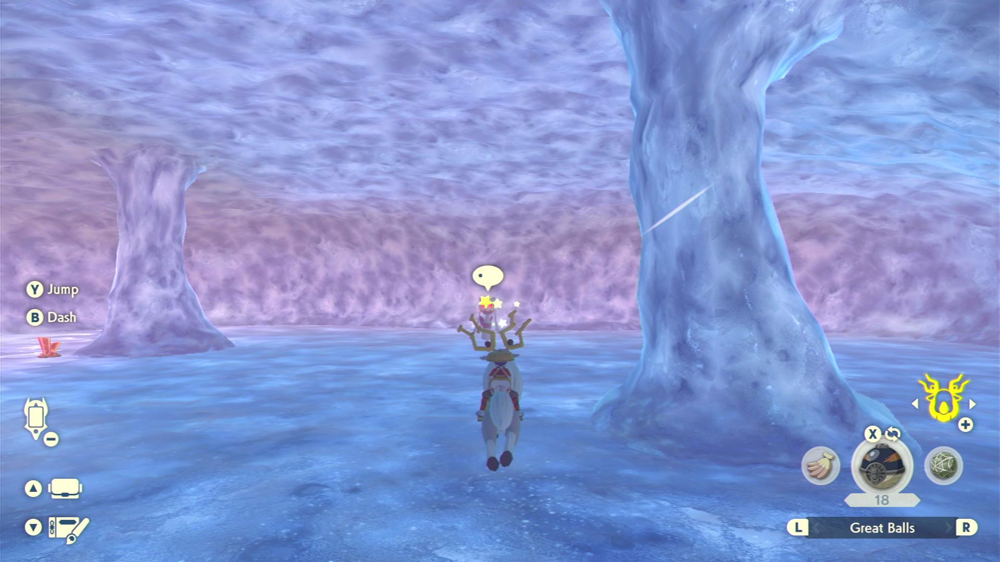

# Froslass Hunter

**Related Programs:**
- [Alpha Crobat Hunter](AlphaCrobatHunter.md)
- [Alpha Gallade Hunter](AlphaGalladeHunter.md)
- [Alpha Froslass Hunter](AlphaFroslassHunter.md) (this program)
- [Unown Hunter](UnownHunter.md)
- [Tree Shiny Hunter](TreeShinyHunter.md)

## Program Description

Goes from Jubilife Village to the Froslass Cave near Icepeak Arena to hunt for an Alpha Shiny.

This program uses audio recognition to detect shinies. And as such, it will also pick up shinies of anything on or near the path to the cave.

These are the Pokémon this program can shiny hunt:
- Alpha Froslass
- Misdreavus
- Snorunt
- Aipom
- Ambipom
- Lickitung
- Lickilicky
- Blissey
- Bergmite
- Dusclops (Night spawn)
- Glalie (outside, right on top of the cave you are)

Demo Video: https://cdn.discordapp.com/attachments/722200321916534876/959021096810737684/FroslassHunter.mp4

### Settings

**Switch Settings:**
1. Screen size: Must be 100% within the Switch settings
2. [Switch 2: The profile you are using must be the 1st (left-most) profile.](/Wiki/Programs/NintendoSwitch/Switch2Notes.md#resetting-a-game-moves-the-cursor-to-the-1st-user-profile)

**Program Settings:**
1. Video Resolution: 1080p or higher
2. Audio input is properly setup.

**Game Settings:**
1. Text Speed: Fast
2. Auto-save is off.

### Instructions

1. You have unlocked Braviary.
2. You have unlocked the Icepeak Arena waypoint.
3. You are in Jubilife city standing in the position pictured below.
4. Start the program in the game.

The program will loop through going from the village to Froslass's cave until a shiny is found, in case no shiny found it resets the game. 

**Notes:**

- If you using Discord notifications please bear in mind sometimes the screenshot won't show the shiny.
- Upon finding a shiny, the program will go back to home screen. Go back to game and save before attempting to catch the shiny. 

## Options

### Enroute/Destination Shiny Action

This program detects shinies by listening for the shiny sound. You can configure what the program should do if it hears a shiny.

There are two of these options - one for enroute, and one for the destination. Thus you can customize the behavior - such as ignoring shinies while enroute.

**Shiny Detected Action:**
- Ignore the shiny. Do not stop the program.
- Stop program. Align camera for a screenshot. Then go Home.
- Stop program. Align camera for a screenshot + video. Then go Home.

**Screenshot Delay:**

If the above is set to stop on a shiny, the program will align the camera and wait X time to potentially allow the shiny to come into view of the camera.
This has no functional affect on the program. Don't set this value too large as some Pokémon will run away from you.

## Credits

- **Author:** lcaroto

**Discord Server:** 

