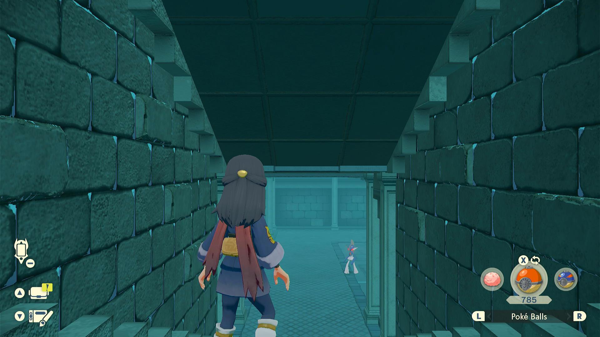
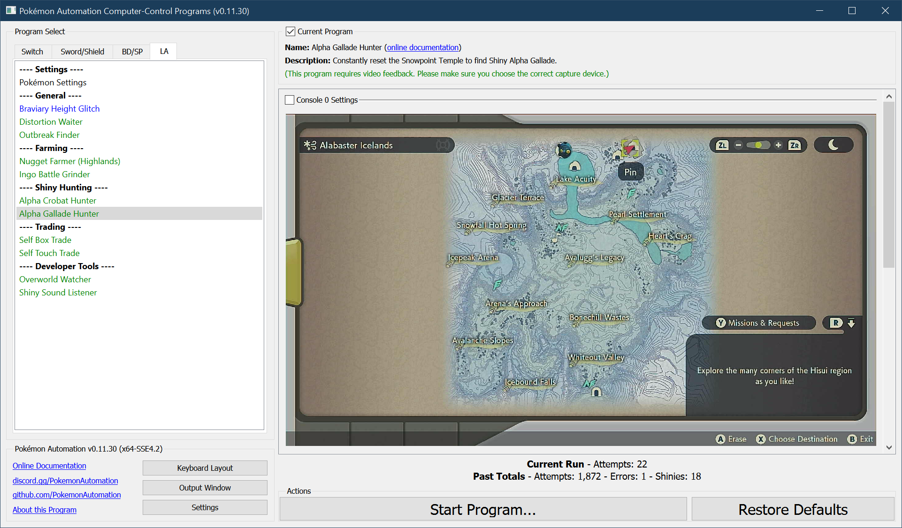
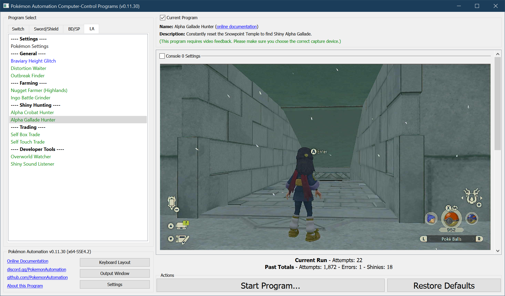

# Alpha Gallade Hunter

**Related Programs:**
- [Alpha Crobat Hunter](AlphaCrobatHunter.md)
- [Alpha Gallade Hunter](AlphaGalladeHunter.md) (this program)
- [Alpha Froslass Hunter](AlphaFroslassHunter.md)
- [Unown Hunter](UnownHunter.md)
- [Tree Shiny Hunter](TreeShinyHunter.md)

## Program Description

Shiny hunt the alpha Gallade in the Wayward Cave using the method described here: https://www.youtube.com/watch?v=tz0b62pkKTk

This program uses audio recognition to detect shinies. And as such, it will also pick up shinies of anything on or near the path to the Gallade.

This list of Pokémon this program can shiny hunt are:
- Alpha Gallade
- Ralts
- Kirlia
- Zubat
- Golbat
- Bronzong

Demo Video: https://cdn.discordapp.com/attachments/755635697737531544/950125812273782844/2022-03-06_06-42-37.mp4

### Settings

**Switch Settings:**
1. Screen size: Must be 100% within the Switch settings
2. [Switch 2: The profile you are using must be the 1st (left-most) profile.](/Wiki/Programs/NintendoSwitch/Switch2Notes.md#resetting-a-game-moves-the-cursor-to-the-1st-user-profile)

**Program Settings:**
1. Video Resolution: 1080p or higher
2. Audio input is properly setup.

**Game Settings:**
1. Text Speed: Fast
2. Auto-save is off.

### Instructions

1. You have unlocked Braviary.
2. Use the [Braviary Height Glitch](BraviaryHeightGlitch.md) program to reach the roof of the Snowpoint Temple on the outside.
3. Stand at the roof entrance of the Snowpoint Temple.
4. Face the entrance and save the game.
5. Start the program in the game.

Make sure you have not entered the Snowpoint Temple during this visit to the Coronet Highlands.
The stats for everything in the cave are generated upon first entry to the cave.

If you run this program after having already entered the cave during this visit to the region, everything in the cave will be identical on each reset! Therefore you are ***required*** to use the Braviary height program to reach the roof entrance without going through the temple!

 

The program will repeatedly enter the temple, navigate to the alpha Gallade, and reset.
If the program finds a shiny, it will stop and go to the Switch home to freeze the game.

This program will stop on *any* shiny, not just the Gallade.

**Notes:**

- The program will hear shinies from a different floor of the temple. So if you can't find it, go deeper into the temple to find it. This applies to Zubat, Crobat, and Bronzong.
- The Ralts/Kirlia that spawns next to the alpha Gallade really likes to run away. Recommend saving the game immediately after re-entering the game.

## Options

### Enroute/Destination Shiny Action

This program detects shinies by listening for the shiny sound. You can configure what the program should do if it hears a shiny.

There are two of these options - one for enroute, and one for the destination. Thus you can customize the behavior - such as ignoring shinies while enroute.

**Shiny Detected Action:**
- Ignore the shiny. Do not stop the program.
- Stop program. Align camera for a screenshot. Then go Home.
- Stop program. Align camera for a screenshot + video. Then go Home.

**Screenshot Delay:**

If the above is set to stop on a shiny, the program will align the camera and wait X time to potentially allow the shiny to come into view of the camera.
This has no functional affect on the program. Don't set this value too large as some Pokémon will run away from you.

*This program uses a default delay of zero to minimize the chance of the Ralts/Kirlia in the same room as the Gallade from running away.*

## Credits

- **Author:** denvoros

**Discord Server:** 

