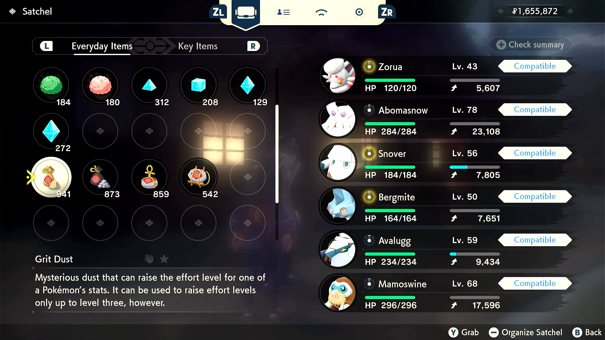

# Apply Grits

## Program Description

This program will apply Grit items on your party Pokémon to level up their Grit level to 10 on all six stats.

### Settings

**Game Settings:**
1. Text speed is fast.

### Instructions

1. Place the party Pokémon you wish to apply Grit items on before the other Pokémon in the party.
The program applies on Pokémon in the party order.
2. You have enough Grit Dust, Grit Gravel, Grit Pebble and Grit Rock in your satchel.
The program may use at most 108 Grit Dust, 108 Grit Gravel, 108 Grit Pebble and 36 Grit Rock in a single run.
3. Order your Grit items shown in the picture below.
4. Stay in the item menu. Move the cursor onto Grit Dust as shown in the picture.
5. Start the program in the game.

The program will apply each Grit item onto the party Pokémon in the party order.
The number of Pokémon is controlled by the option **Num Pokémon to Apply Grits**.

Since it's a non-feedback program, it may try to use the items onto a stat that cannot be applied any more. But this will not break the program.

## Credits

- **Author:** Gin

**Discord Server:** 

