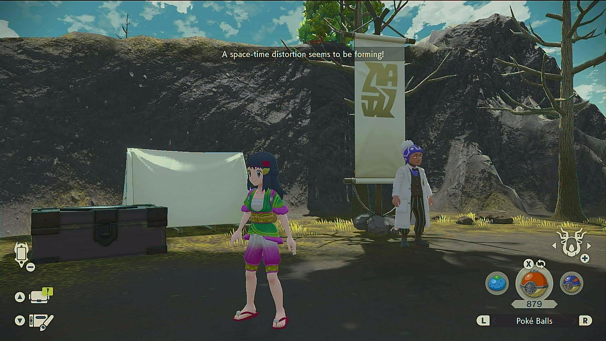

# Distortion Waiter

## Program Description

This program waits for a space-time distortion to occur, then notifies the user.

Once they are unlocked, distortions take at most 40 minutes to appear even if you are doing nothing.

### Settings

**Switch Settings:**
1. Screen size: Must be 100% within the Switch settings

**Program Settings:**
1. Video Resolution: 1080p or higher
2. Game Language is set correctly. This program needs to read the notification!

### Instructions

1. Have distortions unlocked. (2 star rank or higher)
2. You are in a map that spawns distortions. (Not Jubilife or Ancient Retreat)
3. Stand in a safe place where you cannot get attacked.
4. Start the program in the game.

The program will do nothing and wait until a distortion appears. Then it will go the Switch Home and notify the user using the Discord notifications.

## Options

### Game Language

This is the language you are playing in. This needs to be set correctly or the program will not be able to read the notifications.

## Credits

- **Author:** Kuroneko/Mysticial

**Discord Server:** 

