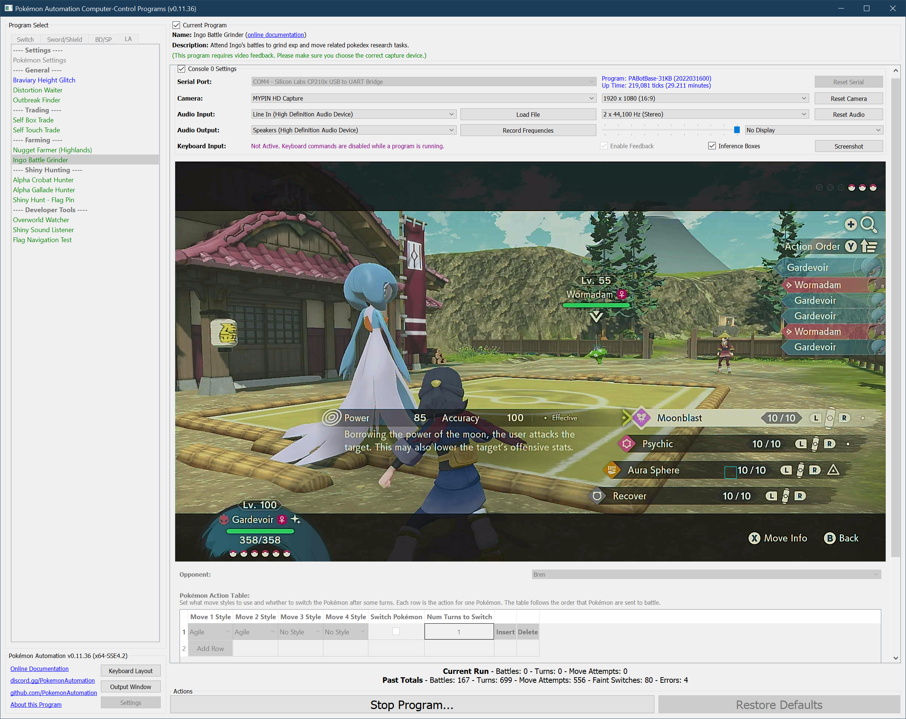
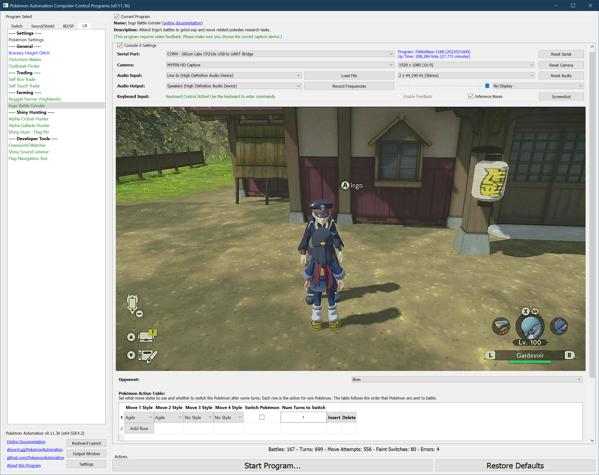

# Ingo Battle Grinder

**Related Programs:**
- [Ingo Battle Grinder](IngoBattleGrinder.md) (this program)
- [Ingo Move Grinder](IngoMoveGrinder.md)

## Program Description

Grind exp, Pokédex research tasks and Pokémon evolve requirements from Ingo's regular battles.

This program will repeatedly attend Ingo's regular battles, send Pokémon to battle with specified move styles and switches. The difference with Ingo Move Grinder is that it will be very inefficient at farming Pokédex research tasks BUT it will allow you to focus more on getting experience, money, evolving Pokémon, etc.

This program works on game version 1.0 and later.

### Settings

**Switch Settings:**
1. Screen size: Must be 100% within the Switch settings

**Program Settings:**
1. Video Resolution: 1080p or higher

**Game Settings:**
1. Text Speed: Fast

### Instructions

1. If your game version is the same or higher than 1.1.0, you have unlocked the battle mode dialogue from Ingo. In this dialogue you can choose between Regular Pokémon battles, Path of Tenacity, Path of Solitude and Select Pokémon.
2. You have unlocked all Ingo's regular battles. If your game version is the same or higher than 1.1.0, check this Serebii [page](https://www.serebii.net/legendsarceus/ingobattles.shtml) for a complete list of all regular battles.
3. Stand in front of Ingo.
4. Start the program in the game.

The program will repeatedly talk to Ingo. It will choose an battle opponent according to the option. You can specify what styles you want to use on each move. You can also specify whether to switch the current Pokémon after a certain number of turns to keep the Pokémon alive (to gain exp or accumulate recoil damage for evolving Basculin).

The program will always start with using the first move from the four move slots. When a move has no PP, the program will move to the next move when it finds the move selection menu is not closed in time.

The first Pokémon sent to battle is always the Pokémon you selected in the bottom right corner of the screen in the overworld.
When a Pokémon is switched out either due to fainting or user input, the program will try to send a Pokémon from the party to battle, in the same order as the party list. When a fainted Pokémon is selected to send out, the program will find out it cannot be sent and move to the next Pokémon in the party.

The program will report the number of battles, number of turns, number of lead Pokémon's move use attempts before any fainting/switching and number of Pokémon switches due to fainting.

**Warning:**

If a Pokémon is fainted when battle ends, it will not receive exp. If you aim to grind exp, make sure your Pokémon are strong enough to defeat the opponent and the Pokémon you want to grind exp is alive when battle ends.

If you aim to grind move and style usages, make sure your Pokémon are fast or bulky enough so that they can at least use one move during battle.

**Example usages:**
- Grind move usage and style usage research tasks for your high-level Pokémon:
  
  Beat an easy opponent like Wenton, Bren or Ress repeatedly with required move styles. Put the move to grind as the first move and select the proper style. If the move has few PPs, you can grind the research tasks of the second move after the program uses all PPs of the first move. You can also collect small amount of exp for the rest of your party.

  You can set the program to stop battling after trying a certain number of moves. Enable this by checking the cell **Limit Move Attempts** and fill in a proper number in the cell **Max Move Attempts**.

- Grind exp on Ingo - but tougher:
  
  Tougher Ingo uses six level 75+ Pokémon which provide lots of exp. Use level 95+ Arceus with the legend plate to finish five of his six Pokémon most of the time. Use two of your strong Pokémon to finish Ingo's remaining ones. The rest three Pokémon in your party will receive lots of exp each battle.

- Evolve Basculin:
  
  First Level up Basculin to level 60+ with good defensive grit values (or higher level without grit investment). Put the Basculin as the end of your party, but select it in the bottom right corner of the screen in the overworld so that it is sent to battle first. Choose opponent as Wenton and set the program to switch the Basculin after 1 turn. Make sure Basculin is bulky enough that it can reliably endure one attack from Wenton's first Pokémon. The program will switch to rest of your Pokémon after the first turn. Make sure the rest of your Pokémon are strong enough to always defeat Wenton. You should be able to find your Basculin ready to evolve after twenty or so battles.

  Note: if you find the program reports at least one **Faint Switch** when running, then there is at least one of your Pokémon fainted during battle and the program detects the follow-up switch screen. In this case it might be your Basculin that fainted. Double check Basculin is bulky enough for the battle.

## Options

### Opponent

The name of the opponent you choose to battle against. You need to have the full list of opponents unlocked to ensure the program can find the correct opponent.

### Pokémon Action Table
A table where each row sets the move styles and switch conditions for each Pokémon.
You can set the styles of all four moves and whether to switch the Pokémon after some turns.
The order of the table rows is the order your Pokémon are sent to battle as explained in **Instructions**.
You can also set a target number of move attempts for each Pokémon. After any target is reached the program will no longer enter any new battle.

Note: if your second last Pokémon faints, the game will send your last Pokémon automatically for you.
The program cannot detect this switch as the program looks for the switch selection screen.
Therefore the program will treat it as the same Pokémon.
In other words, if your opponent knocks out five of your six Pokémon and you are left with the sixth Pokémon on the field,
the program will still think you are using the fifth Pokémon.

## Credits

- **Author:** Gin

**Discord Server:** 

