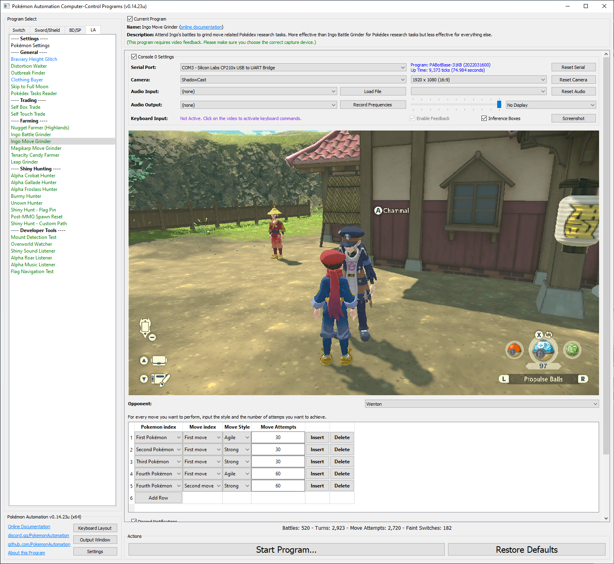

# Ingo Move Grinder

**Related Programs:**
- [Ingo Battle Grinder](IngoBattleGrinder.md)
- [Ingo Move Grinder](IngoMoveGrinder.md) (this program)

## Program Description

Grind Pokédex research tasks from Ingo's regular battles.

This program will repeatedly attend Ingo's regular battles, send Pokémon to battle with specified move styles. The difference with Ingo Battle Grinder is that it will be very inneficient at farming experience, evolving Pokémon, etc BUT it will focus only on grinding the Pokédex research tasks.

This program works on game version 1.0 and later.

### Settings

1. Screen size: Must be 100% within the Switch settings
2. Video Resolution: 1080p or higher in program settings
3. Text speed is fast.

### Instructions

1. If your game version is the same or higher than 1.1.0, you have unlocked the battle mode dialogue from Ingo. In this dialogue you can choose between Regular Pokémon battles, Path of Tenacity, Path of Solitude and Select Pokémon.
2. You have unlocked all Ingo's regular battles. If your game version is the same or higher than 1.1.0, check this Serebii [page](https://www.serebii.net/legendsarceus/ingobattles.shtml) for a complete list of all regular battles.
3. Stand in front of Ingo.
4. Start the program in the game.
5. The first Pokémon to be sent in battle need to be the first in your party.
6. The fifth Pokémon need to be Arceus with judgement as its first move.
7. The sixth Pokémon doesn't matter but you need to have six.

The program will repeatedly talk to Ingo. It will choose an battle opponent according to the option. You can specify what styles you want to use on each move.

## Options

### Opponent

The name of the opponent you choose to battle against. You need to have the full list of opponents unlocked to ensure the program can find the correct opponent.

### Pokémon Action Table
A table where each row sets the moves you want to pick.

It will pick them with the style you chose and if all pokémon that have a move to grind are KO or you ran out of PP, it will use Arceus and spam judgement to finish the battle. Keep in mind is is move ATTEMPTS and you might fail to succeed them (paralysed, confused, sleeping, miss, immunity, etc). Pick an opponent to have the least interference possible.

## Credits

- **Author:** pifopi

**Discord Server:** 

