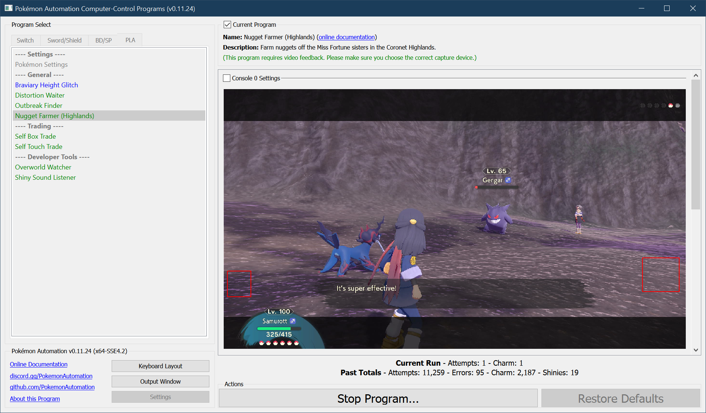
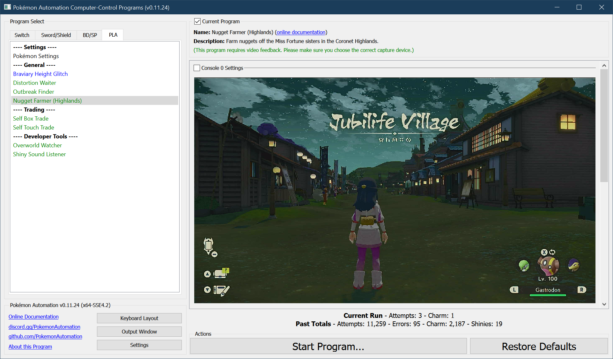

# Nugget Farmer (Coronet Highlands)

## Program Description

Farm nuggets (and therefore money) from the Miss Fortune sisters. This program will repeatedly seek out and battle Charm in the Coronet Highlands.

### Settings

1. Screen size: Must be 100% within the Switch settings
2. Video Resolution: 1080p or higher in program settings
3. Text speed is fast.
4. Auto-save is off.

### Instructions

1. You are in the post-game with Braviary unlocked.
2. The first Pokémon in your party must be able to reliably defeat Charm using only its first move.
    - Charm's Pokémon are Rhydon and Gengar. Gengar knows Hypnosis.
3. The Pokémon selection in the bottom right corner is on your first Pokémon.
4. Stand in the following location. In front of the Jubilife gate with your back towards both the gate and the camera.
5. Save the game in this location and position.
6. Start the program in the game.

The program will repeatedly warp to Coronet Highlands and try to find and battle Charm.

The chance of finding her on each trip to Coronet Highlands is 1-in-5. In the post game, defeating her will reward you with 4 or 5 nuggets.

If the program finds a shiny, it still stop and go to the Switch home to freeze the game. You can change this behavior in the options.

## Options

None specific to this program.

### Shiny Detected Actions

This program detects shinies by listening for the shiny sound. You can configure what the program should do if it hears a shiny.

**Shiny Detected Action:**
- Ignore the shiny. Do not stop the program.
- Stop program. Align camera for a screenshot. Then go Home.
- Stop program. Align camera for a screenshot + video. Then go Home.

**Screenshot Delay:**

If the above is set to stop on a shiny, the program will align the camera and wait X time to potentially allow the shiny to come into view of the camera.
This has no functional affect on the program. Don't set this value too large as some Pokémon will run away from you.

**Discord Server:** 

