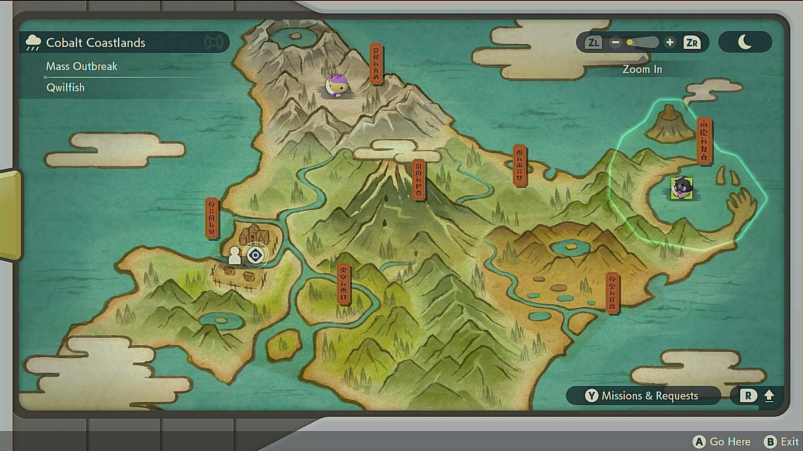
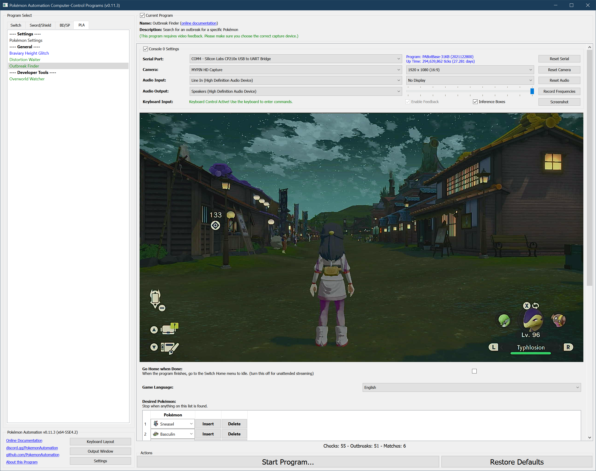

# Outbreak Finder

## Program Description

Find an outbreak for specific Pokémon.

This program repeatedly refresh maps to search for desired Massive Outbreak (MO) or Massive Massive Outbreak (MMO) Pokémon.

It can also search for MMO Pokémon with star symbols which are guaranteed to have a second wave.

Note: MMO related functionalities are only present in upcoming Program v0.16.

### Settings

**Switch Settings:**
1. Screen size: Must be 100% within the Switch settings
2. [Switch 2: The profile you are using must be the 1st (left-most) profile.](/Wiki/Programs/NintendoSwitch/Switch2Notes.md#resetting-a-game-moves-the-cursor-to-the-1st-user-profile)

**Program Settings:**
1. Video Resolution: 1080p or higher
2. Audio input is properly setup.
3. Game Language is set correctly. This program needs to read the Pokémon names!

**Game Settings:**
1. Text Speed: Fast
2. Auto-save is off.
3. If MMO Pokémon are desired:
   
   3.1 Remove all the player-placed map markers (e.g. flag, berries, ores, Pokémon and pokeballs) that
may overlap with MMO Pokémon locations. 
   
   3.2 Remove all the satchels that may overlap with MMO Pokémon locations.
Picked satchels will respawn randomly on the map after loading the map again after a while.
So you may need to pick them up repeatedly until all the spawned satchels don't overlap with MMO Pokémon locations.

   Check Serebii [page](https://www.serebii.net/pokearth/hisui/obsidianfieldlands.shtml) like this to know all the MMO Pokémon locations
on a map.
   > The program uses Pokémon sprite image matching at each MMO Pokémon location. Any map marker or satchel overlap on that location may fail sprite matching.
   > The program can still correctly detect MMO Pokémon on those locations that have no overlap.

### Instructions

1. You have unlocked at least one region. (Obsidian Fieldlands)
2. For all the regions that have been unlocked, entering them will not trigger any plot events.
3. You have no unreported research.
4. You are in Jubilife city standing in the position pictured below.
5. If MMO Pokémon are desired:

   5.1 You have fully unlocked MMO Pokémon by finishing all the MMO side quest line.

   5.2 You have at least 5 Aguav Berries in your satchel.

6. Start the program in the game.

## Options

### Reset Game and Skip Outbreak at Start
If the last outbreak found by the program does not yield what you want, check this option to let the program reset the game
and skip the ongoing outbreaks at start, before continuing the search.

Note: you must have saved at Jubilife Village front gate before starting the program.

### Go Home when Done:

After the program finishes, go to the Switch Home to idle.

### Game Language

This is the language you are playing in. This needs to be set correctly or the program will not be able to read the notifications.

### Desired Outbreak Pokémon

List all the Outbreak Pokémon you are looking for. The program stop when it finds an outbreak for any of them.
You can also look for MMO occurance at any area by adding the MMO symbol to the list.

### Desired MMO Pokémon

List of all the MMO Pokémon you are looking for. After finding a region with MMO, the program will first save the game, then go to that region,
talk to Mai to reveal the MMO Pokémon, and check if there is a match. If no match, it resets the game. It will stop when it finds a Pokémon in the list.

### Desired MMO Pokémon with Shiny Symbols

List of all the MMO Pokémon with shiny symbols you are looking for. It's similar to **Desired MMO Pokémon** but the program also checks if the MMO Pokémon
have shiny symbols.

## Credits

- **Author:** Kuroneko/Mysticial, Gin

**Discord Server:** 

