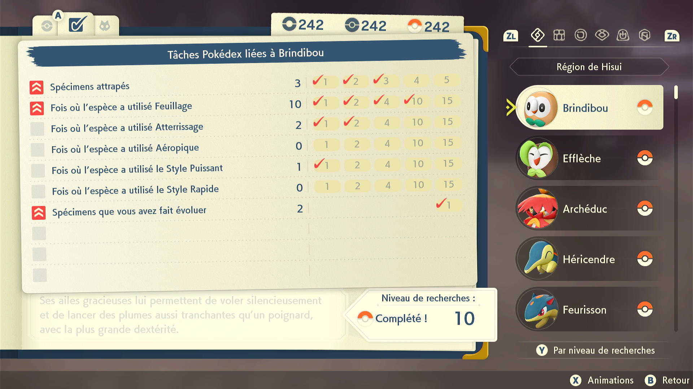

# Pokédex Tasks Reader

## Program Description

This programs scroll through your Pokédex to check how many tasks you did. It then output a file named output.txt with a format that is easy to copy paste in a spreadsheet like https://docs.google.com/spreadsheets/d/1UoZTHlDaLLkA6fH-M74VxLstXjepmbx8kXDFlqN359g/edit#gid=1623949234 (column H)

### Settings

1. Screen size: Must be 100% within the Switch settings
2. Video Resolution: 1080p or higher in program settings
   > Text recognition is not reliable at low resolutions.

### Instructions

1. Have registered every Pokémon in the pokedex (242 entries)
2. Open the Pokédex and look at the first entry (Rowlet)

## Credits

- **Author:** pifopi

**Discord Server:** 

