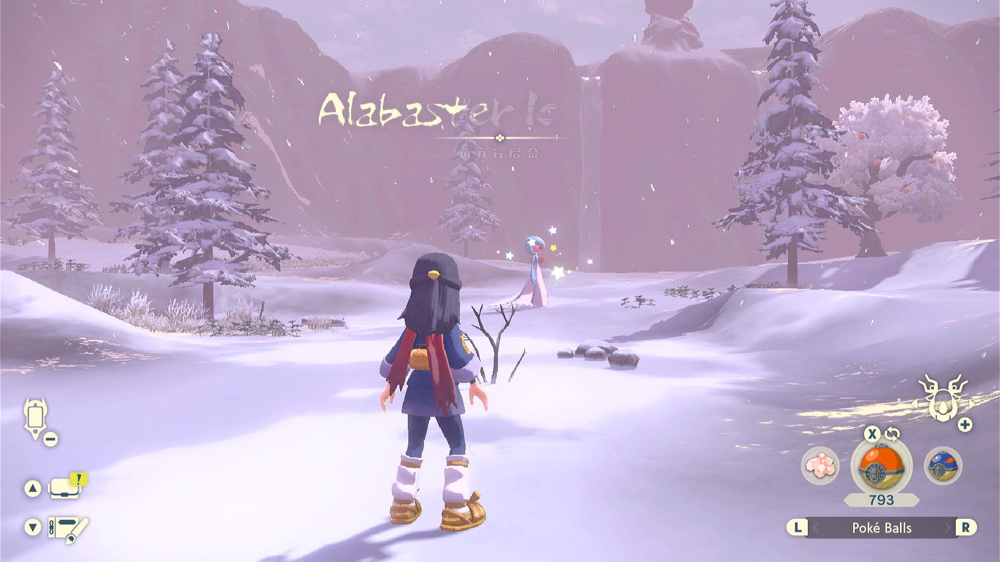

# Post-MMO Spawn Reset

**Related Programs:**
- [Shiny Hunt - Flag Pin](ShinyHunt-FlagPin.md)
- [Post MMO Spawn Reset](PostMMOSpawnReset.md) (this program)

## Program Description

Shiny hunt Pokémon by resetting suppressed spawns after clearing a Massive Mass Outbreak (MMO).

During an MMO, the usual spawns (including alpha spawns) around each MMO spawn point are suppressed. After you clear an MMO spawn point, stay there, save, and reset the game. The usual spawns will then appear around you, but they will be different with each reset. This means that you can reset the game for a shiny version of these Pokémon!

This program will repeatedly reset the game and stop when it hears a shiny.

This program can be used to shiny hunt every Pokémon from spawn points (including alpha spawn points) that overlap with MMO spawners.

Demo Video: https://cdn.discordapp.com/attachments/755635697737531544/970164546276851763/2022-04-30_22-25-15.mp4

### Settings

1. Screen size must be 100% within the Switch settings.
2. Video resolution should be 1080p or higher in program settings.
3. Audio input should be set up properly.
4. Text speed must be set to Fast in-game.
5. Vertical and Horizontal camera controls should both be ***Regular***. Do not set either one to inverted.
6. Camera sensitivity should be at the default value of 3.
7. Autosave should be off.

### Instructions

1. Enter a map with an active MMO.
2. Make sure the time of day is set correctly for your desired spawn to appear.
3. Go to your desired spawn point location.
4. Clear out the MMO spawns there. You can clear them either by despawning them (via catching, KOing, or scaring) or waiting for MMO to finish (rain or snow stops). Make sure the time of day and weather permit your desired spawn after you finish.
5. Stay at the location of the spawn point. Make sure your desired spawn is still suppressed. Save the game.
6. Start the program in the game.

<!--  -->

When you start the program, it will start the cycle of resetting the game and listening for a shiny sound. The program can be set to move around according to the program options after entering the game to move closer to the desired spawn point.

It is strongly recommended to watch the program for a few cycles to make sure it moves within the shiny sound range of the target Pokémon. The spawned Pokémon can appear in random positions near the spawn point each reset. Make sure the path the program goes on covers the optimal range of all possible Pokémon locations.

This program will stop when it hears a shiny *anywhere* around you. You will likely get some "unwanted" shinies from another nearby spawn point before the one you want actually shines.

As of this time, there is no option to ignore shinies that you don't want.

### Caution

Once you save and reset after the MMO is cleared, you will no longer be able to restore this save to before the usual spawns appeared. If you didn't set the correct time of the day or weather before starting, you will not be able to change them anymore on this save.

Fortunately, you can use the hidden backup save to revert the game back to a prior state:
- Press DPAD UP, X and B at the same time at the game title screen to load the backup save.
- This backup save is created whenever you enter a camp.
- If your last visit to the camp was before the MMO spawns were cleared, then you can use this backup save to revert the game and adjust the time/weather if your desired spawn does not appear after resetting the game.
- If your last visit was after the MMO spawns were cleared, then the backup save can not help you and you have to wait for another MMO to hunt what you want.

## Options

If the place you saved the game is not close enough to the spawn point you intend to shiny hunt, here are some options to move the character a bit after entering the game.

Make sure you set enough ticks in the options so that the program has enough time for the game to finish loading and play the shiny sound.

### Camera Turn

This controls how many ticks to turn the camera to point to the direction you want to move towards. You can input a positive or negative number. Positive numbers mean turning the camera rightward and negative numbers mean turning the camera leftward.

### Move Forward

After turning the camera, this controls how many ticks to move forward. The program will move towards the direction the camera is facing.

### Wait Time

Finally, this controls how many ticks to wait for the shiny sound after movement. Make sure you have set enough total time for the program to detect the shiny sound.

### Shiny Detected Actions

This program detects shinies by listening for the shiny sound and then performs an action based on your settings.

#### Possible Actions  
- Ignore the shiny. Do not stop the program.
- Stop program. Align camera for a screenshot. Then go Home.
- Stop program. Align camera for a screenshot + video. Then go Home.

#### Screenshot Delay  
If the above is set to stop on a shiny, the program will align the camera and wait X time to potentially allow the shiny to come into view of the camera.
This has no functional effect on the program. Don't set this value too high as some Pokémon will run away from you.

## Credits 
- So far the earliest source of the method is from [光之烙铁](https://tiebac.baidu.com/p/7759990346?pn=1)
- **Author:** Gin

**Discord Server:** 

