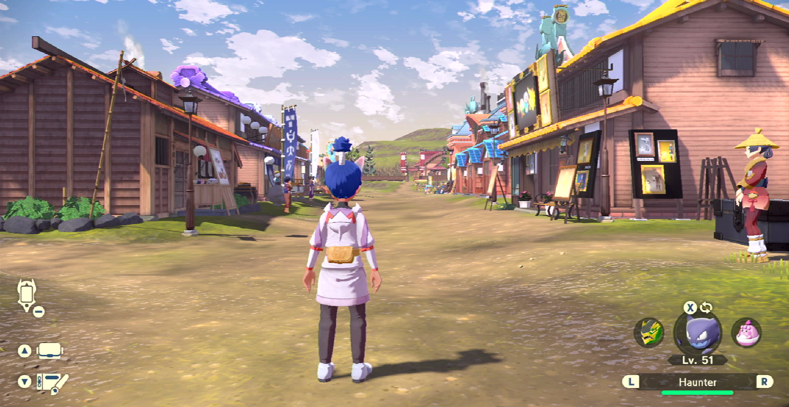

# Ramanas Island Combee Finder

**Related Programs:**
- [Cloth Buyer](ClothingBuyer.md)
- [Skip Full Moon](SkipToFullMoon.md)
- [Outbreak Finder](OutbreakFinder.md.md)
- [Ramanas Combee Finder](RamanasCombeeFinder.md) (this program)

## Program Description

Starting from Jubilife Village, travels to Ramanas Island and check all 5 trees until a Combee is found. 

You will need a Combee from Ramanas Island in order to complete the task **Arceus Request 57: The Taste of Honey**

Alternatively, the program also can stop if a shiny is heard during the route to the tree.

### Settings

**Switch Settings:**
1. Screen size: Must be 100% within the Switch settings

**Program Settings:**
1. Video Resolution: 1080p or higher

**Game Settings:**
1. Text Speed: Fast
2. Auto-save is off.

### Instructions

1. You have unlocked Braviary.
2. You have unlocked the Fieldlands Heights travel point.
3. You are in Jubilife city standing in the position pictured below.
4. **You have Pokémon selected and NOT items on the right bottom side**
5. Start the program in the game.

## Options

### Language

Game Language to help detect Pokémon name

### Enroute Shiny Action

What to do when finding a shiny enroute to destination

**Shiny Detected Action:**
- Ignore the shiny. Do not stop the program.
- Stop program. Align camera for a screenshot. Then go Home.
- Stop program. Align camera for a screenshot + video. Then go Home.

**Screenshot Delay:**

If the above is set to stop on a shiny, the program will align the camera and wait X time to potentially allow the shiny to come into view of the camera.
This has no functional affect on the program. Don't set this value too large as some Pokémon will run away from you.

## Credits

- **Author:** Icaroto

**Discord Server:** 

