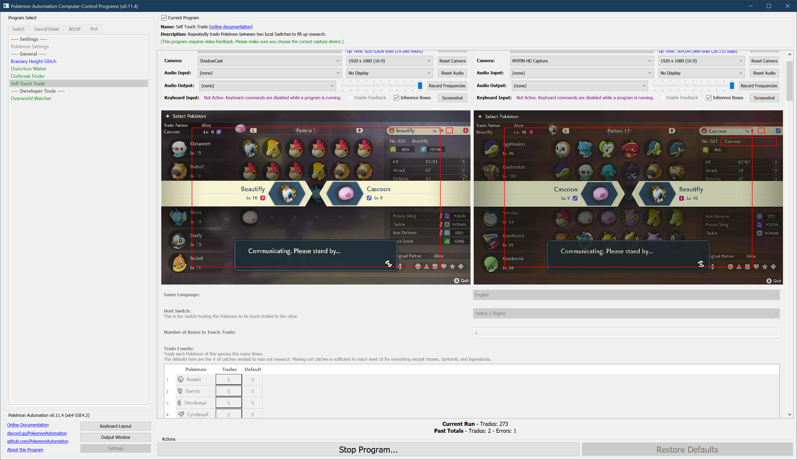

# Self Touch Trade

## Program Description

This is a hard-to-use program that will repeatedly touch-trade Pokémon for the purpose of maxing out the "Number caught" research task.

This method works because trading the same Pokémon back-and-forth will count towards the "Number caught" counter.

Touch-trading will allow you to achieve research level 10 for every Pokémon except for:

1. Legendaries and Spritomb. (they are capped at 1 each)
2. Unown. (you need to get all the forms)
3. Gen 1 trade evolutions: Kadabra, Haunter, Graveler, and Machoke.

While touch-trading will not let you *complete* your dex for the purpose of getting the Shiny Charm, it will get you 95% of the way there along with a free ride to 9-star rank.

It takes roughly 40 hours to touch-trade a complete Hisui living dex the number of times needed to max out the "Number caught" research for everything.

### Settings

1. Screen size: Must be 100% within the Switch settings
2. Video Resolution: 1080p or higher in program settings
   > Text recognition is not reliable at low resolutions.
3. Text speed is fast.
4. Make sure the Game Language of the hosting Switch is set correctly.

### Box Setup

**Hosting Switch:**

The hosting Switch is the Switch with all the Pokémon to be touch-traded.

1. The hosting Switch has N boxes consecutively in the box system. They do not need to be full.
2. All Pokémon in these N boxes must be tradable.

Note that the program will automatically skip trade evolutions. (Kadabra, Haunter, Graveler, and Machoke)

**Receiving Switch:**

The receiving Switch is the one that will receive the touch-trades for dex-filling.

1. There is at least one tradable Pokémon in the current box.

### Instructions

1. The two Switches are in a trade together.
2. The hosting Switch is on the first (left-most) box of the N boxes that will be touch-traded.
3. The hosting Switch has the cursor on the top-left box slot.
4. The receiving Switch has the cursor over any tradable Pokémon.
5. Start the program in the game.

The way this program works is to have a living dex on a hosting Switch. This program will iterate the Pokémon in the boxes. For each Pokémon, it reads its name to identify it.
Then it repeatedly trades it to the receiving Switch the specified number of times before moving on.

The program will automatically skip empty slots as well as Pokémon with a zero trade count requested. It will also skip trade evolutions.
The program will stop when it has iterated over the specified number of boxes.

**Notes:**

- The program will scramble up the order of the Pokémon on the host.
- The program will likely finish one Pokémon early. The last Pokémon may not be fully traded the specified number of times.
- The last Pokémon that is traded will remain on the receiving Switch. You will need to send it back manually.

The complexity of this program means it remains a bit unpolished at this time.

## Options

### Game Language of the Hosting Switch

This is the language of the hosting Switch. This needs to be set correctly or the program cannot determine what Pokémon it is trading.

### Number of Boxes to Touch-Trade

The number of boxes the hosting Switch should trade to the receiving Switch.

### Trade Counts

This section lets you specify how many times each species should be traded over to the receiving Switch.

The hosting Switch does not need to have the Pokémon in any particular order. Furthermore, it doesn't need a complete living dex. If anything is missing, it will be skipped. If there are any duplicates, the later one will be skipped.

**Discord Server:** 

