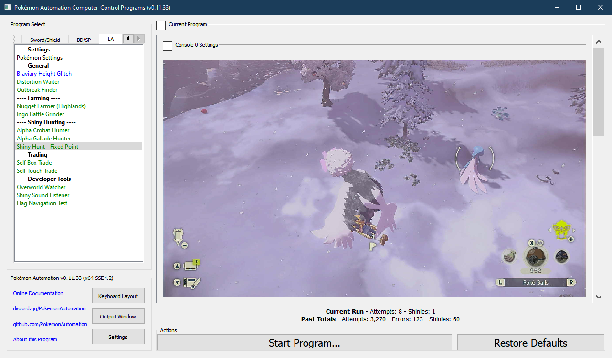
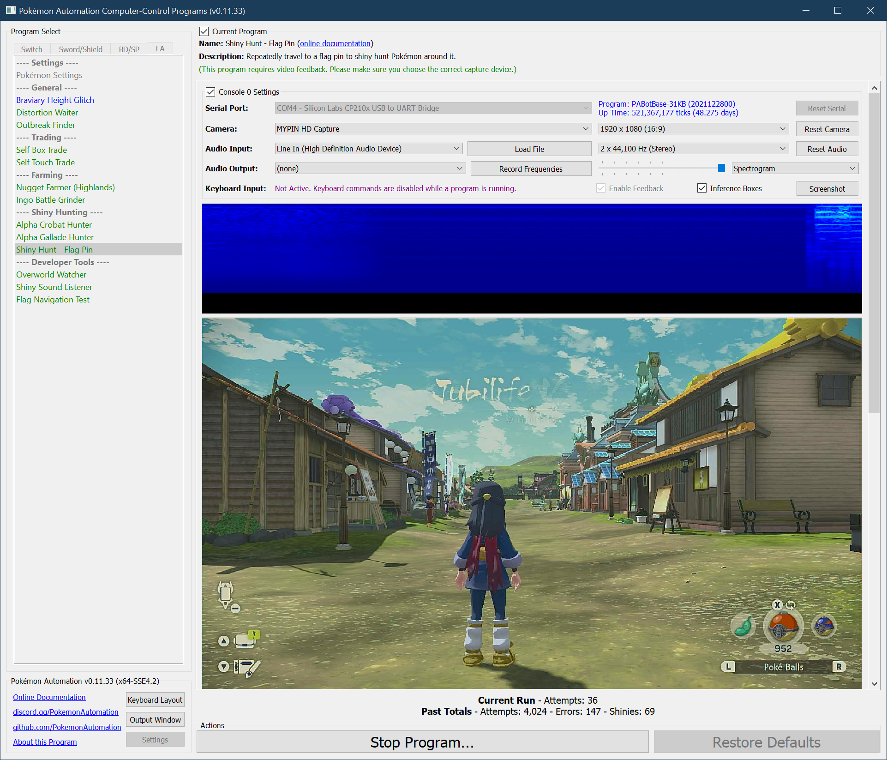

# Shiny Hunt - Flag Pin

## Program Description

Shiny hunt Pokémon around a flag pin.

Place the flag pin somewhere on the map. This program will repeatedly navigate to the flag and stop when it hears a shiny.

This program can be used to shiny-hunt nearly every Pokémon in the game that:
1. Spawns normally. (not a distortion or outbreak exclusive)
2. The spawn location can be reached via a straight line from a warp location. This "straight line" can include climbable walls.

This program cannot shiny hunt:
1. Pokémon inside caves or sub-zones. They cannot be reached via a straight line.
2. Distortion exclusives. Distortions do not spawn since this program constantly resets.
3. Outbreak exclusives. Outbreak seeds are persistent across resets.

Demo Video: https://cdn.discordapp.com/attachments/755635697737531544/952330044246749224/2022-03-12_16-14-49.mp4

### Settings

1. Screen size: Must be 100% within the Switch settings
2. Video Resolution: 1080p or higher in program settings
3. Audio input is properly setup.
4. Text speed is fast.
5. Auto-save is off.

### Instructions

1. You have unlocked Braviary.
2. You have unlocked all warp spots in the map you are hunting in. (unlocked both camps, the arena, and settlements - if applicable)
3. Go to you desired location and place the flag pin on the spot.
4. Select the desired start location in the options.
5. If the spawn you are hunting is dependent on the time of the day, set it now by resting at the tent.
6. Return to Jubilife Village and save the game in the below position.
7. Start the program in the game.

When you start the program, it will first travel to the desired start location. Then it will hop on Braviary, look for the flag, and travel to the flag in a straight line.

The program will climb over walls that get in the way and will dive down when it gets near the flag.

However, there are some things that the program cannot handle:
1. The program cannot climb ice.
2. The program can get stuck on the edge of the map.
3. The program can (rarely) get stuck under a tree.
4. The game disallows flying over the lava in the Coastlands volcano. So the program can get stuck.
5. The program cannot handle getting attacked by a Miss Fortune sister.

It is strongly recommended to watch the program for a few runs to make sure it successfully reaches the flag and comes near the desired spawn you are hunting. If it does get stuck, it will automatically reset after a certain amount of time. So it is okay if it occasionally gets stuck.

You should also check that the path the program is traveling does not cross paths with a Miss Fortune sister. If it does, you should pick a different start location. Crossing paths with a Miss Fortune sister can reduce the efficiency of the program by up to 20%.

**Recommendations:**

This program will stop when it hears a shiny anywhere along the path. So if you are hunting something specific where the flag is placed, you will likely get a lot of "unwanted" shinies before the one you want actually shines.

As of this time, there is no option to ignore shinies that are not near the flag. If this is problematic, you may want to prefer paths that take you high in the air where you are too high to hear any shinies on the ground far below.

## Options

### Start Location

Pick a start location from which you will begin traveling to the flag.

Note that the Colbalt Coastlands arena location has an alternate version where it moves to the northwest of the volcano. This allows you to reach the northern area of the map without getting stuck behind the lava.

### Stop Distance

Stop when you have reached within this distance of the flag. (the units is the number on the flag - which we presume is meters)
Note that the program navigational accuracy is only about +/- 10m. So if you set it too low, the program may take a long time to actually get that close.

You shouldn't need to change this option.

### Target Reached Delay:

Once you have reached the flag (by coming within the "Stop Distance" above), wait this long to ensure everything loads and any shinies are heard before resetting.

### Navigation Timeout:

If you don't reach the flag after this long, give up and reset.

### Shiny Detected Actions

This program detects shinies by listening for the shiny sound. You can configure what the program should do if it hears a shiny.

**Shiny Detected Action:**
- Ignore the shiny. Do not stop the program.
- Stop program. Align camera for a screenshot. Then go Home.
- Stop program. Align camera for a screenshot + video. Then go Home.

**Screenshot Delay:**

If the above is set to stop on a shiny, the program will align the camera and wait X time to potentially allow the shiny to come into view of the camera.
This has no functional affect on the program. Don't set this value too large as some Pokémon will run away from you.

**Discord Server:** 

