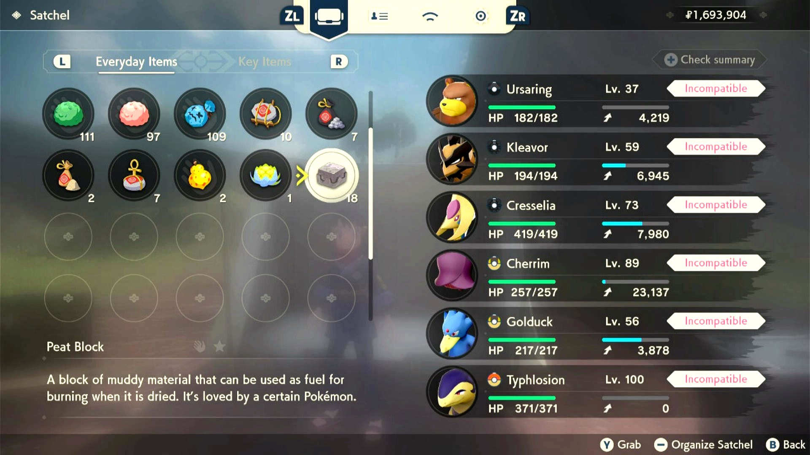
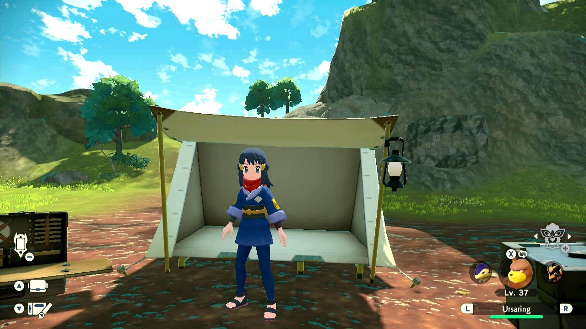

# Skip To Full Moon

## Program Description

This program will automatically rest in the tent until a full moon night has arrived.

This is useful for evolving Ursaring and finishing The Clefairy's Moonlit Dance Request.

### Settings

1. Screen size: Must be 100% within the Switch settings
2. Video Resolution: 1080p or higher in program settings
3. Text speed is fast.

### Instructions

1. You have an Ursaring as the party lead.
2. You have a Peat Block in your satchel.
3. When your item menu is open, make sure the cursor points at the Peat Block, so that you can see the red "Incompatible" on your Ursaring. (If you see the blue "Compatible", then congratulation, you are already at a full moon night.)
4. Close your item menu, stand just in front of the tent in any camp.
5. Start the program in the game.

The program will open the menu, check if there is the red "Incompatible" on the lead Pokémon. If there is, go back and rest in the tent until night fall. Repeat.

## Credits

- **Author:** Gin

**Discord Server:** 

