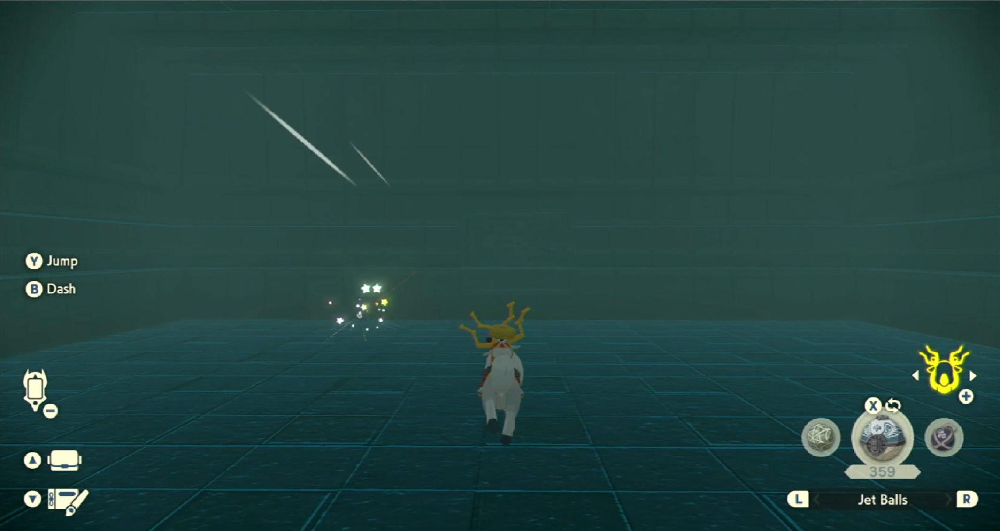
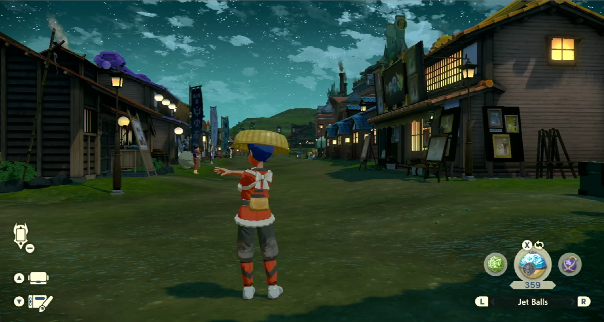

# Unown Hunter

**Related Programs:**
- [Alpha Crobat Hunter](AlphaCrobatHunter.md)
- [Alpha Gallade Hunter](AlphaGalladeHunter.md)
- [Unown Hunter](UnownHunter.md) (this program)

## Program Description

Goes from Jubilife Village to Solaceon Ruins to shiny hunt Unowns.

This program uses audio recognition to detect shinies. And as such, it will also pick up shinies of anything on or near the path to the Ruins.

These are the Pokémon this program can shiny hunt:
- Unown
- Psyduck
- Carnivine
- Kricketot
- Kricketune
- Gastly (Night spawn)
- Bronzor (MMO on Solaceon Ruins)
- Bronzong (MMO on Solaceon Ruins)

Demo Video: https://cdn.discordapp.com/attachments/722200321916534876/954529043775119401/20220318_234451.mp4

### Settings

1. Screen size: Must be 100% within the Switch settings
2. Video Resolution: 1080p or higher in program settings
3. Audio input is properly setup.
4. Auto-save is off.

### Instructions

1. You have unlocked Braviary.
2. You have found all Unowns.
3. You are in Jubilife city standing in the position pictured below.
4. Start the program in the game.

The program will loop through going from the village to Solaceon Ruins until a shiny is found. There is a chance of a Bronzor/Brozong MMO in the ruins rather than Unowns, the program will keep running regardless. Also, to avoid getting into a battle with Bronzong, the program retuns to the tunnel so it can fly back to the camp.

**Notes:**

- If you using Discord notifications please bear in mind sometimes the screenshot won't show the shiny.
- Upon finding a shiny, the program will go back to home screen. Go back to game and save before attempting to catch the shiny, as Unowns can potentially run away after one miss catch. 

## Options

### Skip any shinies in the path

Enable this option if you want to skip any shinies found in the path to Solaceon Ruins.

### Shiny Detected Actions

This program detects shinies by listening for the shiny sound. You can configure what the program should do if it hears a shiny.

**Shiny Detected Action:**
- Ignore the shiny. Do not stop the program.
- Stop program. Align camera for a screenshot. Then go Home.
- Stop program. Align camera for a screenshot + video. Then go Home.

**Screenshot Delay:**

If the above is set to stop on a shiny, the program will align the camera and wait X time to potentially allow the shiny to come into view of the camera.
This has no functional affect on the program. Don't set this value too large as some Pokémon will run away from you.

## Credits

- **Author:** lcaroto

**Discord Server:** 

