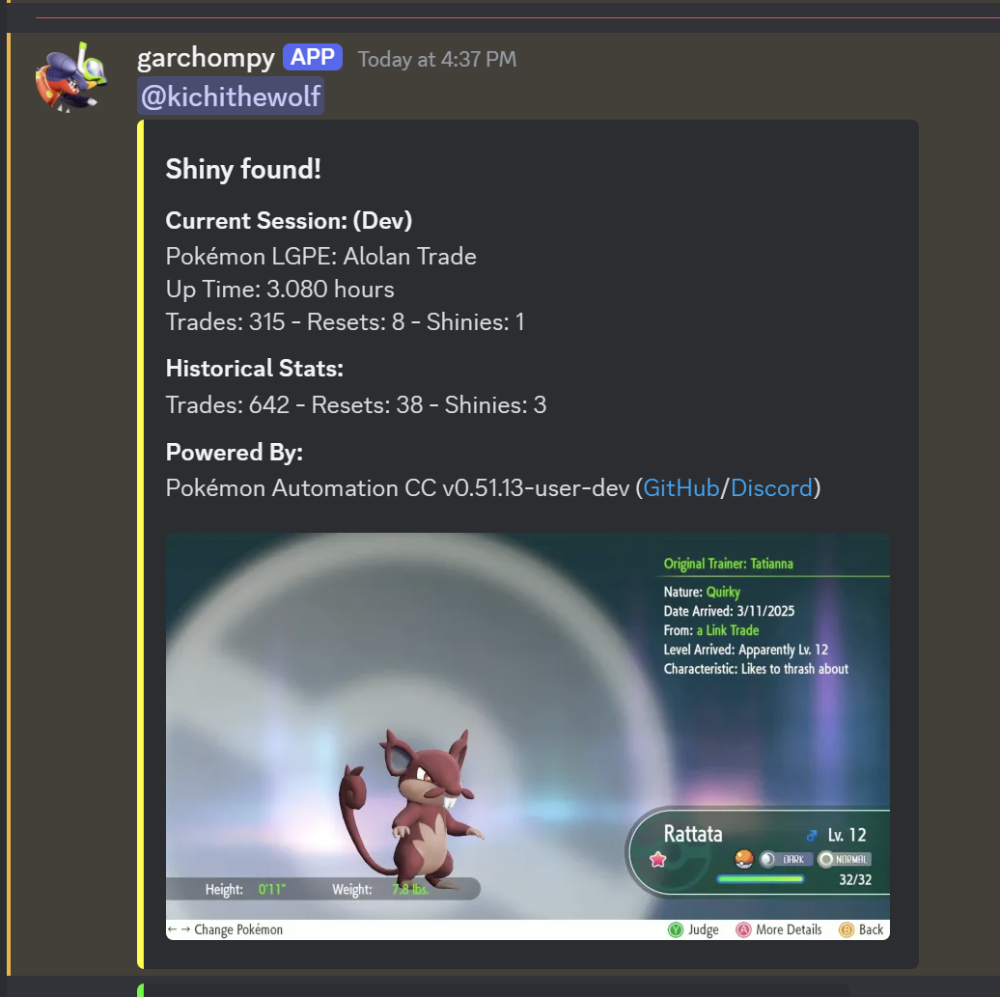

# Alolan Trade

## Program Description

Shiny hunt Alolan forms by trading in-game.

## Setup

1. As with all LGPE programs, Right Joycon is required. This program will not run otherwise.
2. Move any tradeable Pokemon you want to keep into Home or another save file. Favoriting a Pokemon does not prevent it from being traded.
3. Do not have any of the tradeable Pokemon favorited.
4. Text speed: Fast
5. Make sure the system date on your Switch is later than the catch date of any Pokemon you have. The program sorts the box by Recently Caught to navigate to the correct Pokemon and shiny check. (This mostly an issue if you've caught Pokemon in the "future" from date-skipping.)

## Instructions

1. Stand in front of the trade NPC. (Locations [here](https://www.serebii.net/letsgopikachueevee/trade.shtml).)
2. Save the game.
3. Start the program in-game.

The program will automatically favorite any shinies found.

## Options

### Number of Pokemon to trade:

The number of Kantonian form Pokemon you have to trade.

### Go Home when Done:

Go to the Switch Home to idle when finished.

## Credits

- **Author:** kichithewolf

**Discord Server:** 

