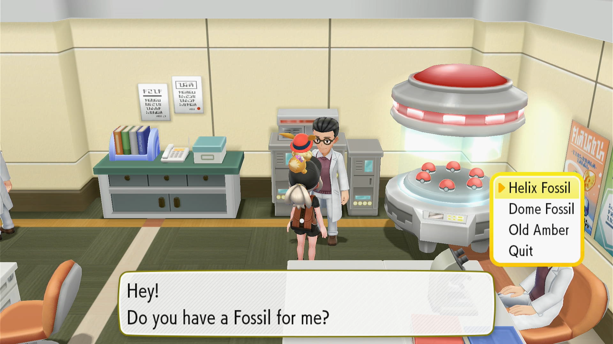

# Fossil Revival

## Program Description

Shiny hunt fossil Pokemon by reviving and resetting.

## Setup

1. As with all LGPE programs, Right Joycon is required. This program will not run otherwise.
2. Text speed: Fast
3. Make sure the system date on your Switch is later than the catch date of any Pokemon you have. The program sorts the box by Recently Caught to navigate to the correct Pokemon and shiny check. (This mostly an issue if you've caught Pokemon in the "future" from date-skipping.)

## Instructions

1. Stand in front of the fossil scientist in Cinnabar Lab.
2. Save the game.
3. Start the program in-game.

The program will automatically favorite any shinies found.

To farm fossils, use [DailyItemFarmer](DailyItemFarmer.md).

## Options

### Fossil slot:

Position of the fossil in the selection dialog.

### Number of fossils to revive:

The amount of the fossil you are reviving. Make sure not to exceed the actual amount that you have.

### Go Home when Done:

Go to the Switch Home to idle when finished.

## Credits

- **Author:** kichithewolf

**Discord Server:** 

