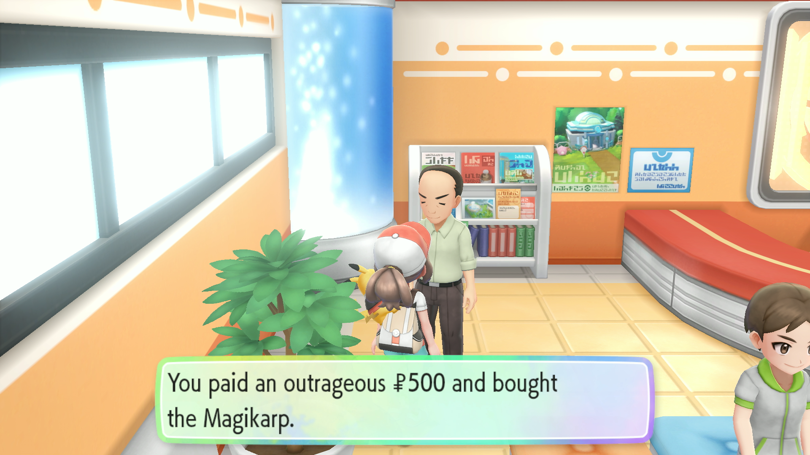

# Gift Reset

## Program Description

Shiny hunt gift Pokemon by resetting the game.

This does not work for fossil revivals.

Beta note: only tested with Magikarp so far.

## Setup

1. As with all LGPE programs, Right Joycon is required. This program will not run otherwise.

## Instructions

1. Stand in front of the gift NPC. (Locations [here](https://www.serebii.net/letsgopikachueevee/gift.shtml).)
    - For Magikarp, make sure you have the money to purchase it.
    - For any gifts with a catch requirement, make sure you've fulfilled it.
2. Save the game.
3. Start the program in-game.

## Options

### Go Home when Done:

Go to the Switch Home to idle when finished.

## Credits

- **Author:** kichithewolf

**Discord Server:** 

