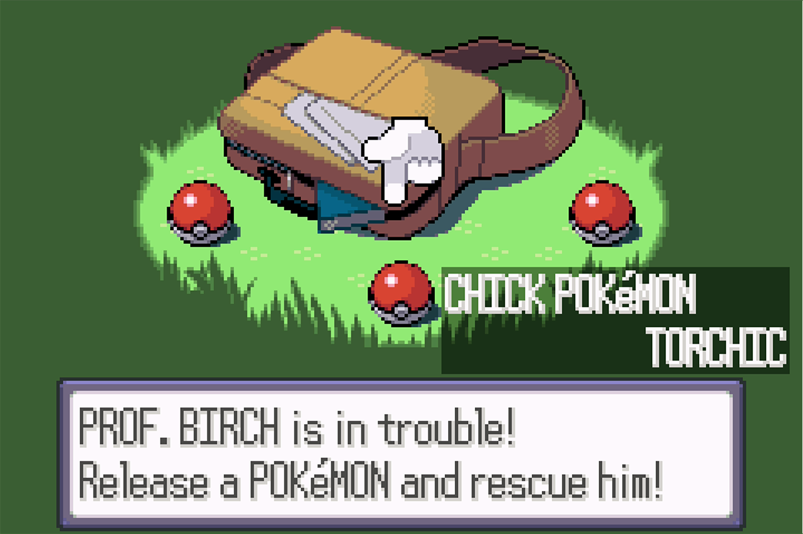

# Starter Reset (Ruby/Sapphire)

## Program Description

Soft reset for a shiny starter. Ruby and Sapphire only.

## Game Settings

1. Text Speed: Fast
2. Battle Scene: Off
3. Frame: Type 1

## Switch Settings

1. Full screen
2. No filter

## Instructions

1. Stand in front of Birch's bag.
2. Save the game.
3. Start the program in game.

## Notes

This program only applies to Ruby and Sapphire. While it will run in Emerald, the starting seed will always be 0, so soft resetting will not work.

If on cartridge, the battery cannot be dry, as it will result in the same issue Emerald has.

## Options

### Starter:

The starter Pokemon you are resetting for.

## Credits

- **Author:** kichithewolf

**Discord Server:** 

