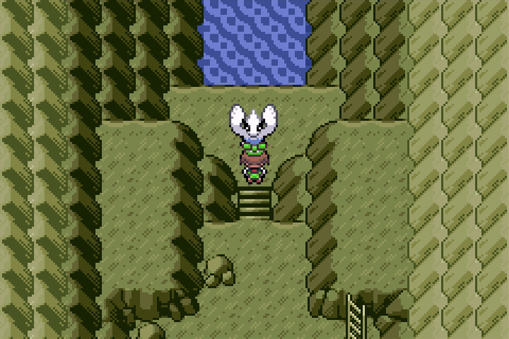
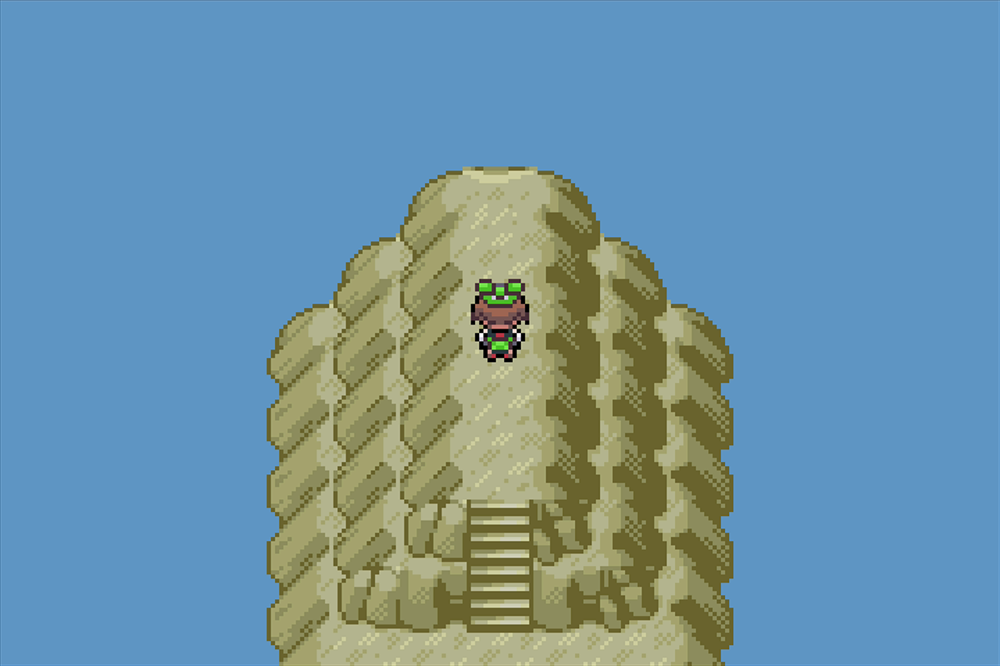
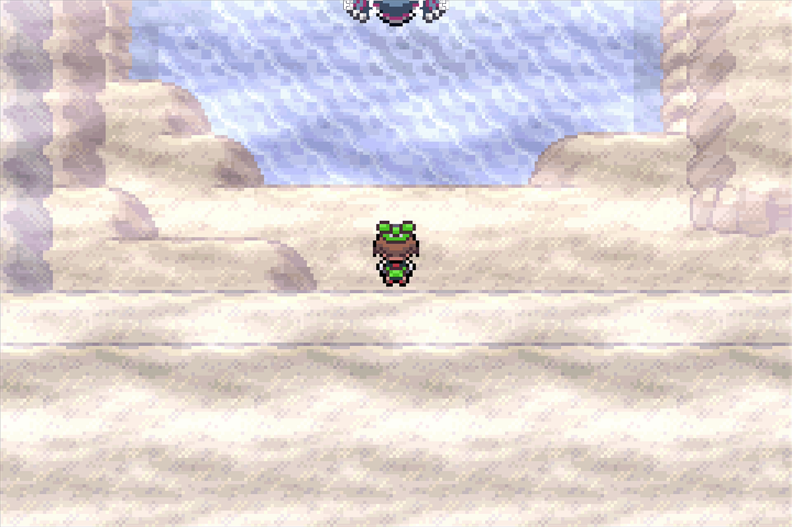

# Legendary Hunt (Emerald)

## Program Description

Use the Run Away method to shiny hunt legendaries in Emerald.

## Game Settings

1. Text Speed: Fast
2. Battle Scene: Off
3. Frame: Type 1

## Switch Settings

1. Full screen
2. No filter

## Setup

1. Your lead Pokemon must be able to run away successfully, or must have a Smoke Ball.
2. (Optional) Your lead does not have any abilities that activate on entry.

## Instructions

1. Stand in front of your target.
    - For Ho-Oh, Groudon, and Kyogre, stand one tile before your target. (See below.)
2. Start the program in game.

 

## Notes

If you stop the program and switch off or soft reset your game, try to vary the amount of time you wait before starting the program again. This is due to Emerald's broken RNG.

## Options

### Target:

The legendary Pokemon you are hunting.

For Deoxys, see [Shiny Hunt - Deoxys](ShinyHuntDeoxys.md).

For Mew, see [Shiny Hunt - Mew](ShinyHuntMew.md).

## Credits

- **Author:** kichithewolf

**Discord Server:** 

