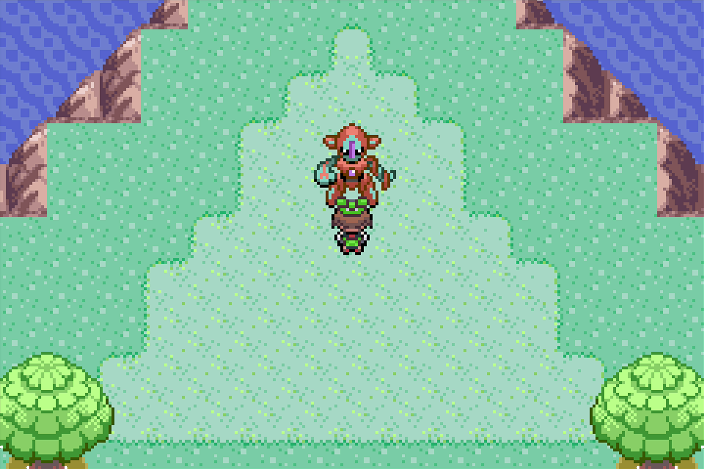

# Shiny Hunt - Deoxys

## Program Description

Use the run away method to shiny hunt Deoxys in Emerald.

## Game Settings

1. Text Speed: Fast
2. Battle Scene: Off
3. Frame: Type 1

## Switch Settings

1. Full screen
2. No filter

## Setup

1. Your lead Pokemon must be able to run away successfully, or must have a Smoke Ball.

## Instructions

1. Travel to Birth Island. Once you exit the ship, stay on that tile. (Pictured above.)
2. Start the program in game.

## Notes

If you stop the program and switch off or soft reset your game, try to vary the amount of time you wait before starting the program again. This is due to Emerald's broken RNG.

## Options

### Walk up/down time:

The amount of time it takes to walk from the ship to the triangle rock.

## Credits

- **Author:** kichithewolf

**Discord Server:** 

